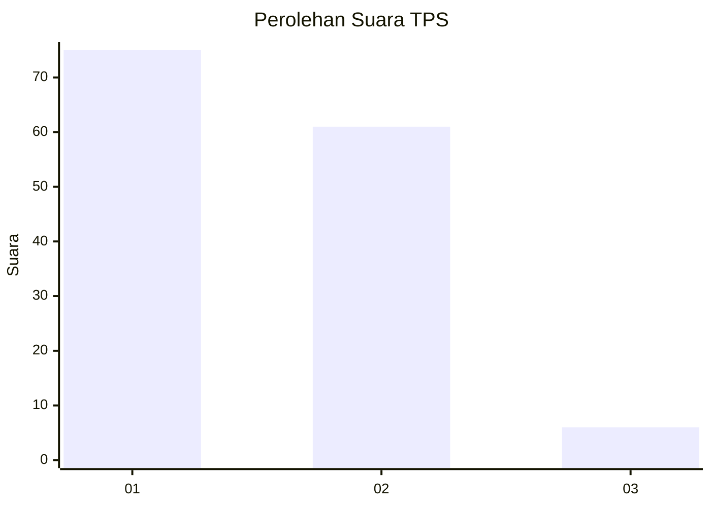
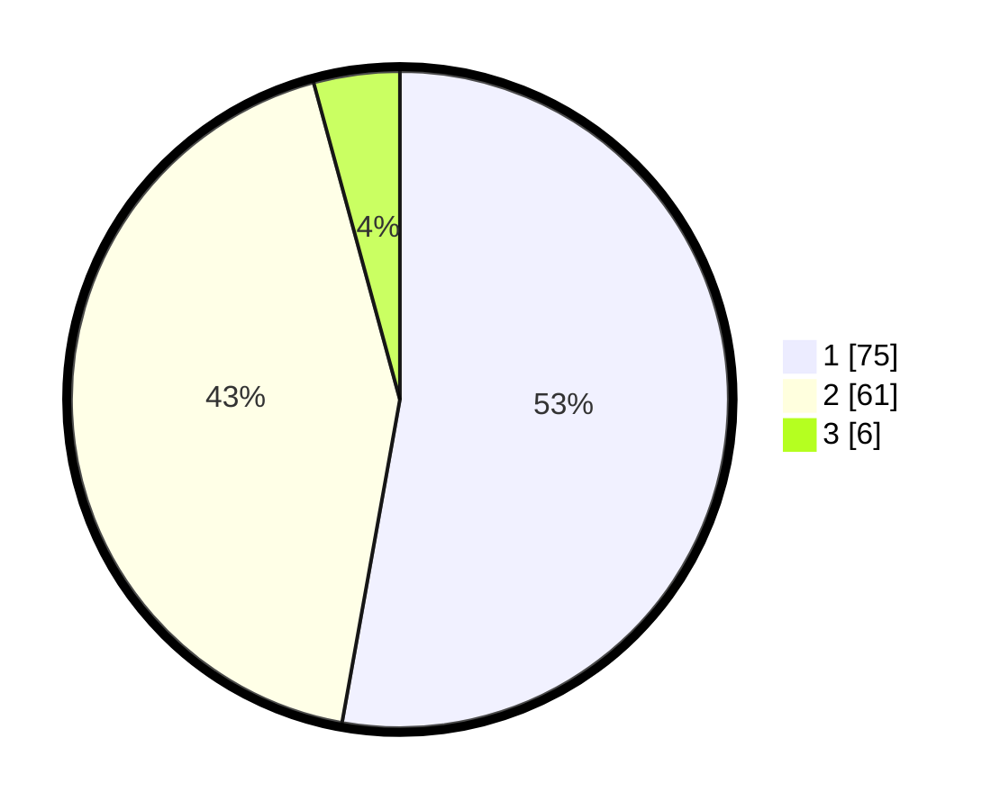

# Hasil

## Grafik

## Tabel

| No. | Nama Paslon    | Suara | Suara (raw) | Persentase |
|:--- |:-------------- | -----:| -----------:| ----------:|
| 1   | ANIES MUHAIMIN | 75    | [75][p-1]   | 52,82      |
| 2   | PRABOWO GIBRAN | 61    | [61][p-2]   | 42,96      |
| 3   | GANJAR MAHFUD  | 6     | [6][p-3]    | 4,23       |

[p-1]: https://github.com/gigit-pemilu/pemilu-2024-32-jawa-barat/blob/main/pilpres/hitung-suara/sub/32-jawa-barat/sub/03-cianjur/sub/01-cianjur/sub/1006-pamoyanan/sub/004-tps/sub/paslon-1.txt
[p-2]: https://github.com/gigit-pemilu/pemilu-2024-32-jawa-barat/blob/main/pilpres/hitung-suara/sub/32-jawa-barat/sub/03-cianjur/sub/01-cianjur/sub/1006-pamoyanan/sub/004-tps/sub/paslon-2.txt
[p-3]: https://github.com/gigit-pemilu/pemilu-2024-32-jawa-barat/blob/main/pilpres/hitung-suara/sub/32-jawa-barat/sub/03-cianjur/sub/01-cianjur/sub/1006-pamoyanan/sub/004-tps/sub/paslon-3.txt

## Foto C Plano

https://sirekap-obj-formc.kpu.go.id/b989/pemilu/ppwp/32/03/01/10/06/3203011006004-20240214-155125--7f8ca50d-2580-477b-a4b4-4a0044f85d41.jpg

https://sirekap-obj-formc.kpu.go.id/b989/pemilu/ppwp/32/03/01/10/06/3203011006004-20240214-155104--5fd85b50-9eb0-4eee-88dc-2523cc4a5863.jpg

https://sirekap-obj-formc.kpu.go.id/b989/pemilu/ppwp/32/03/01/10/06/3203011006004-20240214-155206--44e32175-b069-4447-83ff-8ef56714f4cd.jpg

## Metadata

| Key        | Value               |
| ---------- | ------------------- |
| Time Stamp | 2024-02-15 17:00:25 |

