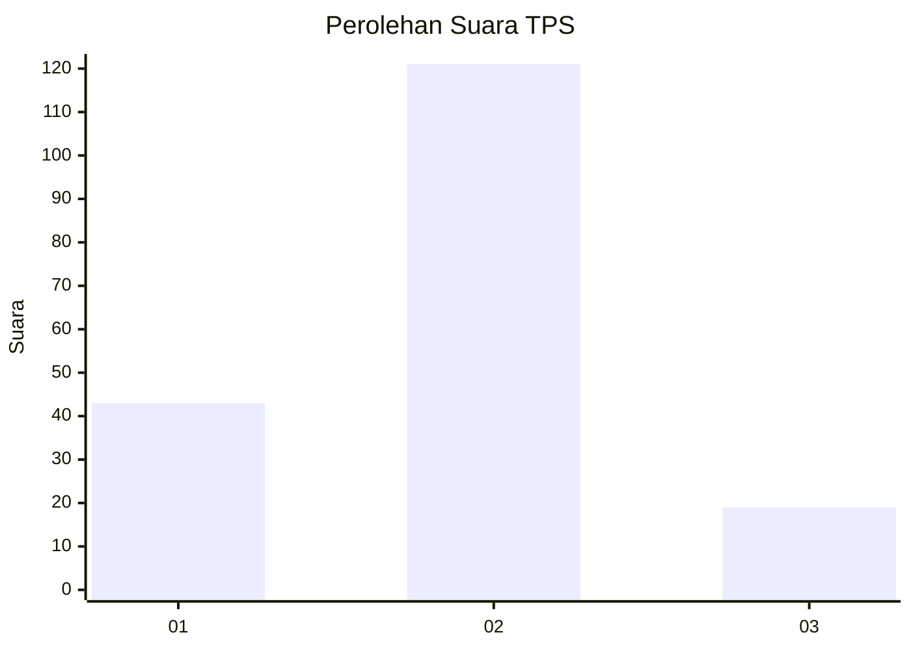

# Hasil

## Grafik

## Tabel

| No. | Nama Paslon    | Suara | Suara (raw) | Persentase |
|:--- |:-------------- | -----:| -----------:| ----------:|
| 1   | ANIES MUHAIMIN | 43    | [43][p-1]   | 23,50      |
| 2   | PRABOWO GIBRAN | 121   | [121][p-2]  | 66,12      |
| 3   | GANJAR MAHFUD  | 19    | [19][p-3]   | 10,38      |

[p-1]: https://github.com/gigit-pemilu/pemilu-2024/blob/main/pilpres/hitung-suara/sub/32-jawa-barat/sub/03-cianjur/sub/01-cianjur/sub/1008-bojongherang/sub/008-tps/sub/paslon-1.txt
[p-2]: https://github.com/gigit-pemilu/pemilu-2024/blob/main/pilpres/hitung-suara/sub/32-jawa-barat/sub/03-cianjur/sub/01-cianjur/sub/1008-bojongherang/sub/008-tps/sub/paslon-2.txt
[p-3]: https://github.com/gigit-pemilu/pemilu-2024/blob/main/pilpres/hitung-suara/sub/32-jawa-barat/sub/03-cianjur/sub/01-cianjur/sub/1008-bojongherang/sub/008-tps/sub/paslon-3.txt

## Foto C Plano

https://sirekap-obj-formc.kpu.go.id/9ae5/pemilu/ppwp/32/03/01/10/08/3203011008008-20240214-204942--5239d565-18f1-4800-a98d-2e9f63a5752d.jpg

https://sirekap-obj-formc.kpu.go.id/9ae5/pemilu/ppwp/32/03/01/10/08/3203011008008-20240214-205130--0733a3c3-9674-4d67-80b2-a0e8eb596bc0.jpg

https://sirekap-obj-formc.kpu.go.id/9ae5/pemilu/ppwp/32/03/01/10/08/3203011008008-20240214-205850--d224b135-681d-4f36-9328-6e162e5bc0d3.jpg

## Metadata

| Key        | Value               |
| ---------- | ------------------- |
| Time Stamp | 2024-02-15 22:00:27 |

