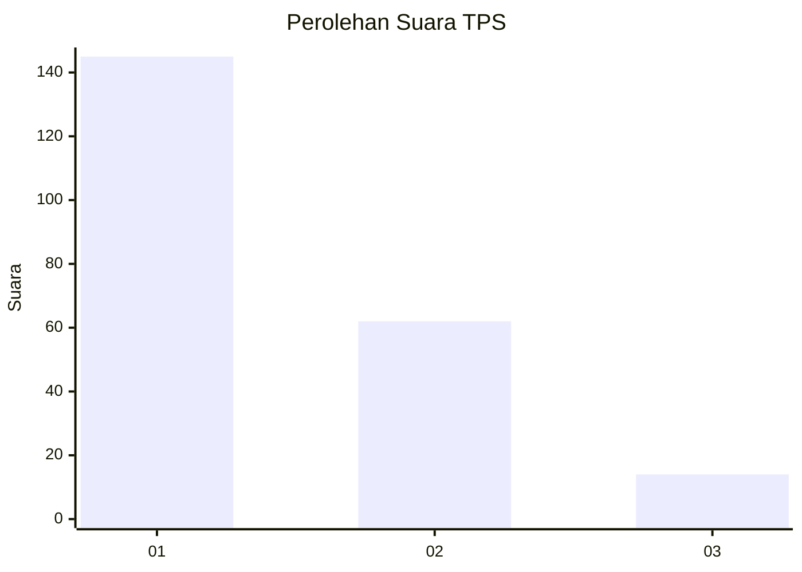
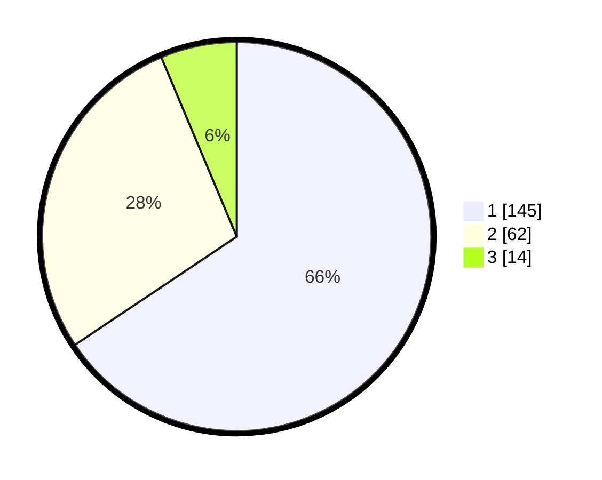

# Hasil

## Grafik

## Tabel

| No. | Nama Paslon    | Suara | Suara (raw) | Persentase |
|:--- |:-------------- | -----:| -----------:| ----------:|
| 1   | ANIES MUHAIMIN | 145   | [145][p-1]  | 65,61      |
| 2   | PRABOWO GIBRAN | 62    | [62][p-2]   | 28,05      |
| 3   | GANJAR MAHFUD  | 14    | [14][p-3]   | 6,33       |

[p-1]: https://github.com/gigit-pemilu/pemilu-2024-32-jawa-barat/blob/main/pilpres/hitung-suara/sub/32-jawa-barat/sub/03-cianjur/sub/01-cianjur/sub/1009-sayang/sub/012-tps/sub/paslon-1.txt
[p-2]: https://github.com/gigit-pemilu/pemilu-2024-32-jawa-barat/blob/main/pilpres/hitung-suara/sub/32-jawa-barat/sub/03-cianjur/sub/01-cianjur/sub/1009-sayang/sub/012-tps/sub/paslon-2.txt
[p-3]: https://github.com/gigit-pemilu/pemilu-2024-32-jawa-barat/blob/main/pilpres/hitung-suara/sub/32-jawa-barat/sub/03-cianjur/sub/01-cianjur/sub/1009-sayang/sub/012-tps/sub/paslon-3.txt

## Foto C Plano

https://sirekap-obj-formc.kpu.go.id/be4d/pemilu/ppwp/32/03/01/10/09/3203011009012-20240214-225537--874d0abe-24be-4472-ae39-8d2a6c28b0c9.jpg

https://sirekap-obj-formc.kpu.go.id/be4d/pemilu/ppwp/32/03/01/10/09/3203011009012-20240214-225756--7fe7c45e-8e89-49b6-b221-162e38593970.jpg

https://sirekap-obj-formc.kpu.go.id/be4d/pemilu/ppwp/32/03/01/10/09/3203011009012-20240214-225940--5ede5298-9be5-4d1e-9c5f-c20ede016e0f.jpg

## Metadata

| Key        | Value               |
| ---------- | ------------------- |
| Time Stamp | 2024-02-19 18:00:00 |

