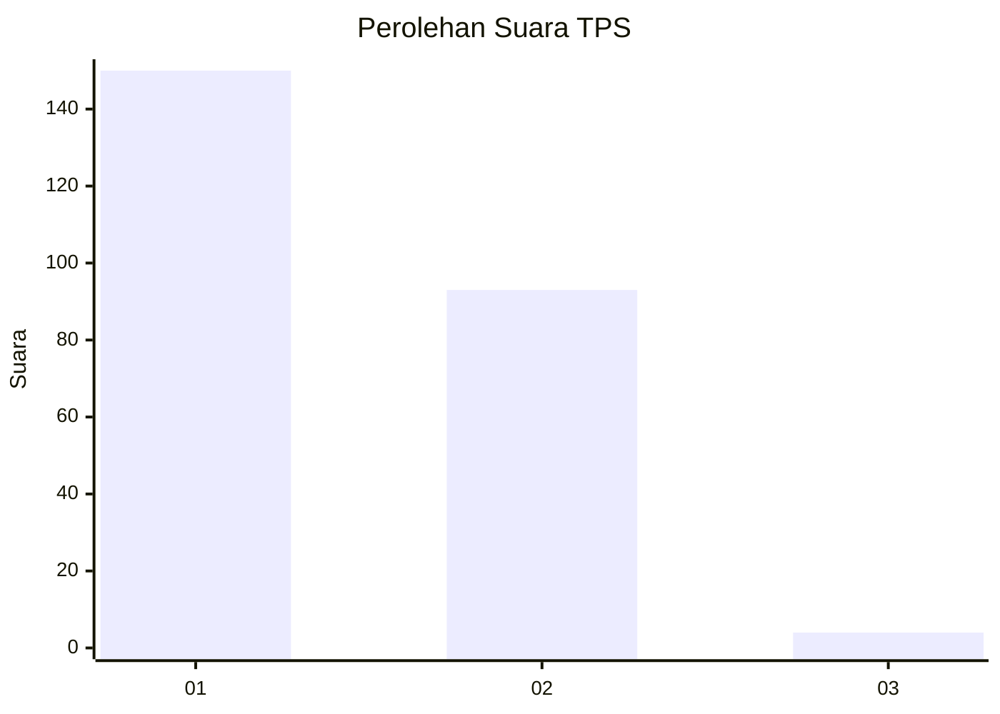
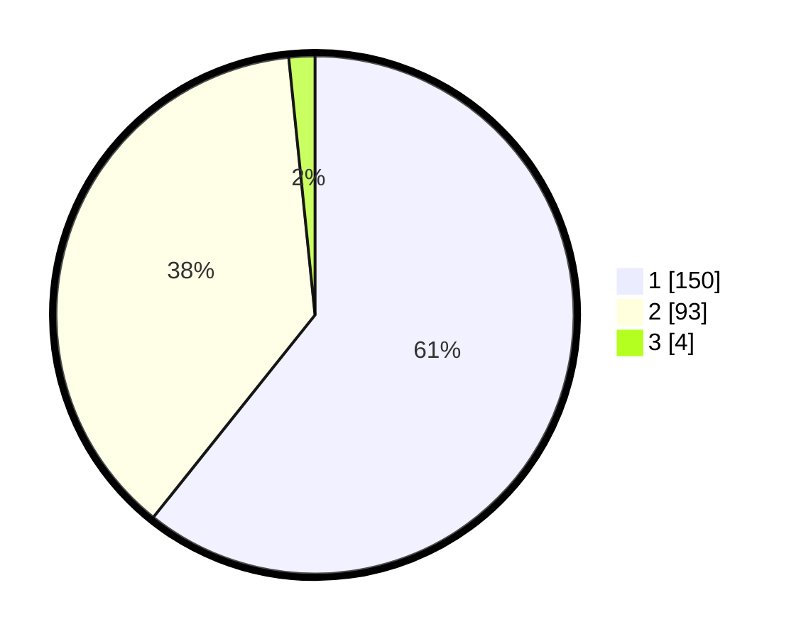

# Hasil

## Grafik

## Tabel

| No. | Nama Paslon    | Suara | Suara (raw) | Persentase |
|:--- |:-------------- | -----:| -----------:| ----------:|
| 1   | ANIES MUHAIMIN | 150   | [150][p-1]  | 60,73      |
| 2   | PRABOWO GIBRAN | 93    | [93][p-2]   | 37,65      |
| 3   | GANJAR MAHFUD  | 4     | [4][p-3]    | 1,62       |

[p-1]: https://github.com/gigit-pemilu/pemilu-2024/blob/main/pilpres/hitung-suara/sub/32-jawa-barat/sub/03-cianjur/sub/01-cianjur/sub/1009-sayang/sub/073-tps/sub/paslon-1.txt
[p-2]: https://github.com/gigit-pemilu/pemilu-2024/blob/main/pilpres/hitung-suara/sub/32-jawa-barat/sub/03-cianjur/sub/01-cianjur/sub/1009-sayang/sub/073-tps/sub/paslon-2.txt
[p-3]: https://github.com/gigit-pemilu/pemilu-2024/blob/main/pilpres/hitung-suara/sub/32-jawa-barat/sub/03-cianjur/sub/01-cianjur/sub/1009-sayang/sub/073-tps/sub/paslon-3.txt

## Foto C Plano

https://sirekap-obj-formc.kpu.go.id/3d36/pemilu/ppwp/32/03/01/10/09/3203011009073-20240215-003059--d3ed8234-48b3-4730-ac7c-28904746bd46.jpg

https://sirekap-obj-formc.kpu.go.id/3d36/pemilu/ppwp/32/03/01/10/09/3203011009073-20240215-003410--3b58a831-6e3a-4df7-9c8c-b2f28196c688.jpg

https://sirekap-obj-formc.kpu.go.id/3d36/pemilu/ppwp/32/03/01/10/09/3203011009073-20240215-003620--794dc88d-2eb2-4acd-a70b-abcee9a32b5f.jpg

## Metadata

| Key        | Value               |
| ---------- | ------------------- |
| Time Stamp | 2024-02-16 02:30:27 |

