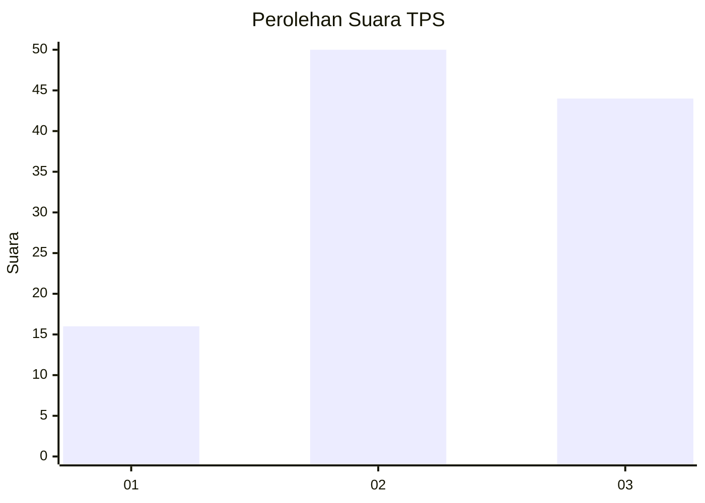
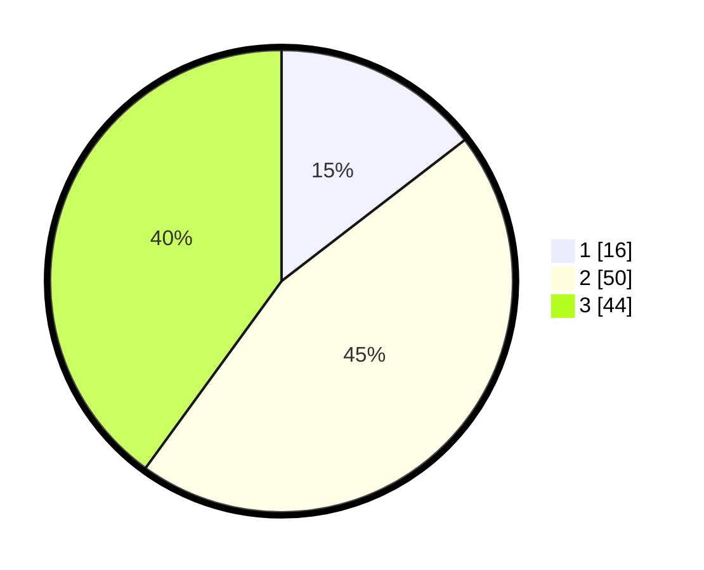

# Hasil

## Grafik

## Tabel

| No. | Nama Paslon    | Suara | Suara (raw) | Persentase |
|:--- |:-------------- | -----:| -----------:| ----------:|
| 1   | ANIES MUHAIMIN | 16    | [16][p-1]   | 14,55      |
| 2   | PRABOWO GIBRAN | 50    | [50][p-2]   | 45,45      |
| 3   | GANJAR MAHFUD  | 44    | [44][p-3]   | 40,00      |

[p-1]: https://github.com/gigit-pemilu/pemilu-2024-32-jawa-barat/blob/main/pilpres/hitung-suara/sub/32-jawa-barat/sub/03-cianjur/sub/01-cianjur/sub/1010-solokpandan/sub/007-tps/sub/paslon-1.txt
[p-2]: https://github.com/gigit-pemilu/pemilu-2024-32-jawa-barat/blob/main/pilpres/hitung-suara/sub/32-jawa-barat/sub/03-cianjur/sub/01-cianjur/sub/1010-solokpandan/sub/007-tps/sub/paslon-2.txt
[p-3]: https://github.com/gigit-pemilu/pemilu-2024-32-jawa-barat/blob/main/pilpres/hitung-suara/sub/32-jawa-barat/sub/03-cianjur/sub/01-cianjur/sub/1010-solokpandan/sub/007-tps/sub/paslon-3.txt

## Foto C Plano

https://sirekap-obj-formc.kpu.go.id/32b6/pemilu/ppwp/32/03/01/10/10/3203011010007-20240218-095904--9b891ea6-2214-414d-bb99-1d7de2808422.jpg

https://sirekap-obj-formc.kpu.go.id/32b6/pemilu/ppwp/32/03/01/10/10/3203011010007-20240218-095931--465aff93-0779-4fbe-887f-8ca6068f082e.jpg

https://sirekap-obj-formc.kpu.go.id/32b6/pemilu/ppwp/32/03/01/10/10/3203011010007-20240218-100000--de2db71d-3358-4b8c-9dbf-0cecbf7c3820.jpg

## Metadata

| Key        | Value               |
| ---------- | ------------------- |
| Time Stamp | 2024-02-19 18:00:00 |

