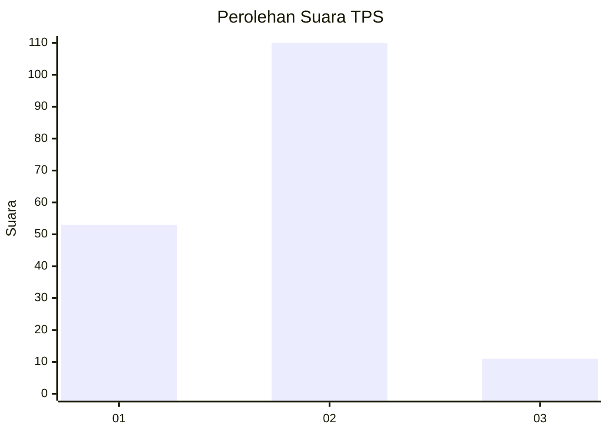
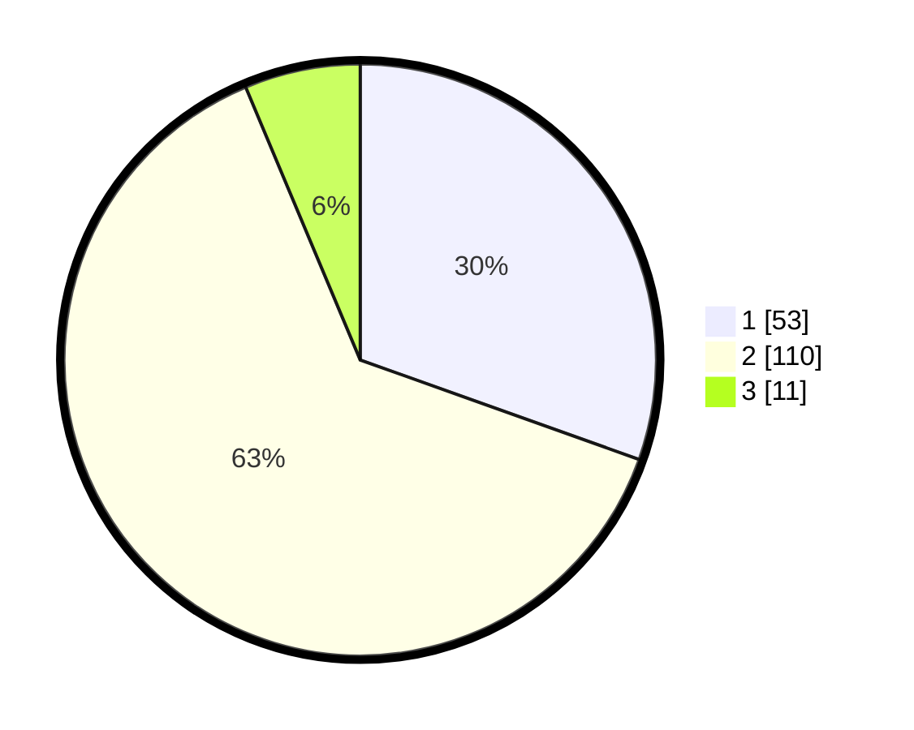

# Hasil

## Grafik

## Tabel

| No. | Nama Paslon    | Suara | Suara (raw) | Persentase |
|:--- |:-------------- | -----:| -----------:| ----------:|
| 1   | ANIES MUHAIMIN | 53    | [53][p-1]   | 30,46      |
| 2   | PRABOWO GIBRAN | 110   | [110][p-2]  | 63,22      |
| 3   | GANJAR MAHFUD  | 11    | [11][p-3]   | 6,32       |

[p-1]: https://github.com/gigit-pemilu/pemilu-2024/blob/main/pilpres/hitung-suara/sub/32-jawa-barat/sub/03-cianjur/sub/01-cianjur/sub/2001-babakankaret/sub/003-tps/sub/paslon-1.txt
[p-2]: https://github.com/gigit-pemilu/pemilu-2024/blob/main/pilpres/hitung-suara/sub/32-jawa-barat/sub/03-cianjur/sub/01-cianjur/sub/2001-babakankaret/sub/003-tps/sub/paslon-2.txt
[p-3]: https://github.com/gigit-pemilu/pemilu-2024/blob/main/pilpres/hitung-suara/sub/32-jawa-barat/sub/03-cianjur/sub/01-cianjur/sub/2001-babakankaret/sub/003-tps/sub/paslon-3.txt

## Foto C Plano

https://sirekap-obj-formc.kpu.go.id/af44/pemilu/ppwp/32/03/01/20/01/3203012001003-20240214-225620--c16fb4ab-7515-44ed-a7fc-9c4bb7a62a5a.jpg

https://sirekap-obj-formc.kpu.go.id/af44/pemilu/ppwp/32/03/01/20/01/3203012001003-20240214-225724--855faeef-34fa-4781-a3c1-4daec90cd938.jpg

https://sirekap-obj-formc.kpu.go.id/af44/pemilu/ppwp/32/03/01/20/01/3203012001003-20240214-225825--4308c13a-57e4-47bb-b132-750cd474e913.jpg

## Metadata

| Key        | Value               |
| ---------- | ------------------- |
| Time Stamp | 2024-02-24 22:31:28 |

