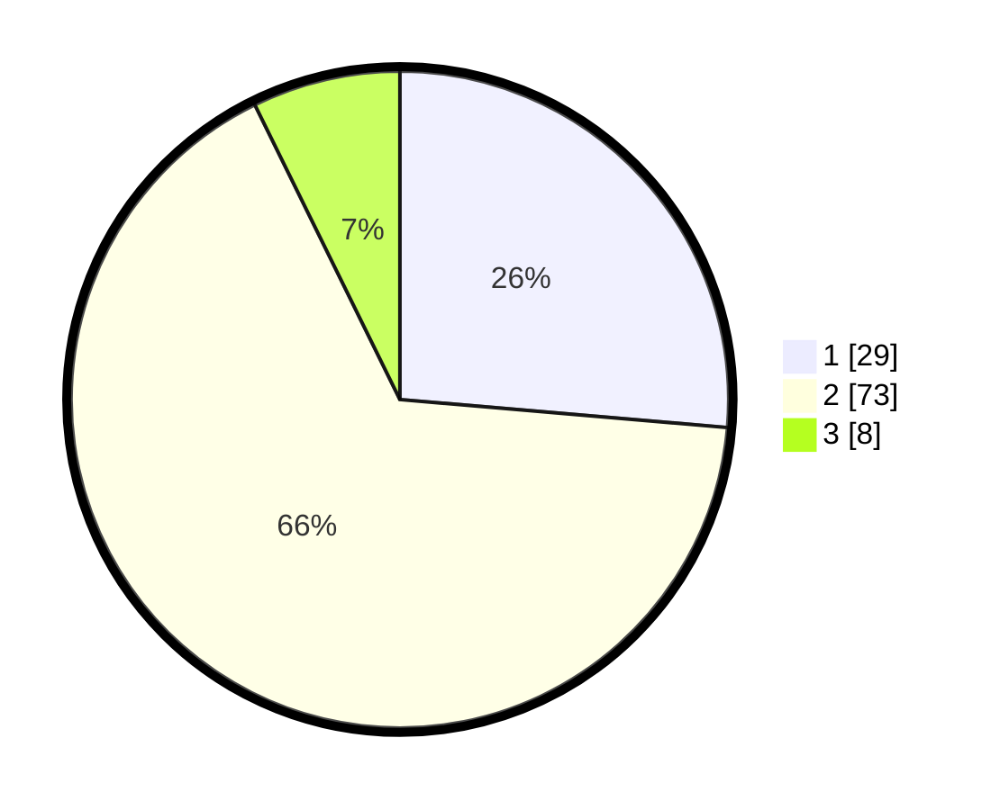

# Hasil

## Grafik

## Tabel

| No. | Nama Paslon    | Suara | Suara (raw) | Persentase |
|:--- |:-------------- | -----:| -----------:| ----------:|
| 1   | ANIES MUHAIMIN | 29    | [29][p-1]   | 26,36      |
| 2   | PRABOWO GIBRAN | 73    | [73][p-2]   | 66,36      |
| 3   | GANJAR MAHFUD  | 8     | [8][p-3]    | 7,27       |

[p-1]: https://github.com/gigit-pemilu/pemilu-2024/blob/main/pilpres/hitung-suara/sub/32-jawa-barat/sub/03-cianjur/sub/01-cianjur/sub/2001-babakankaret/sub/004-tps/sub/paslon-1.txt
[p-2]: https://github.com/gigit-pemilu/pemilu-2024/blob/main/pilpres/hitung-suara/sub/32-jawa-barat/sub/03-cianjur/sub/01-cianjur/sub/2001-babakankaret/sub/004-tps/sub/paslon-2.txt
[p-3]: https://github.com/gigit-pemilu/pemilu-2024/blob/main/pilpres/hitung-suara/sub/32-jawa-barat/sub/03-cianjur/sub/01-cianjur/sub/2001-babakankaret/sub/004-tps/sub/paslon-3.txt

## Foto C Plano

https://sirekap-obj-formc.kpu.go.id/16a2/pemilu/ppwp/32/03/01/20/01/3203012001004-20240214-223630--551a523c-119c-4091-8726-b2bf7d30812d.jpg

https://sirekap-obj-formc.kpu.go.id/16a2/pemilu/ppwp/32/03/01/20/01/3203012001004-20240214-225223--53be63f3-6fa7-468c-a8f7-61a7ff6c6281.jpg

https://sirekap-obj-formc.kpu.go.id/16a2/pemilu/ppwp/32/03/01/20/01/3203012001004-20240214-225250--f1607d52-be3c-4e76-bab2-22a9aca322c6.jpg

## Metadata

| Key        | Value               |
| ---------- | ------------------- |
| Time Stamp | 2024-02-25 12:00:00 |

