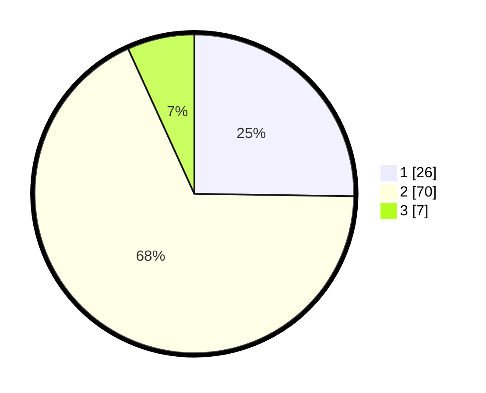

# Hasil

## Grafik

## Tabel

| No. | Nama Paslon    | Suara | Suara (raw) | Persentase |
|:--- |:-------------- | -----:| -----------:| ----------:|
| 1   | ANIES MUHAIMIN | 26    | [26][p-1]   | 25,24      |
| 2   | PRABOWO GIBRAN | 70    | [70][p-2]   | 67,96      |
| 3   | GANJAR MAHFUD  | 7     | [7][p-3]    | 6,80       |

[p-1]: https://github.com/gigit-pemilu/pemilu-2024/blob/main/pilpres/hitung-suara/sub/32-jawa-barat/sub/03-cianjur/sub/01-cianjur/sub/2002-nagrak/sub/012-tps/sub/paslon-1.txt
[p-2]: https://github.com/gigit-pemilu/pemilu-2024/blob/main/pilpres/hitung-suara/sub/32-jawa-barat/sub/03-cianjur/sub/01-cianjur/sub/2002-nagrak/sub/012-tps/sub/paslon-2.txt
[p-3]: https://github.com/gigit-pemilu/pemilu-2024/blob/main/pilpres/hitung-suara/sub/32-jawa-barat/sub/03-cianjur/sub/01-cianjur/sub/2002-nagrak/sub/012-tps/sub/paslon-3.txt

## Foto C Plano

https://sirekap-obj-formc.kpu.go.id/da01/pemilu/ppwp/32/03/01/20/02/3203012002012-20240214-200836--11367bc4-3109-4a80-ac1d-cf344c256526.jpg

https://sirekap-obj-formc.kpu.go.id/da01/pemilu/ppwp/32/03/01/20/02/3203012002012-20240214-201021--a9c62940-9530-4ebc-89dc-f247f2b9f87e.jpg

https://sirekap-obj-formc.kpu.go.id/da01/pemilu/ppwp/32/03/01/20/02/3203012002012-20240214-201135--97660813-efdc-44be-a725-3fe45c5db205.jpg

## Metadata

| Key        | Value               |
| ---------- | ------------------- |
| Time Stamp | 2024-02-19 06:16:00 |

