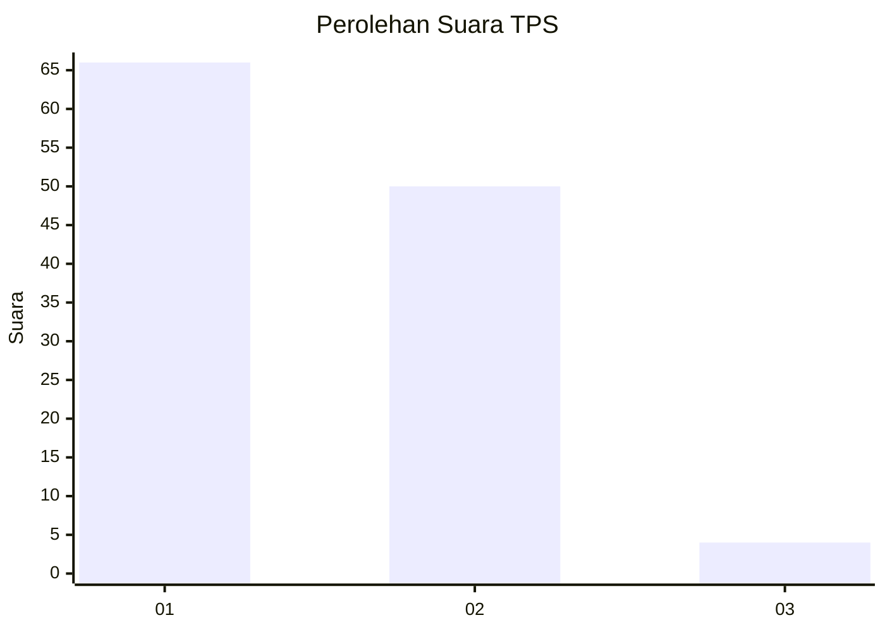
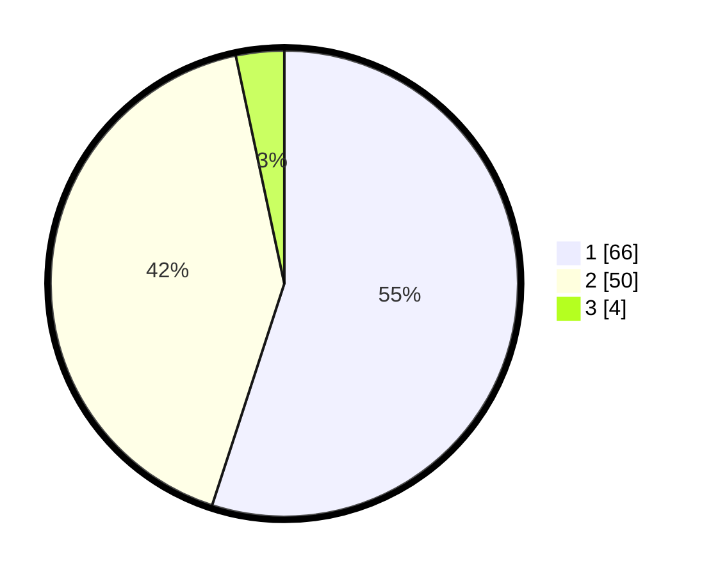

# Hasil

## Grafik

## Tabel

| No. | Nama Paslon    | Suara | Suara (raw) | Persentase |
|:--- |:-------------- | -----:| -----------:| ----------:|
| 1   | ANIES MUHAIMIN | 66    | [66][p-1]   | 55,00      |
| 2   | PRABOWO GIBRAN | 50    | [50][p-2]   | 41,67      |
| 3   | GANJAR MAHFUD  | 4     | [4][p-3]    | 3,33       |

[p-1]: https://github.com/gigit-pemilu/pemilu-2024/blob/main/pilpres/hitung-suara/sub/32-jawa-barat/sub/03-cianjur/sub/01-cianjur/sub/2002-nagrak/sub/039-tps/sub/paslon-1.txt
[p-2]: https://github.com/gigit-pemilu/pemilu-2024/blob/main/pilpres/hitung-suara/sub/32-jawa-barat/sub/03-cianjur/sub/01-cianjur/sub/2002-nagrak/sub/039-tps/sub/paslon-2.txt
[p-3]: https://github.com/gigit-pemilu/pemilu-2024/blob/main/pilpres/hitung-suara/sub/32-jawa-barat/sub/03-cianjur/sub/01-cianjur/sub/2002-nagrak/sub/039-tps/sub/paslon-3.txt

## Foto C Plano

https://sirekap-obj-formc.kpu.go.id/50eb/pemilu/ppwp/32/03/01/20/02/3203012002039-20240214-214012--768c7fe6-8e51-4256-9a34-2e8b4d1811b8.jpg

https://sirekap-obj-formc.kpu.go.id/50eb/pemilu/ppwp/32/03/01/20/02/3203012002039-20240214-235911--b8d2f1ed-94f1-4463-b2bf-5ef436d41308.jpg

https://sirekap-obj-formc.kpu.go.id/50eb/pemilu/ppwp/32/03/01/20/02/3203012002039-20240215-004458--1e7e5a70-d238-4129-91c1-fd927b24e3bf.jpg

## Metadata

| Key        | Value               |
| ---------- | ------------------- |
| Time Stamp | 2024-02-19 23:00:00 |

