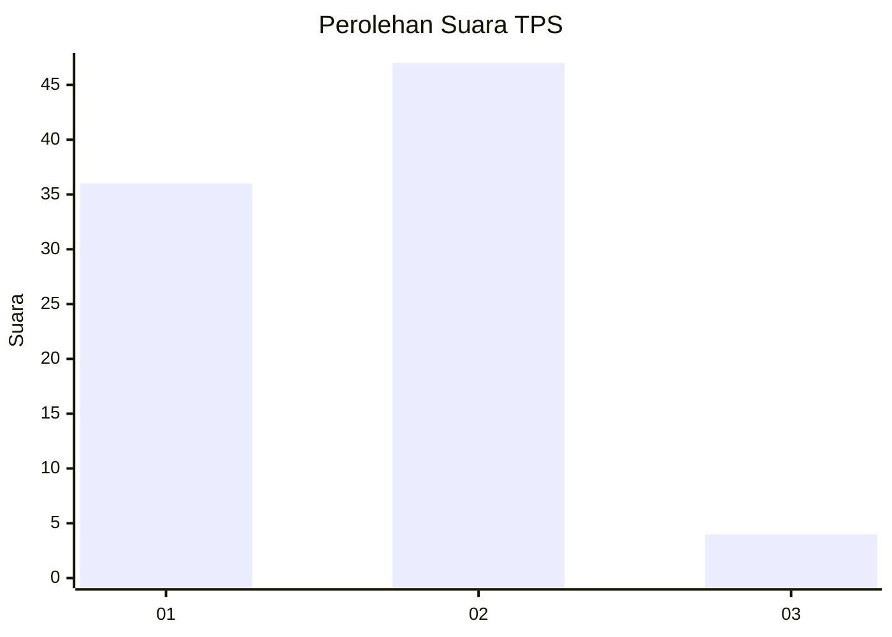
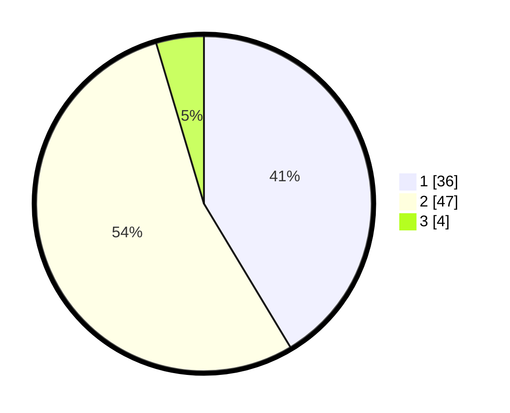

# Hasil

## Grafik

## Tabel

| No. | Nama Paslon    | Suara | Suara (raw) | Persentase |
|:--- |:-------------- | -----:| -----------:| ----------:|
| 1   | ANIES MUHAIMIN | 36    | [36][p-1]   | 41,38      |
| 2   | PRABOWO GIBRAN | 47    | [47][p-2]   | 54,02      |
| 3   | GANJAR MAHFUD  | 4     | [4][p-3]    | 4,60       |

[p-1]: https://github.com/gigit-pemilu/pemilu-2024-32-jawa-barat/blob/main/pilpres/hitung-suara/sub/32-jawa-barat/sub/03-cianjur/sub/01-cianjur/sub/2004-mekarsari/sub/004-tps/sub/paslon-1.txt
[p-2]: https://github.com/gigit-pemilu/pemilu-2024-32-jawa-barat/blob/main/pilpres/hitung-suara/sub/32-jawa-barat/sub/03-cianjur/sub/01-cianjur/sub/2004-mekarsari/sub/004-tps/sub/paslon-2.txt
[p-3]: https://github.com/gigit-pemilu/pemilu-2024-32-jawa-barat/blob/main/pilpres/hitung-suara/sub/32-jawa-barat/sub/03-cianjur/sub/01-cianjur/sub/2004-mekarsari/sub/004-tps/sub/paslon-3.txt

## Foto C Plano

https://sirekap-obj-formc.kpu.go.id/8f33/pemilu/ppwp/32/03/01/20/04/3203012004004-20240218-155637--9a62858d-5860-48f0-b4cc-84661c415af9.jpg

https://sirekap-obj-formc.kpu.go.id/8f33/pemilu/ppwp/32/03/01/20/04/3203012004004-20240218-155712--cf4434b9-e73d-44f0-8ba9-d674946810ae.jpg

https://sirekap-obj-formc.kpu.go.id/8f33/pemilu/ppwp/32/03/01/20/04/3203012004004-20240218-155751--aee1d1ba-49e7-4c40-a0e2-77d41d054b0f.jpg

## Metadata

| Key        | Value               |
| ---------- | ------------------- |
| Time Stamp | 2024-02-20 00:00:00 |

