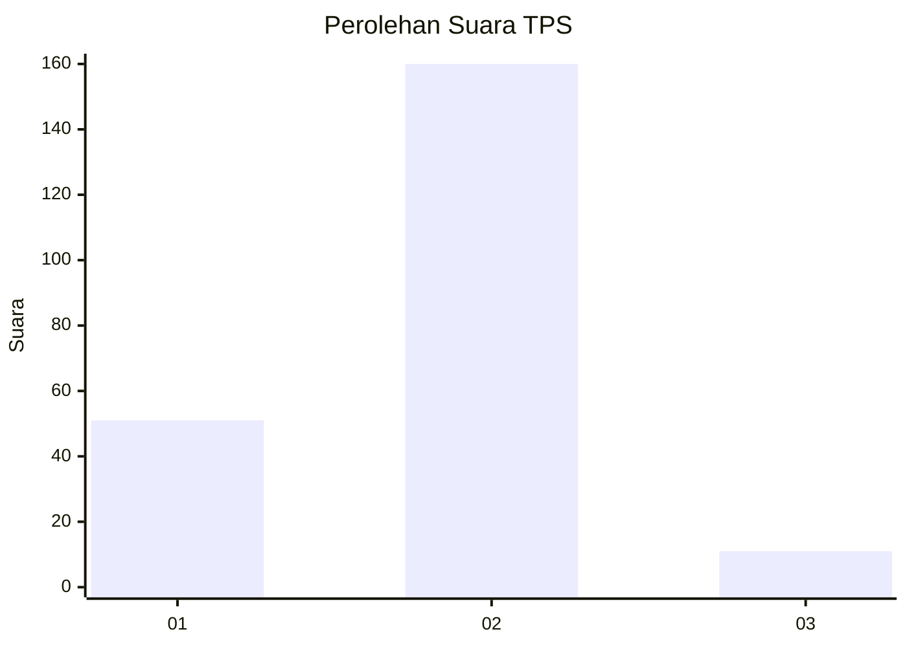
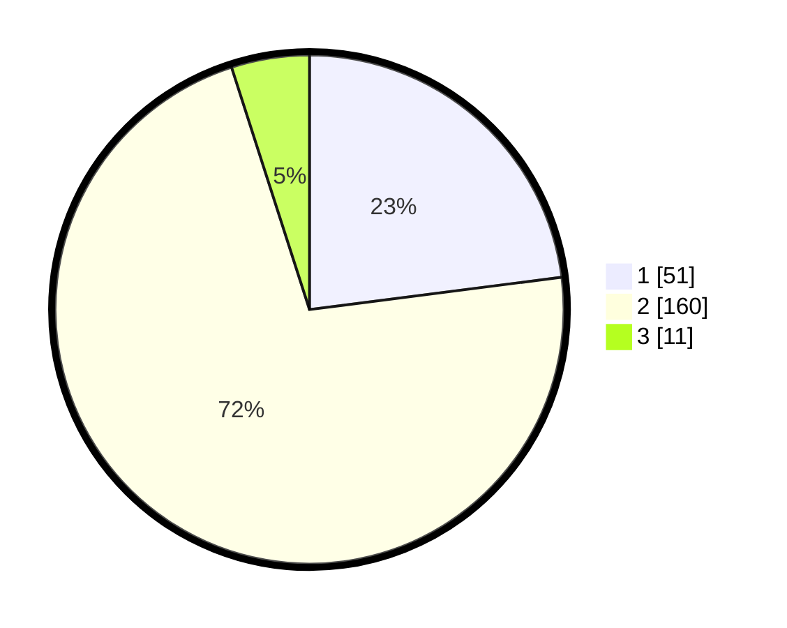

# Hasil

## Grafik

## Tabel

| No. | Nama Paslon    | Suara | Suara (raw) | Persentase |
|:--- |:-------------- | -----:| -----------:| ----------:|
| 1   | ANIES MUHAIMIN | 51    | [51][p-1]   | 22,97      |
| 2   | PRABOWO GIBRAN | 160   | [160][p-2]  | 72,07      |
| 3   | GANJAR MAHFUD  | 11    | [11][p-3]   | 4,95       |

[p-1]: https://github.com/gigit-pemilu/pemilu-2024/blob/main/pilpres/hitung-suara/sub/32-jawa-barat/sub/03-cianjur/sub/02-warungkondang/sub/2002-jambudipa/sub/006-tps/sub/paslon-1.txt
[p-2]: https://github.com/gigit-pemilu/pemilu-2024/blob/main/pilpres/hitung-suara/sub/32-jawa-barat/sub/03-cianjur/sub/02-warungkondang/sub/2002-jambudipa/sub/006-tps/sub/paslon-2.txt
[p-3]: https://github.com/gigit-pemilu/pemilu-2024/blob/main/pilpres/hitung-suara/sub/32-jawa-barat/sub/03-cianjur/sub/02-warungkondang/sub/2002-jambudipa/sub/006-tps/sub/paslon-3.txt

## Foto C Plano

https://sirekap-obj-formc.kpu.go.id/6d42/pemilu/ppwp/32/03/02/20/02/3203022002006-20240215-001417--d5dd4ec4-9ee1-4f38-8229-e67720b1f984.jpg

https://sirekap-obj-formc.kpu.go.id/6d42/pemilu/ppwp/32/03/02/20/02/3203022002006-20240215-001546--b1e6928a-38f6-4bc6-864c-2c8748a08244.jpg

https://sirekap-obj-formc.kpu.go.id/6d42/pemilu/ppwp/32/03/02/20/02/3203022002006-20240215-001503--a7db76dc-fc93-4f7f-a91f-22522f19df66.jpg

## Metadata

| Key        | Value               |
| ---------- | ------------------- |
| Time Stamp | 2024-02-16 13:30:32 |

