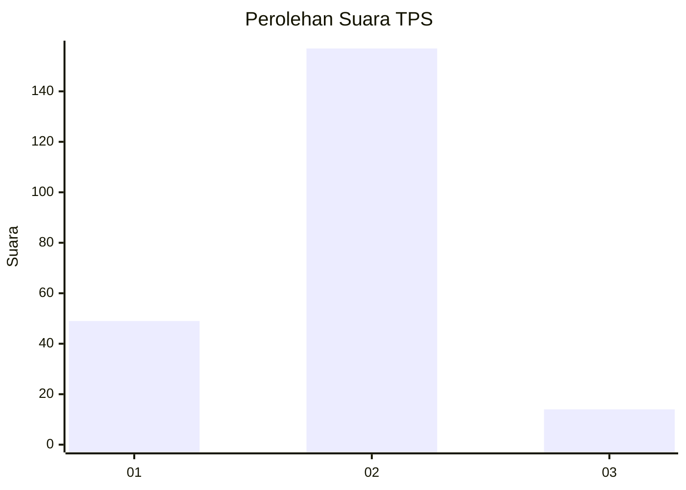

# Hasil

## Grafik

## Tabel

| No. | Nama Paslon    | Suara | Suara (raw) | Persentase |
|:--- |:-------------- | -----:| -----------:| ----------:|
| 1   | ANIES MUHAIMIN | 49    | [49][p-1]   | 22,27      |
| 2   | PRABOWO GIBRAN | 157   | [157][p-2]  | 71,36      |
| 3   | GANJAR MAHFUD  | 14    | [14][p-3]   | 6,36       |

[p-1]: https://github.com/gigit-pemilu/pemilu-2024/blob/main/pilpres/hitung-suara/sub/32-jawa-barat/sub/03-cianjur/sub/02-warungkondang/sub/2006-cisarandi/sub/002-tps/sub/paslon-1.txt
[p-2]: https://github.com/gigit-pemilu/pemilu-2024/blob/main/pilpres/hitung-suara/sub/32-jawa-barat/sub/03-cianjur/sub/02-warungkondang/sub/2006-cisarandi/sub/002-tps/sub/paslon-2.txt
[p-3]: https://github.com/gigit-pemilu/pemilu-2024/blob/main/pilpres/hitung-suara/sub/32-jawa-barat/sub/03-cianjur/sub/02-warungkondang/sub/2006-cisarandi/sub/002-tps/sub/paslon-3.txt

## Foto C Plano

https://sirekap-obj-formc.kpu.go.id/adfe/pemilu/ppwp/32/03/02/20/06/3203022006002-20240215-000206--2fa0f193-73bb-4a48-a654-a87ab5f154cd.jpg

https://sirekap-obj-formc.kpu.go.id/adfe/pemilu/ppwp/32/03/02/20/06/3203022006002-20240215-000206--2f6856f0-c43a-420a-8280-11ba965952c2.jpg

https://sirekap-obj-formc.kpu.go.id/adfe/pemilu/ppwp/32/03/02/20/06/3203022006002-20240215-000236--4163aa5d-d0fd-4a8c-a98e-a6d9ff923385.jpg

## Metadata

| Key        | Value               |
| ---------- | ------------------- |
| Time Stamp | 2024-02-15 17:00:25 |

