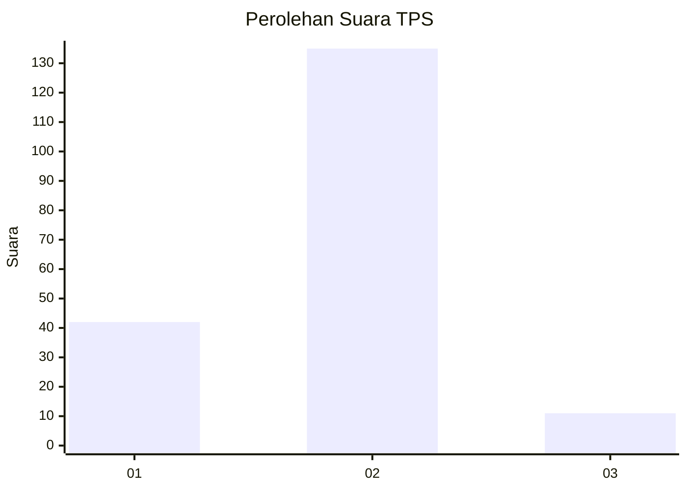
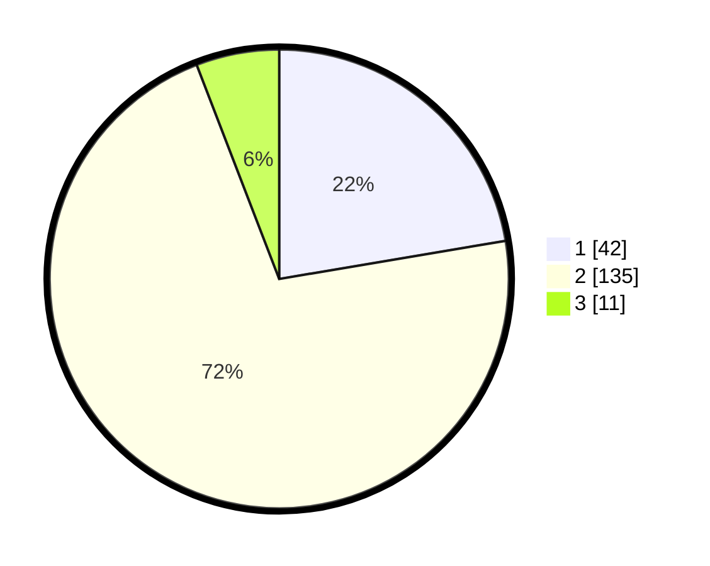

# Hasil

## Grafik

## Tabel

| No. | Nama Paslon    | Suara | Suara (raw) | Persentase |
|:--- |:-------------- | -----:| -----------:| ----------:|
| 1   | ANIES MUHAIMIN | 42    | [42][p-1]   | 22,34      |
| 2   | PRABOWO GIBRAN | 135   | [135][p-2]  | 71,81      |
| 3   | GANJAR MAHFUD  | 11    | [11][p-3]   | 5,85       |

[p-1]: https://github.com/gigit-pemilu/pemilu-2024-32-jawa-barat/blob/main/pilpres/hitung-suara/sub/32-jawa-barat/sub/03-cianjur/sub/02-warungkondang/sub/2006-cisarandi/sub/004-tps/sub/paslon-1.txt
[p-2]: https://github.com/gigit-pemilu/pemilu-2024-32-jawa-barat/blob/main/pilpres/hitung-suara/sub/32-jawa-barat/sub/03-cianjur/sub/02-warungkondang/sub/2006-cisarandi/sub/004-tps/sub/paslon-2.txt
[p-3]: https://github.com/gigit-pemilu/pemilu-2024-32-jawa-barat/blob/main/pilpres/hitung-suara/sub/32-jawa-barat/sub/03-cianjur/sub/02-warungkondang/sub/2006-cisarandi/sub/004-tps/sub/paslon-3.txt

## Foto C Plano

https://sirekap-obj-formc.kpu.go.id/bc51/pemilu/ppwp/32/03/02/20/06/3203022006004-20240214-194525--058e4750-6b57-4376-92cd-a73ec3b4b679.jpg

https://sirekap-obj-formc.kpu.go.id/bc51/pemilu/ppwp/32/03/02/20/06/3203022006004-20240214-194611--bb50f985-9141-4d62-9718-49a31034ed3f.jpg

https://sirekap-obj-formc.kpu.go.id/bc51/pemilu/ppwp/32/03/02/20/06/3203022006004-20240214-194703--91c095ed-5bcd-4434-824b-7c92938d953e.jpg

## Metadata

| Key        | Value               |
| ---------- | ------------------- |
| Time Stamp | 2024-02-15 15:30:25 |

