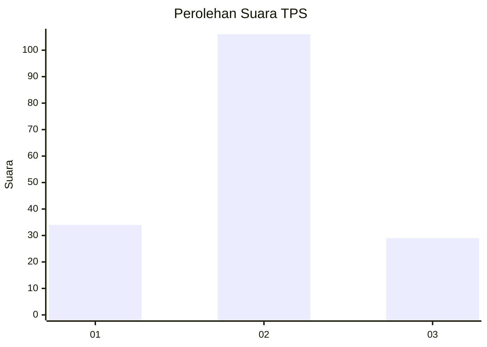

# Hasil

## Grafik

## Tabel

| No. | Nama Paslon    | Suara | Suara (raw) | Persentase |
|:--- |:-------------- | -----:| -----------:| ----------:|
| 1   | ANIES MUHAIMIN | 34    | [34][p-1]   | 20,12      |
| 2   | PRABOWO GIBRAN | 106   | [106][p-2]  | 62,72      |
| 3   | GANJAR MAHFUD  | 29    | [29][p-3]   | 17,16      |

[p-1]: https://github.com/gigit-pemilu/pemilu-2024/blob/main/pilpres/hitung-suara/sub/32-jawa-barat/sub/03-cianjur/sub/02-warungkondang/sub/2006-cisarandi/sub/006-tps/sub/paslon-1.txt
[p-2]: https://github.com/gigit-pemilu/pemilu-2024/blob/main/pilpres/hitung-suara/sub/32-jawa-barat/sub/03-cianjur/sub/02-warungkondang/sub/2006-cisarandi/sub/006-tps/sub/paslon-2.txt
[p-3]: https://github.com/gigit-pemilu/pemilu-2024/blob/main/pilpres/hitung-suara/sub/32-jawa-barat/sub/03-cianjur/sub/02-warungkondang/sub/2006-cisarandi/sub/006-tps/sub/paslon-3.txt

## Foto C Plano

https://sirekap-obj-formc.kpu.go.id/1f26/pemilu/ppwp/32/03/02/20/06/3203022006006-20240214-191202--bdec2c2e-14a9-4885-924c-e9cf6dbd64c1.jpg

https://sirekap-obj-formc.kpu.go.id/1f26/pemilu/ppwp/32/03/02/20/06/3203022006006-20240214-191555--3a123134-42b2-40bc-aaf3-2c22b7165b4f.jpg

https://sirekap-obj-formc.kpu.go.id/1f26/pemilu/ppwp/32/03/02/20/06/3203022006006-20240214-192133--bf4c69e0-a0f8-4f94-be43-8d178c302a89.jpg

## Metadata

| Key        | Value               |
| ---------- | ------------------- |
| Time Stamp | 2024-02-16 13:30:32 |

