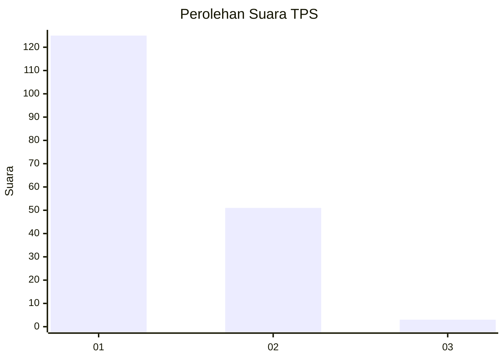
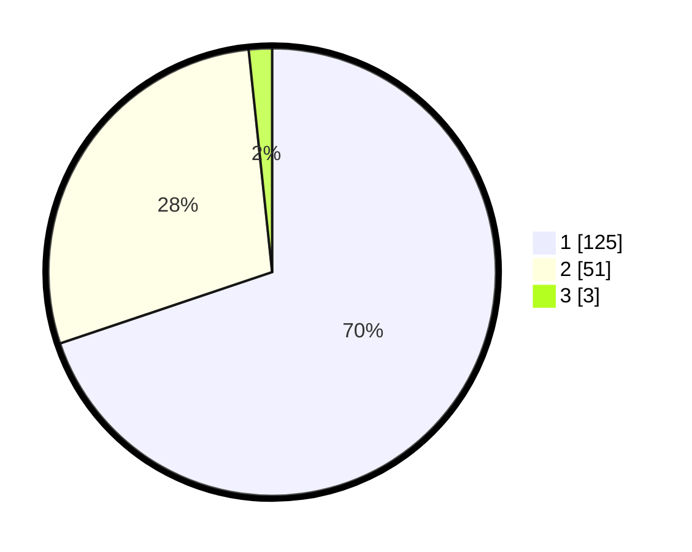

# Hasil

## Grafik

## Tabel

| No. | Nama Paslon    | Suara | Suara (raw) | Persentase |
|:--- |:-------------- | -----:| -----------:| ----------:|
| 1   | ANIES MUHAIMIN | 125   | [125][p-1]  | 69,83      |
| 2   | PRABOWO GIBRAN | 51    | [51][p-2]   | 28,49      |
| 3   | GANJAR MAHFUD  | 3     | [3][p-3]    | 1,68       |

[p-1]: https://github.com/gigit-pemilu/pemilu-2024/blob/main/pilpres/hitung-suara/sub/32-jawa-barat/sub/03-cianjur/sub/02-warungkondang/sub/2014-bunisari/sub/007-tps/sub/paslon-1.txt
[p-2]: https://github.com/gigit-pemilu/pemilu-2024/blob/main/pilpres/hitung-suara/sub/32-jawa-barat/sub/03-cianjur/sub/02-warungkondang/sub/2014-bunisari/sub/007-tps/sub/paslon-2.txt
[p-3]: https://github.com/gigit-pemilu/pemilu-2024/blob/main/pilpres/hitung-suara/sub/32-jawa-barat/sub/03-cianjur/sub/02-warungkondang/sub/2014-bunisari/sub/007-tps/sub/paslon-3.txt

## Foto C Plano

https://sirekap-obj-formc.kpu.go.id/3961/pemilu/ppwp/32/03/02/20/14/3203022014007-20240214-194344--7234a138-fc7f-41ad-b03e-5e8781a82b02.jpg

https://sirekap-obj-formc.kpu.go.id/3961/pemilu/ppwp/32/03/02/20/14/3203022014007-20240214-194455--cdf24c95-f7e9-4688-8656-44e94baa4812.jpg

https://sirekap-obj-formc.kpu.go.id/3961/pemilu/ppwp/32/03/02/20/14/3203022014007-20240214-194553--0aafc586-e636-4577-9b20-cd4c258b103a.jpg

## Metadata

| Key        | Value               |
| ---------- | ------------------- |
| Time Stamp | 2024-02-16 14:30:33 |

