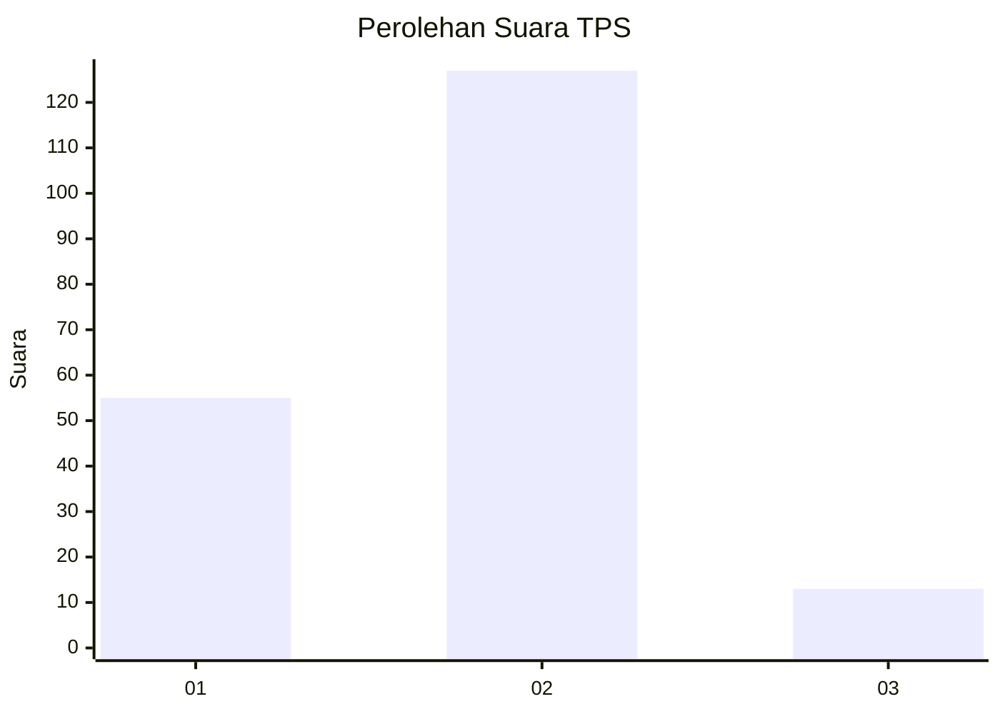
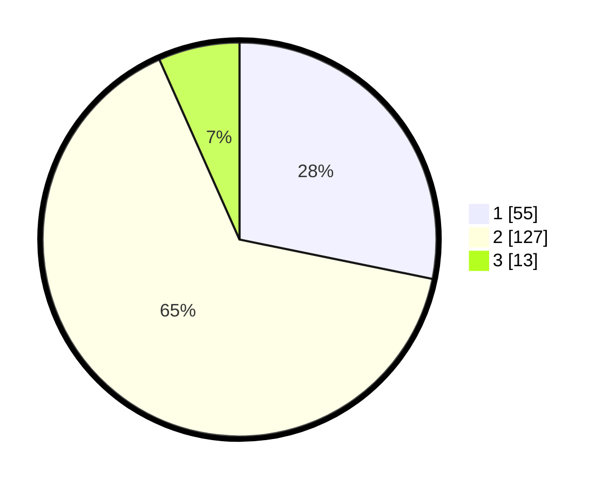

# Hasil

## Grafik

## Tabel

| No. | Nama Paslon    | Suara | Suara (raw) | Persentase |
|:--- |:-------------- | -----:| -----------:| ----------:|
| 1   | ANIES MUHAIMIN | 55    | [55][p-1]   | 28,21      |
| 2   | PRABOWO GIBRAN | 127   | [127][p-2]  | 65,13      |
| 3   | GANJAR MAHFUD  | 13    | [13][p-3]   | 6,67       |

[p-1]: https://github.com/gigit-pemilu/pemilu-2024/blob/main/pilpres/hitung-suara/sub/32-jawa-barat/sub/03-cianjur/sub/02-warungkondang/sub/2017-cieundeur/sub/005-tps/sub/paslon-1.txt
[p-2]: https://github.com/gigit-pemilu/pemilu-2024/blob/main/pilpres/hitung-suara/sub/32-jawa-barat/sub/03-cianjur/sub/02-warungkondang/sub/2017-cieundeur/sub/005-tps/sub/paslon-2.txt
[p-3]: https://github.com/gigit-pemilu/pemilu-2024/blob/main/pilpres/hitung-suara/sub/32-jawa-barat/sub/03-cianjur/sub/02-warungkondang/sub/2017-cieundeur/sub/005-tps/sub/paslon-3.txt

## Foto C Plano

https://sirekap-obj-formc.kpu.go.id/3fc1/pemilu/ppwp/32/03/02/20/17/3203022017005-20240214-233335--51ad9fb2-25b4-4119-8f21-5e6f97ffe2d1.jpg

https://sirekap-obj-formc.kpu.go.id/3fc1/pemilu/ppwp/32/03/02/20/17/3203022017005-20240214-233542--42895742-9045-4726-9c8f-25fcb7a3c6b8.jpg

https://sirekap-obj-formc.kpu.go.id/3fc1/pemilu/ppwp/32/03/02/20/17/3203022017005-20240214-233515--b1371251-c597-4be7-a142-e4cb0657358f.jpg

## Metadata

| Key        | Value               |
| ---------- | ------------------- |
| Time Stamp | 2024-02-24 22:31:28 |

