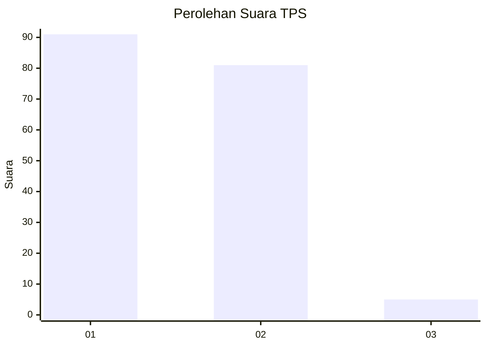
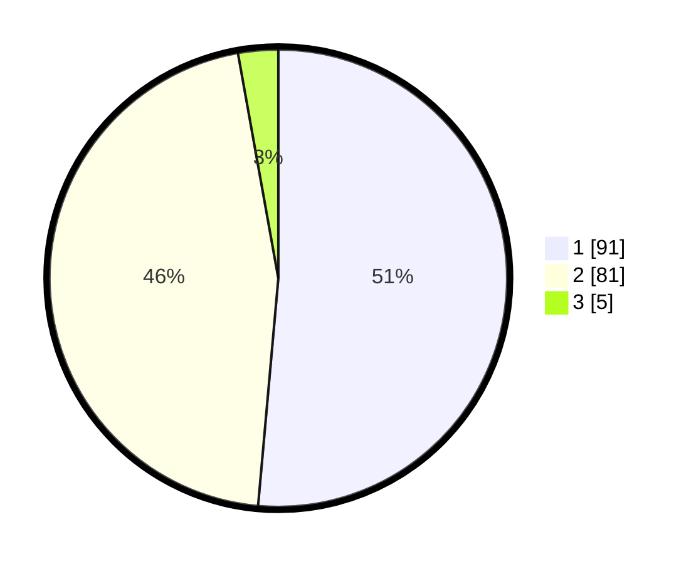

# Hasil

## Grafik

## Tabel

| No. | Nama Paslon    | Suara | Suara (raw) | Persentase |
|:--- |:-------------- | -----:| -----------:| ----------:|
| 1   | ANIES MUHAIMIN | 91    | [91][p-1]   | 51,41      |
| 2   | PRABOWO GIBRAN | 81    | [81][p-2]   | 45,76      |
| 3   | GANJAR MAHFUD  | 5     | [5][p-3]    | 2,82       |

[p-1]: https://github.com/gigit-pemilu/pemilu-2024/blob/main/pilpres/hitung-suara/sub/32-jawa-barat/sub/03-cianjur/sub/03-cibeber/sub/2001-cipetir/sub/013-tps/sub/paslon-1.txt
[p-2]: https://github.com/gigit-pemilu/pemilu-2024/blob/main/pilpres/hitung-suara/sub/32-jawa-barat/sub/03-cianjur/sub/03-cibeber/sub/2001-cipetir/sub/013-tps/sub/paslon-2.txt
[p-3]: https://github.com/gigit-pemilu/pemilu-2024/blob/main/pilpres/hitung-suara/sub/32-jawa-barat/sub/03-cianjur/sub/03-cibeber/sub/2001-cipetir/sub/013-tps/sub/paslon-3.txt

## Foto C Plano

https://sirekap-obj-formc.kpu.go.id/4a03/pemilu/ppwp/32/03/03/20/01/3203032001013-20240214-214400--52faa8c2-0c88-4a52-95e4-23919a95e71c.jpg

https://sirekap-obj-formc.kpu.go.id/4a03/pemilu/ppwp/32/03/03/20/01/3203032001013-20240214-214723--18e0bf86-88c2-4ce3-be3f-d2aa5cb12836.jpg

https://sirekap-obj-formc.kpu.go.id/4a03/pemilu/ppwp/32/03/03/20/01/3203032001013-20240214-214923--3793d47c-847b-4fc6-9858-aa0db83bb54e.jpg

## Metadata

| Key        | Value               |
| ---------- | ------------------- |
| Time Stamp | 2024-02-16 13:30:32 |

