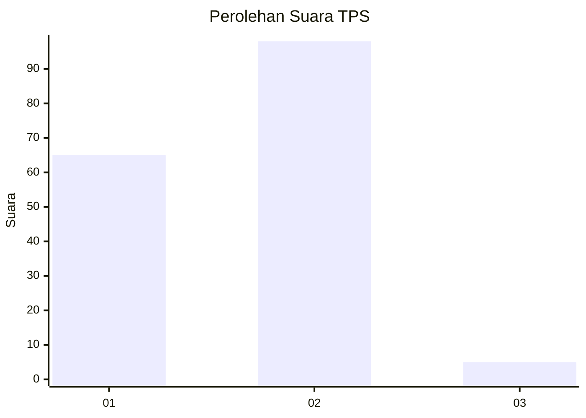
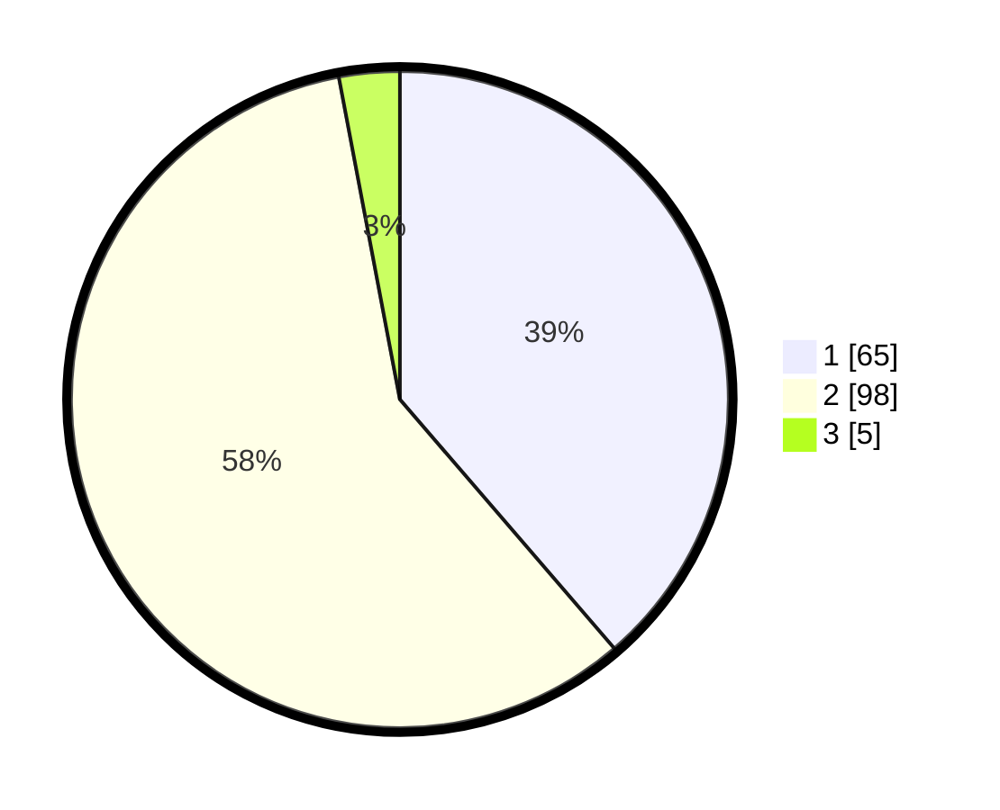

# Hasil

## Grafik

## Tabel

| No. | Nama Paslon    | Suara | Suara (raw) | Persentase |
|:--- |:-------------- | -----:| -----------:| ----------:|
| 1   | ANIES MUHAIMIN | 65    | [65][p-1]   | 38,69      |
| 2   | PRABOWO GIBRAN | 98    | [98][p-2]   | 58,33      |
| 3   | GANJAR MAHFUD  | 5     | [5][p-3]    | 2,98       |

[p-1]: https://github.com/gigit-pemilu/pemilu-2024/blob/main/pilpres/hitung-suara/sub/32-jawa-barat/sub/03-cianjur/sub/03-cibeber/sub/2006-peuteuycondong/sub/025-tps/sub/paslon-1.txt
[p-2]: https://github.com/gigit-pemilu/pemilu-2024/blob/main/pilpres/hitung-suara/sub/32-jawa-barat/sub/03-cianjur/sub/03-cibeber/sub/2006-peuteuycondong/sub/025-tps/sub/paslon-2.txt
[p-3]: https://github.com/gigit-pemilu/pemilu-2024/blob/main/pilpres/hitung-suara/sub/32-jawa-barat/sub/03-cianjur/sub/03-cibeber/sub/2006-peuteuycondong/sub/025-tps/sub/paslon-3.txt

## Foto C Plano

https://sirekap-obj-formc.kpu.go.id/063c/pemilu/ppwp/32/03/03/20/06/3203032006025-20240215-023609--1adbcc68-c8e2-406c-bde4-bdbfafe52723.jpg

https://sirekap-obj-formc.kpu.go.id/063c/pemilu/ppwp/32/03/03/20/06/3203032006025-20240215-023546--da00d000-a2cc-478a-969e-06efc49486d7.jpg

https://sirekap-obj-formc.kpu.go.id/063c/pemilu/ppwp/32/03/03/20/06/3203032006025-20240214-141900--a0c9f6e6-70a3-4478-8208-037dabe7bec4.jpg

## Metadata

| Key        | Value               |
| ---------- | ------------------- |
| Time Stamp | 2024-02-15 06:00:23 |

