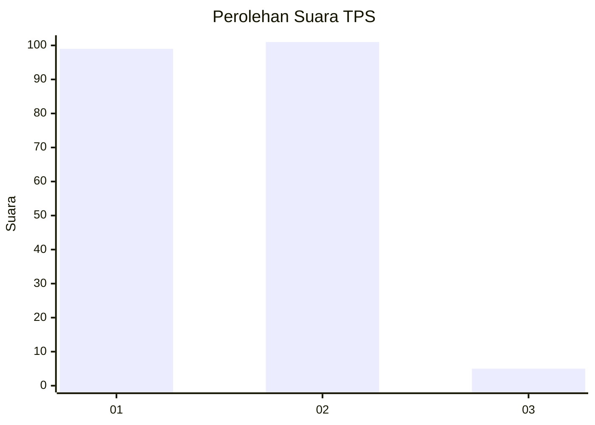
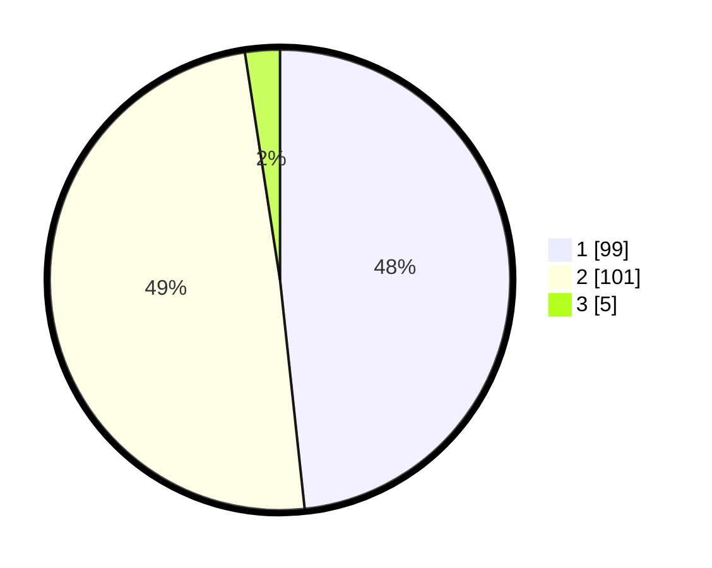

# Hasil

## Grafik

## Tabel

| No. | Nama Paslon    | Suara | Suara (raw) | Persentase |
|:--- |:-------------- | -----:| -----------:| ----------:|
| 1   | ANIES MUHAIMIN | 99    | [99][p-1]   | 48,29      |
| 2   | PRABOWO GIBRAN | 101   | [101][p-2]  | 49,27      |
| 3   | GANJAR MAHFUD  | 5     | [5][p-3]    | 2,44       |

[p-1]: https://github.com/gigit-pemilu/pemilu-2024/blob/main/pilpres/hitung-suara/sub/32-jawa-barat/sub/03-cianjur/sub/04-cilaku/sub/2001-rancagoong/sub/007-tps/sub/paslon-1.txt
[p-2]: https://github.com/gigit-pemilu/pemilu-2024/blob/main/pilpres/hitung-suara/sub/32-jawa-barat/sub/03-cianjur/sub/04-cilaku/sub/2001-rancagoong/sub/007-tps/sub/paslon-2.txt
[p-3]: https://github.com/gigit-pemilu/pemilu-2024/blob/main/pilpres/hitung-suara/sub/32-jawa-barat/sub/03-cianjur/sub/04-cilaku/sub/2001-rancagoong/sub/007-tps/sub/paslon-3.txt

## Foto C Plano

https://sirekap-obj-formc.kpu.go.id/066b/pemilu/ppwp/32/03/04/20/01/3203042001007-20240214-160122--cd51a662-030f-40a9-bd07-8ab2a2f089e1.jpg

https://sirekap-obj-formc.kpu.go.id/066b/pemilu/ppwp/32/03/04/20/01/3203042001007-20240214-162220--0ae1cd3c-fea3-43c6-acac-392febb0507c.jpg

https://sirekap-obj-formc.kpu.go.id/066b/pemilu/ppwp/32/03/04/20/01/3203042001007-20240214-191042--92bd3654-62cb-4aba-85e3-73ab7b527290.jpg

## Metadata

| Key        | Value               |
| ---------- | ------------------- |
| Time Stamp | 2024-02-14 21:46:01 |

