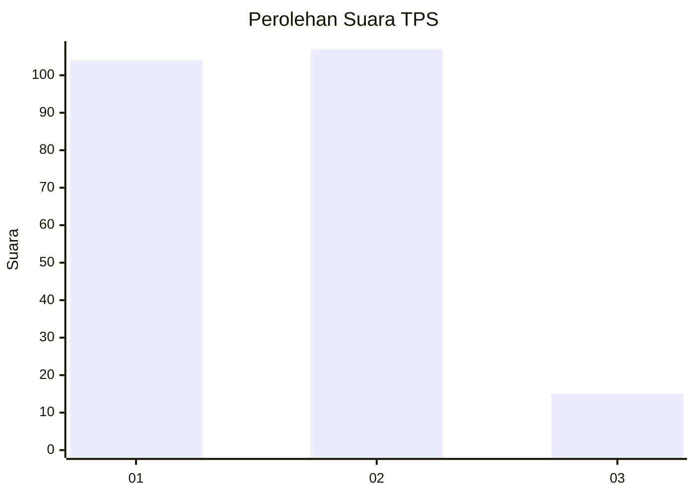
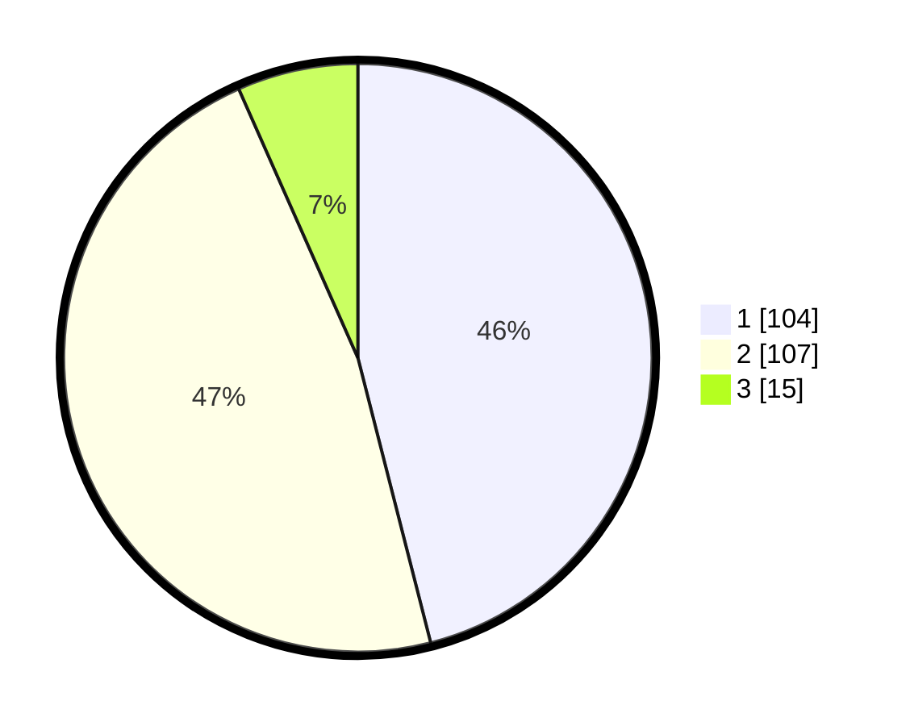

# Hasil

## Grafik

## Tabel

| No. | Nama Paslon    | Suara | Suara (raw) | Persentase |
|:--- |:-------------- | -----:| -----------:| ----------:|
| 1   | ANIES MUHAIMIN | 104   | [104][p-1]  | 46,02      |
| 2   | PRABOWO GIBRAN | 107   | [107][p-2]  | 47,35      |
| 3   | GANJAR MAHFUD  | 15    | [15][p-3]   | 6,64       |

[p-1]: https://github.com/gigit-pemilu/pemilu-2024/blob/main/pilpres/hitung-suara/sub/32-jawa-barat/sub/03-cianjur/sub/04-cilaku/sub/2001-rancagoong/sub/010-tps/sub/paslon-1.txt
[p-2]: https://github.com/gigit-pemilu/pemilu-2024/blob/main/pilpres/hitung-suara/sub/32-jawa-barat/sub/03-cianjur/sub/04-cilaku/sub/2001-rancagoong/sub/010-tps/sub/paslon-2.txt
[p-3]: https://github.com/gigit-pemilu/pemilu-2024/blob/main/pilpres/hitung-suara/sub/32-jawa-barat/sub/03-cianjur/sub/04-cilaku/sub/2001-rancagoong/sub/010-tps/sub/paslon-3.txt

## Foto C Plano

https://sirekap-obj-formc.kpu.go.id/8b50/pemilu/ppwp/32/03/04/20/01/3203042001010-20240214-221926--6c3e5b16-a3d5-492c-bf1a-05ee742032e8.jpg

https://sirekap-obj-formc.kpu.go.id/8b50/pemilu/ppwp/32/03/04/20/01/3203042001010-20240214-221929--7dd7e0f9-3aeb-42fa-a8ce-7e536489e42b.jpg

https://sirekap-obj-formc.kpu.go.id/8b50/pemilu/ppwp/32/03/04/20/01/3203042001010-20240214-221931--38a710fe-a722-4eb0-bc18-f701e2530aae.jpg

## Metadata

| Key        | Value               |
| ---------- | ------------------- |
| Time Stamp | 2024-02-16 16:25:10 |

