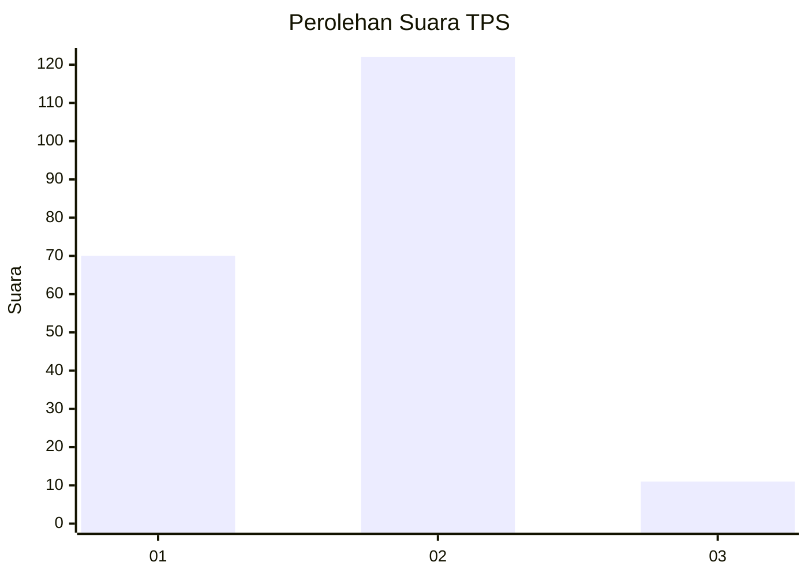
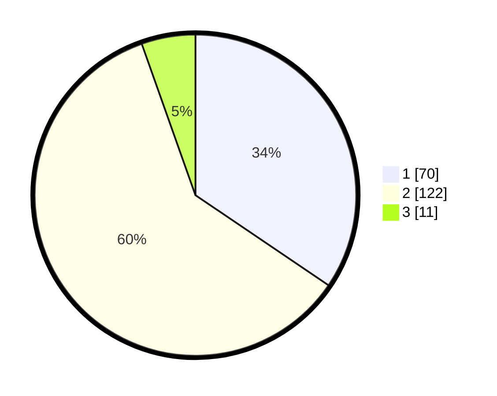

# Hasil

## Grafik

## Tabel

| No. | Nama Paslon    | Suara | Suara (raw) | Persentase |
|:--- |:-------------- | -----:| -----------:| ----------:|
| 1   | ANIES MUHAIMIN | 70    | [70][p-1]   | 34,48      |
| 2   | PRABOWO GIBRAN | 122   | [122][p-2]  | 60,10      |
| 3   | GANJAR MAHFUD  | 11    | [11][p-3]   | 5,42       |

[p-1]: https://github.com/gigit-pemilu/pemilu-2024-32-jawa-barat/blob/main/pilpres/hitung-suara/sub/32-jawa-barat/sub/03-cianjur/sub/04-cilaku/sub/2001-rancagoong/sub/022-tps/sub/paslon-1.txt
[p-2]: https://github.com/gigit-pemilu/pemilu-2024-32-jawa-barat/blob/main/pilpres/hitung-suara/sub/32-jawa-barat/sub/03-cianjur/sub/04-cilaku/sub/2001-rancagoong/sub/022-tps/sub/paslon-2.txt
[p-3]: https://github.com/gigit-pemilu/pemilu-2024-32-jawa-barat/blob/main/pilpres/hitung-suara/sub/32-jawa-barat/sub/03-cianjur/sub/04-cilaku/sub/2001-rancagoong/sub/022-tps/sub/paslon-3.txt

## Foto C Plano

https://sirekap-obj-formc.kpu.go.id/d9c5/pemilu/ppwp/32/03/04/20/01/3203042001022-20240214-191052--152ac5d3-be9a-4acb-8579-8131d5940129.jpg

https://sirekap-obj-formc.kpu.go.id/d9c5/pemilu/ppwp/32/03/04/20/01/3203042001022-20240214-192902--a9e8f5c6-98e7-4877-a672-b50f4a7ca675.jpg

https://sirekap-obj-formc.kpu.go.id/d9c5/pemilu/ppwp/32/03/04/20/01/3203042001022-20240214-212626--98bb063d-80c6-44f4-86d3-2188d377e460.jpg

## Metadata

| Key        | Value               |
| ---------- | ------------------- |
| Time Stamp | 2024-02-14 21:46:01 |

