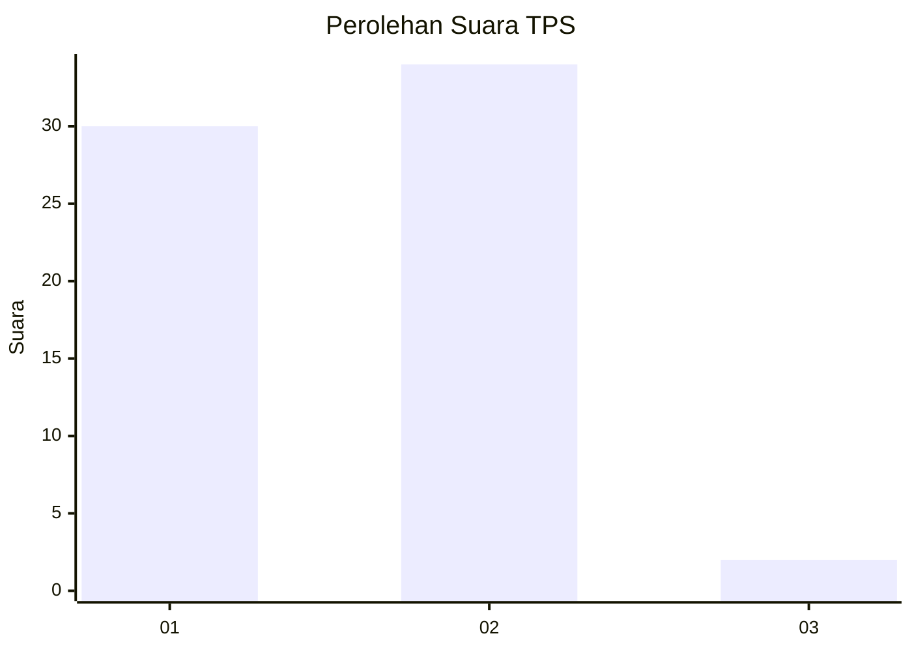
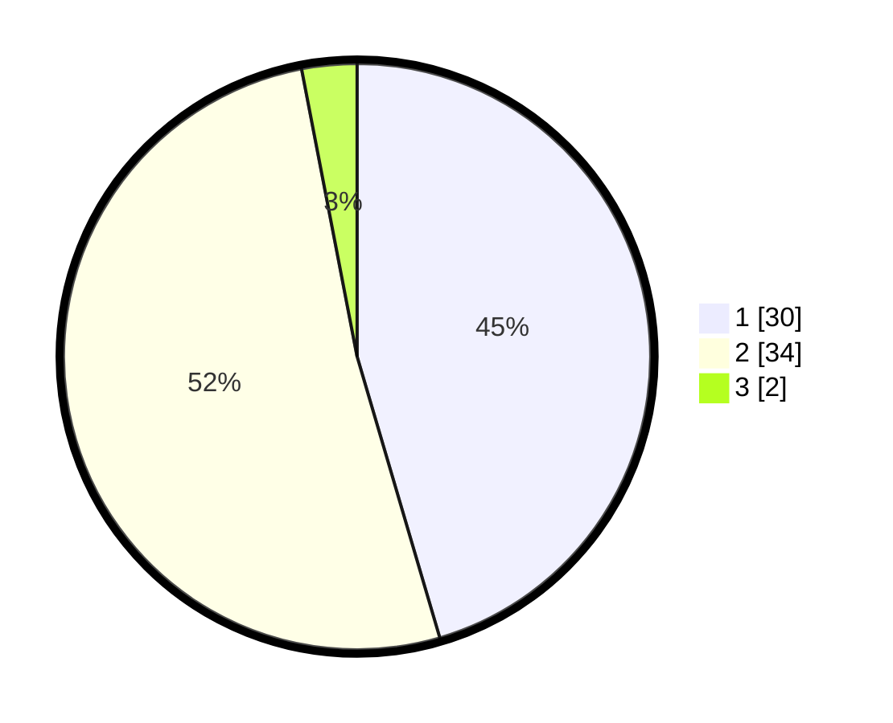

# Hasil

## Grafik

## Tabel

| No. | Nama Paslon    | Suara | Suara (raw) | Persentase |
|:--- |:-------------- | -----:| -----------:| ----------:|
| 1   | ANIES MUHAIMIN | 30    | [30][p-1]   | 45,45      |
| 2   | PRABOWO GIBRAN | 34    | [34][p-2]   | 51,52      |
| 3   | GANJAR MAHFUD  | 2     | [2][p-3]    | 3,03       |

[p-1]: https://github.com/gigit-pemilu/pemilu-2024-32-jawa-barat/blob/main/pilpres/hitung-suara/sub/32-jawa-barat/sub/03-cianjur/sub/04-cilaku/sub/2003-sirnagalih/sub/056-tps/sub/paslon-1.txt
[p-2]: https://github.com/gigit-pemilu/pemilu-2024-32-jawa-barat/blob/main/pilpres/hitung-suara/sub/32-jawa-barat/sub/03-cianjur/sub/04-cilaku/sub/2003-sirnagalih/sub/056-tps/sub/paslon-2.txt
[p-3]: https://github.com/gigit-pemilu/pemilu-2024-32-jawa-barat/blob/main/pilpres/hitung-suara/sub/32-jawa-barat/sub/03-cianjur/sub/04-cilaku/sub/2003-sirnagalih/sub/056-tps/sub/paslon-3.txt

## Foto C Plano

https://sirekap-obj-formc.kpu.go.id/0056/pemilu/ppwp/32/03/04/20/03/3203042003056-20240214-160055--10158149-7361-4635-b139-61bf61ecf9c3.jpg

https://sirekap-obj-formc.kpu.go.id/0056/pemilu/ppwp/32/03/04/20/03/3203042003056-20240214-155443--f46fe8e4-ff5f-456d-94d9-d6a94814ff71.jpg

https://sirekap-obj-formc.kpu.go.id/0056/pemilu/ppwp/32/03/04/20/03/3203042003056-20240214-155838--1627c6bc-feb0-4e03-93b6-bfab2c3df74e.jpg

## Metadata

| Key        | Value               |
| ---------- | ------------------- |
| Time Stamp | 2024-02-25 11:00:00 |

