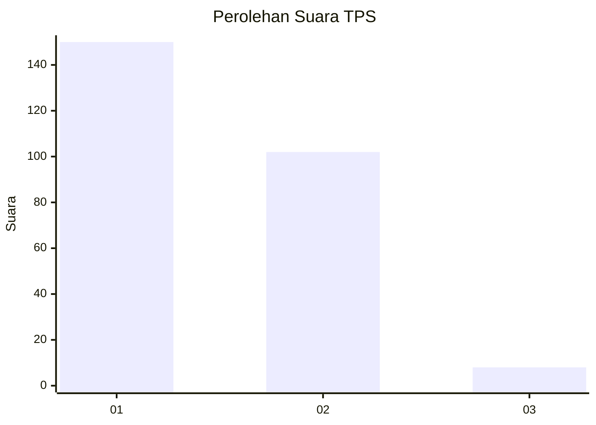
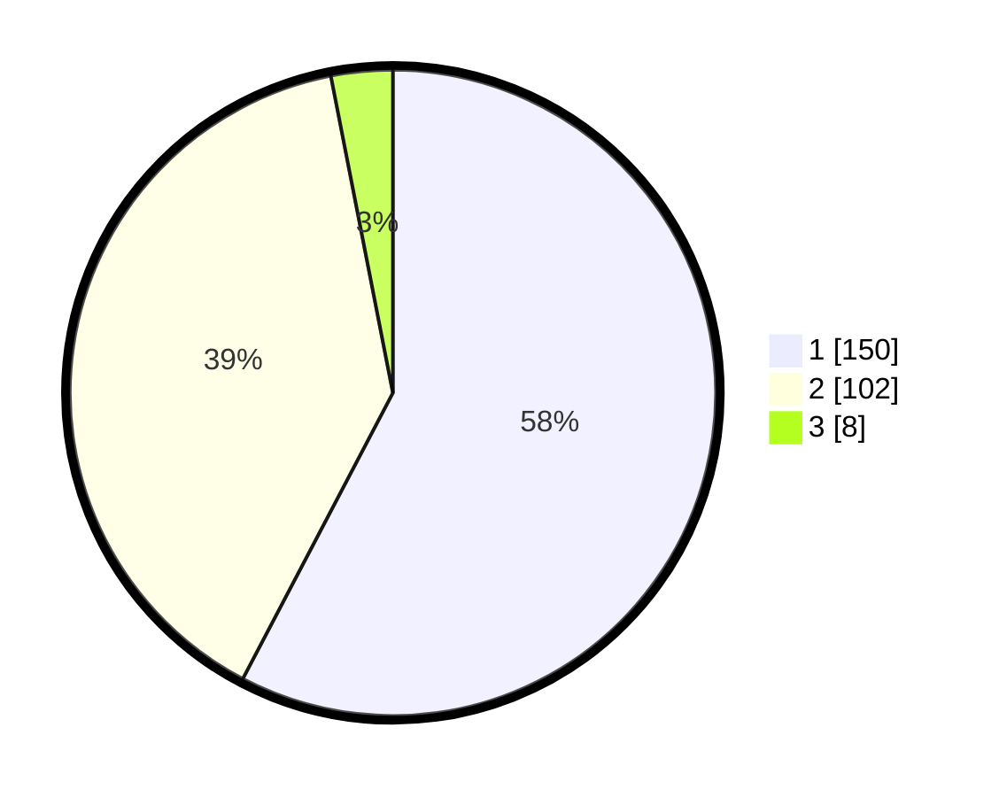

# Hasil

## Grafik

## Tabel

| No. | Nama Paslon    | Suara | Suara (raw) | Persentase |
|:--- |:-------------- | -----:| -----------:| ----------:|
| 1   | ANIES MUHAIMIN | 150   | [150][p-1]  | 57,69      |
| 2   | PRABOWO GIBRAN | 102   | [102][p-2]  | 39,23      |
| 3   | GANJAR MAHFUD  | 8     | [8][p-3]    | 3,08       |

[p-1]: https://github.com/gigit-pemilu/pemilu-2024/blob/main/pilpres/hitung-suara/sub/32-jawa-barat/sub/03-cianjur/sub/04-cilaku/sub/2003-sirnagalih/sub/075-tps/sub/paslon-1.txt
[p-2]: https://github.com/gigit-pemilu/pemilu-2024/blob/main/pilpres/hitung-suara/sub/32-jawa-barat/sub/03-cianjur/sub/04-cilaku/sub/2003-sirnagalih/sub/075-tps/sub/paslon-2.txt
[p-3]: https://github.com/gigit-pemilu/pemilu-2024/blob/main/pilpres/hitung-suara/sub/32-jawa-barat/sub/03-cianjur/sub/04-cilaku/sub/2003-sirnagalih/sub/075-tps/sub/paslon-3.txt

## Foto C Plano

https://sirekap-obj-formc.kpu.go.id/ea6c/pemilu/ppwp/32/03/04/20/03/3203042003075-20240216-075330--c3d50873-2d30-4f9a-b4d6-f470281fdcec.jpg

https://sirekap-obj-formc.kpu.go.id/ea6c/pemilu/ppwp/32/03/04/20/03/3203042003075-20240216-075421--65e3b623-b566-4e35-bf33-c8b4add41045.jpg

https://sirekap-obj-formc.kpu.go.id/ea6c/pemilu/ppwp/32/03/04/20/03/3203042003075-20240220-212437--e995292c-eede-4784-b64a-d59290164de5.jpg

## Metadata

| Key        | Value               |
| ---------- | ------------------- |
| Time Stamp | 2024-02-25 13:00:00 |

