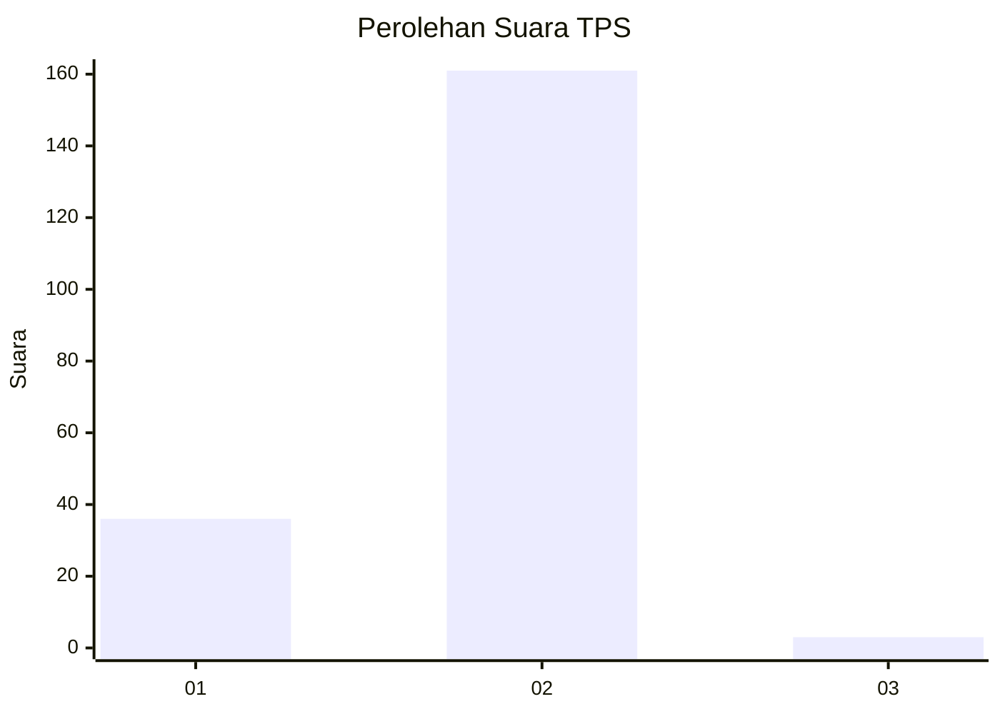
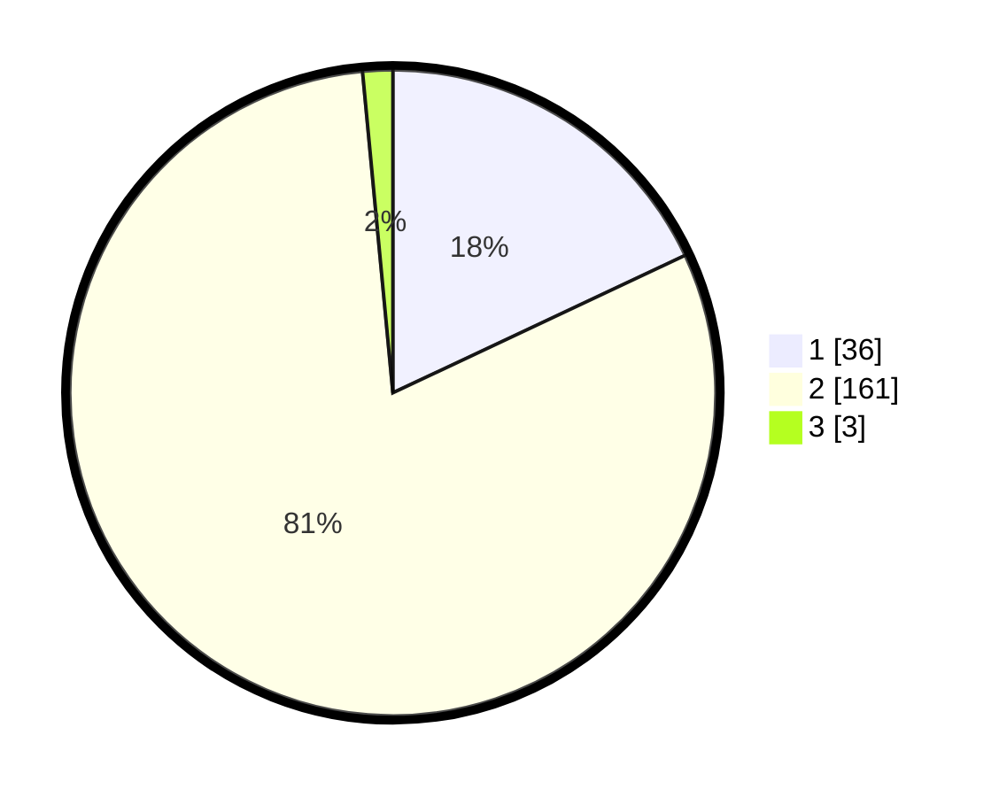

# Hasil

## Grafik

## Tabel

| No. | Nama Paslon    | Suara | Suara (raw) | Persentase |
|:--- |:-------------- | -----:| -----------:| ----------:|
| 1   | ANIES MUHAIMIN | 36    | [36][p-1]   | 18,00      |
| 2   | PRABOWO GIBRAN | 161   | [161][p-2]  | 80,50      |
| 3   | GANJAR MAHFUD  | 3     | [3][p-3]    | 1,50       |

[p-1]: https://github.com/gigit-pemilu/pemilu-2024-32-jawa-barat/blob/main/pilpres/hitung-suara/sub/32-jawa-barat/sub/03-cianjur/sub/05-ciranjang/sub/2001-ciranjang/sub/001-tps/sub/paslon-1.txt
[p-2]: https://github.com/gigit-pemilu/pemilu-2024-32-jawa-barat/blob/main/pilpres/hitung-suara/sub/32-jawa-barat/sub/03-cianjur/sub/05-ciranjang/sub/2001-ciranjang/sub/001-tps/sub/paslon-2.txt
[p-3]: https://github.com/gigit-pemilu/pemilu-2024-32-jawa-barat/blob/main/pilpres/hitung-suara/sub/32-jawa-barat/sub/03-cianjur/sub/05-ciranjang/sub/2001-ciranjang/sub/001-tps/sub/paslon-3.txt

## Foto C Plano

https://sirekap-obj-formc.kpu.go.id/efd1/pemilu/ppwp/32/03/05/20/01/3203052001001-20240214-211809--a73195c4-a0b1-4d0f-b7ab-c0c0d83f4cf5.jpg

https://sirekap-obj-formc.kpu.go.id/efd1/pemilu/ppwp/32/03/05/20/01/3203052001001-20240214-212308--ab51014d-5e2f-4765-9321-0a5ab8aa7dd5.jpg

https://sirekap-obj-formc.kpu.go.id/efd1/pemilu/ppwp/32/03/05/20/01/3203052001001-20240214-212553--65ea372d-6faf-4a26-a3f7-7162445b76a6.jpg

## Metadata

| Key        | Value               |
| ---------- | ------------------- |
| Time Stamp | 2024-02-15 19:30:26 |

