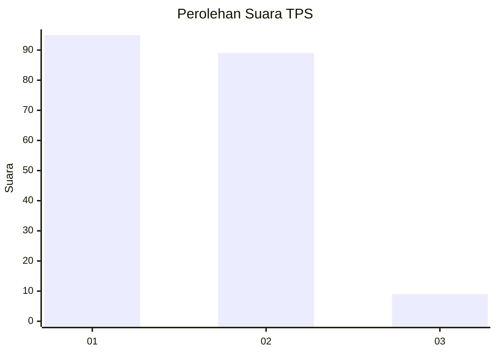
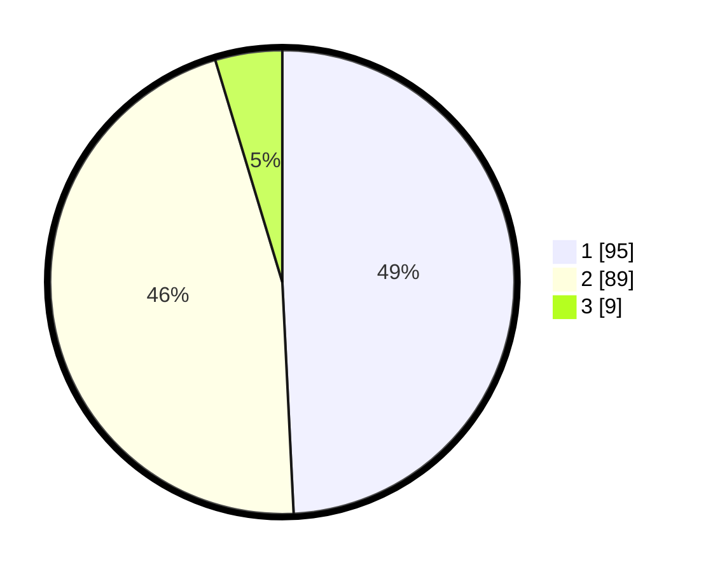

# Hasil

## Grafik

## Tabel

| No. | Nama Paslon    | Suara | Suara (raw) | Persentase |
|:--- |:-------------- | -----:| -----------:| ----------:|
| 1   | ANIES MUHAIMIN | 95    | [95][p-1]   | 49,22      |
| 2   | PRABOWO GIBRAN | 89    | [89][p-2]   | 46,11      |
| 3   | GANJAR MAHFUD  | 9     | [9][p-3]    | 4,66       |

[p-1]: https://github.com/gigit-pemilu/pemilu-2024-32-jawa-barat/blob/main/pilpres/hitung-suara/sub/32-jawa-barat/sub/03-cianjur/sub/05-ciranjang/sub/2001-ciranjang/sub/004-tps/sub/paslon-1.txt
[p-2]: https://github.com/gigit-pemilu/pemilu-2024-32-jawa-barat/blob/main/pilpres/hitung-suara/sub/32-jawa-barat/sub/03-cianjur/sub/05-ciranjang/sub/2001-ciranjang/sub/004-tps/sub/paslon-2.txt
[p-3]: https://github.com/gigit-pemilu/pemilu-2024-32-jawa-barat/blob/main/pilpres/hitung-suara/sub/32-jawa-barat/sub/03-cianjur/sub/05-ciranjang/sub/2001-ciranjang/sub/004-tps/sub/paslon-3.txt

## Foto C Plano

https://sirekap-obj-formc.kpu.go.id/a929/pemilu/ppwp/32/03/05/20/01/3203052001004-20240214-204141--d4c5b88f-470f-4754-a886-9b67c66147df.jpg

https://sirekap-obj-formc.kpu.go.id/a929/pemilu/ppwp/32/03/05/20/01/3203052001004-20240214-204205--d9738f29-018c-46b6-99d2-9eb4bf7bcd90.jpg

https://sirekap-obj-formc.kpu.go.id/a929/pemilu/ppwp/32/03/05/20/01/3203052001004-20240214-204032--1875333b-8c41-4f7a-8f45-02555de78cf4.jpg

## Metadata

| Key        | Value               |
| ---------- | ------------------- |
| Time Stamp | 2024-02-19 16:00:00 |

