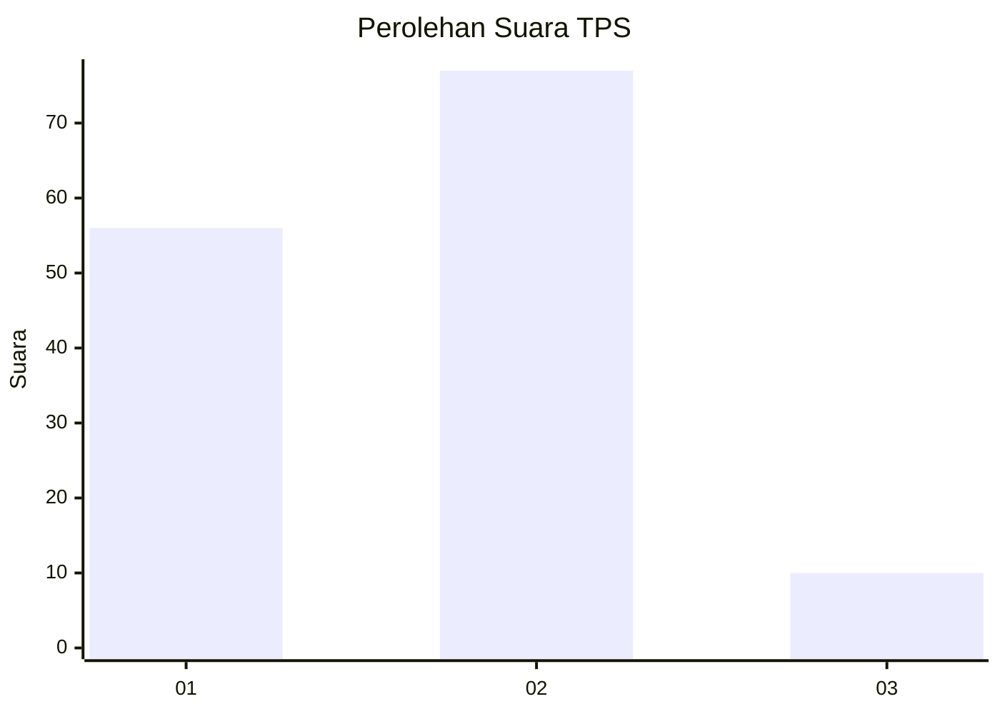

# Hasil

## Grafik

## Tabel

| No. | Nama Paslon    | Suara | Suara (raw) | Persentase |
|:--- |:-------------- | -----:| -----------:| ----------:|
| 1   | ANIES MUHAIMIN | 56    | [56][p-1]   | 39,16      |
| 2   | PRABOWO GIBRAN | 77    | [77][p-2]   | 53,85      |
| 3   | GANJAR MAHFUD  | 10    | [10][p-3]   | 6,99       |

[p-1]: https://github.com/gigit-pemilu/pemilu-2024/blob/main/pilpres/hitung-suara/sub/32-jawa-barat/sub/03-cianjur/sub/05-ciranjang/sub/2001-ciranjang/sub/005-tps/sub/paslon-1.txt
[p-2]: https://github.com/gigit-pemilu/pemilu-2024/blob/main/pilpres/hitung-suara/sub/32-jawa-barat/sub/03-cianjur/sub/05-ciranjang/sub/2001-ciranjang/sub/005-tps/sub/paslon-2.txt
[p-3]: https://github.com/gigit-pemilu/pemilu-2024/blob/main/pilpres/hitung-suara/sub/32-jawa-barat/sub/03-cianjur/sub/05-ciranjang/sub/2001-ciranjang/sub/005-tps/sub/paslon-3.txt

## Foto C Plano

https://sirekap-obj-formc.kpu.go.id/963d/pemilu/ppwp/32/03/05/20/01/3203052001005-20240214-200701--86d37a17-850f-4485-ab7d-4127809a505b.jpg

https://sirekap-obj-formc.kpu.go.id/963d/pemilu/ppwp/32/03/05/20/01/3203052001005-20240214-201107--ef48ab47-b1c7-4cfa-ba45-e89bb1965991.jpg

https://sirekap-obj-formc.kpu.go.id/963d/pemilu/ppwp/32/03/05/20/01/3203052001005-20240214-201312--cf75cdde-fcfe-423f-9f8a-8c0928677c0b.jpg

## Metadata

| Key        | Value               |
| ---------- | ------------------- |
| Time Stamp | 2024-02-16 16:25:10 |

