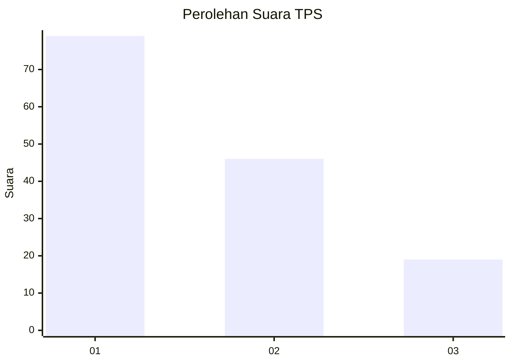
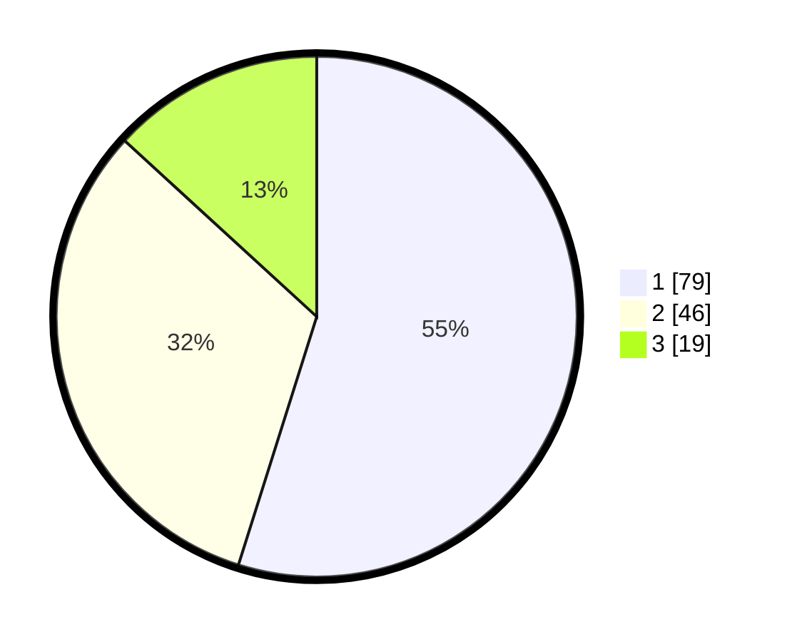

# Hasil

## Grafik

## Tabel

| No. | Nama Paslon    | Suara | Suara (raw) | Persentase |
|:--- |:-------------- | -----:| -----------:| ----------:|
| 1   | ANIES MUHAIMIN | 79    | [79][p-1]   | 54,86      |
| 2   | PRABOWO GIBRAN | 46    | [46][p-2]   | 31,94      |
| 3   | GANJAR MAHFUD  | 19    | [19][p-3]   | 13,19      |

[p-1]: https://github.com/gigit-pemilu/pemilu-2024/blob/main/pilpres/hitung-suara/sub/32-jawa-barat/sub/03-cianjur/sub/05-ciranjang/sub/2001-ciranjang/sub/007-tps/sub/paslon-1.txt
[p-2]: https://github.com/gigit-pemilu/pemilu-2024/blob/main/pilpres/hitung-suara/sub/32-jawa-barat/sub/03-cianjur/sub/05-ciranjang/sub/2001-ciranjang/sub/007-tps/sub/paslon-2.txt
[p-3]: https://github.com/gigit-pemilu/pemilu-2024/blob/main/pilpres/hitung-suara/sub/32-jawa-barat/sub/03-cianjur/sub/05-ciranjang/sub/2001-ciranjang/sub/007-tps/sub/paslon-3.txt

## Foto C Plano

https://sirekap-obj-formc.kpu.go.id/e638/pemilu/ppwp/32/03/05/20/01/3203052001007-20240214-212634--0cf2bda5-3935-4302-8273-d0b11b5e9f7e.jpg

https://sirekap-obj-formc.kpu.go.id/e638/pemilu/ppwp/32/03/05/20/01/3203052001007-20240214-192807--d4934717-257c-4d95-b903-0c2558a5eb5a.jpg

https://sirekap-obj-formc.kpu.go.id/e638/pemilu/ppwp/32/03/05/20/01/3203052001007-20240214-193914--937826ee-01e4-414f-b672-8ee75975e264.jpg

## Metadata

| Key        | Value               |
| ---------- | ------------------- |
| Time Stamp | 2024-02-15 02:10:27 |

