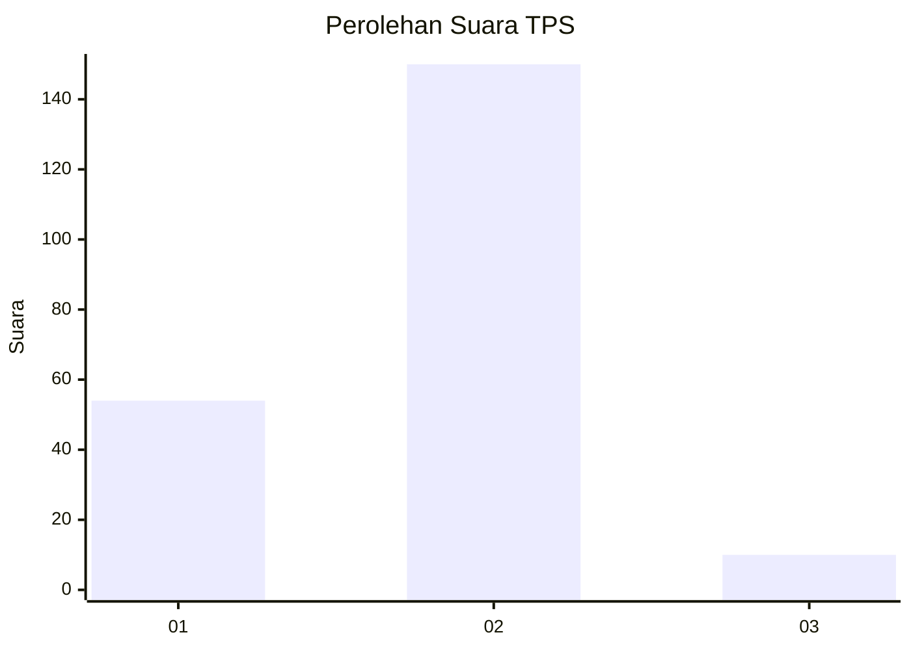
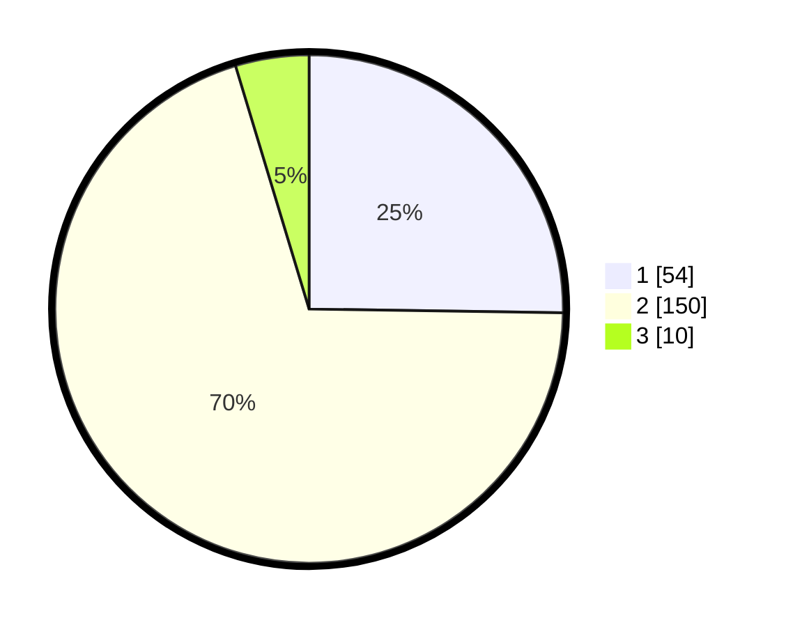

# Hasil

## Grafik

## Tabel

| No. | Nama Paslon    | Suara | Suara (raw) | Persentase |
|:--- |:-------------- | -----:| -----------:| ----------:|
| 1   | ANIES MUHAIMIN | 54    | [54][p-1]   | 25,23      |
| 2   | PRABOWO GIBRAN | 150   | [150][p-2]  | 70,09      |
| 3   | GANJAR MAHFUD  | 10    | [10][p-3]   | 4,67       |

[p-1]: https://github.com/gigit-pemilu/pemilu-2024-32-jawa-barat/blob/main/pilpres/hitung-suara/sub/32-jawa-barat/sub/03-cianjur/sub/06-bojongpicung/sub/2001-hegarmanah/sub/008-tps/sub/paslon-1.txt
[p-2]: https://github.com/gigit-pemilu/pemilu-2024-32-jawa-barat/blob/main/pilpres/hitung-suara/sub/32-jawa-barat/sub/03-cianjur/sub/06-bojongpicung/sub/2001-hegarmanah/sub/008-tps/sub/paslon-2.txt
[p-3]: https://github.com/gigit-pemilu/pemilu-2024-32-jawa-barat/blob/main/pilpres/hitung-suara/sub/32-jawa-barat/sub/03-cianjur/sub/06-bojongpicung/sub/2001-hegarmanah/sub/008-tps/sub/paslon-3.txt

## Foto C Plano

https://sirekap-obj-formc.kpu.go.id/39ac/pemilu/ppwp/32/03/06/20/01/3203062001008-20240215-003007--d07b2fa8-c9db-4706-bcfb-36d74ca3f99d.jpg

https://sirekap-obj-formc.kpu.go.id/39ac/pemilu/ppwp/32/03/06/20/01/3203062001008-20240215-003244--5691ff94-e612-4ec7-b3c5-8fd1c6996f2a.jpg

https://sirekap-obj-formc.kpu.go.id/39ac/pemilu/ppwp/32/03/06/20/01/3203062001008-20240215-003449--046ad7d6-2f77-4de5-b16e-125394b482b7.jpg

## Metadata

| Key        | Value               |
| ---------- | ------------------- |
| Time Stamp | 2024-02-24 22:31:28 |

