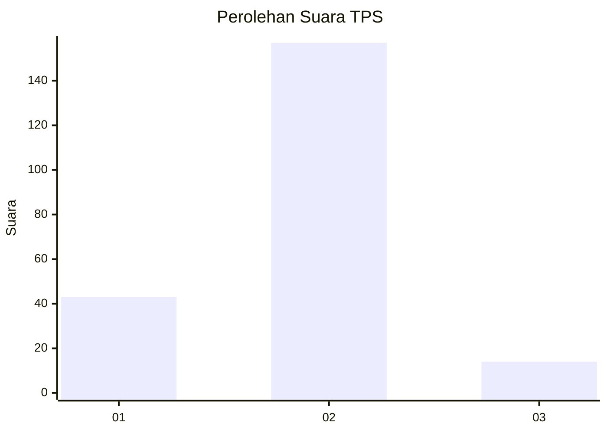

# Hasil

## Grafik

## Tabel

| No. | Nama Paslon    | Suara | Suara (raw) | Persentase |
|:--- |:-------------- | -----:| -----------:| ----------:|
| 1   | ANIES MUHAIMIN | 43    | [43][p-1]   | 20,09      |
| 2   | PRABOWO GIBRAN | 157   | [157][p-2]  | 73,36      |
| 3   | GANJAR MAHFUD  | 14    | [14][p-3]   | 6,54       |

[p-1]: https://github.com/gigit-pemilu/pemilu-2024-32-jawa-barat/blob/main/pilpres/hitung-suara/sub/32-jawa-barat/sub/03-cianjur/sub/06-bojongpicung/sub/2001-hegarmanah/sub/011-tps/sub/paslon-1.txt
[p-2]: https://github.com/gigit-pemilu/pemilu-2024-32-jawa-barat/blob/main/pilpres/hitung-suara/sub/32-jawa-barat/sub/03-cianjur/sub/06-bojongpicung/sub/2001-hegarmanah/sub/011-tps/sub/paslon-2.txt
[p-3]: https://github.com/gigit-pemilu/pemilu-2024-32-jawa-barat/blob/main/pilpres/hitung-suara/sub/32-jawa-barat/sub/03-cianjur/sub/06-bojongpicung/sub/2001-hegarmanah/sub/011-tps/sub/paslon-3.txt

## Foto C Plano

https://sirekap-obj-formc.kpu.go.id/8ad7/pemilu/ppwp/32/03/06/20/01/3203062001011-20240222-122015--0c912ad8-2a24-42ee-b376-79122450a111.jpg

https://sirekap-obj-formc.kpu.go.id/8ad7/pemilu/ppwp/32/03/06/20/01/3203062001011-20240222-122234--0fdf554a-acae-4839-94d3-7bbb74368856.jpg

https://sirekap-obj-formc.kpu.go.id/8ad7/pemilu/ppwp/32/03/06/20/01/3203062001011-20240222-123414--b2efdf1b-a6ec-4e4b-a388-3ab77a2e2761.jpg

## Metadata

| Key        | Value               |
| ---------- | ------------------- |
| Time Stamp | 2024-02-22 13:00:00 |

