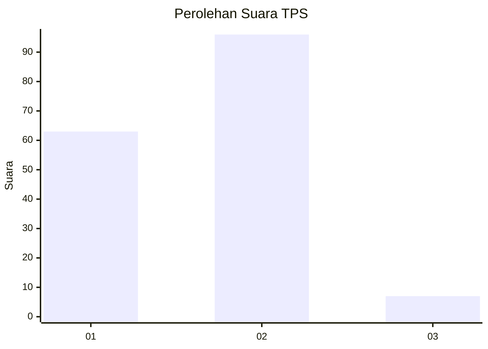
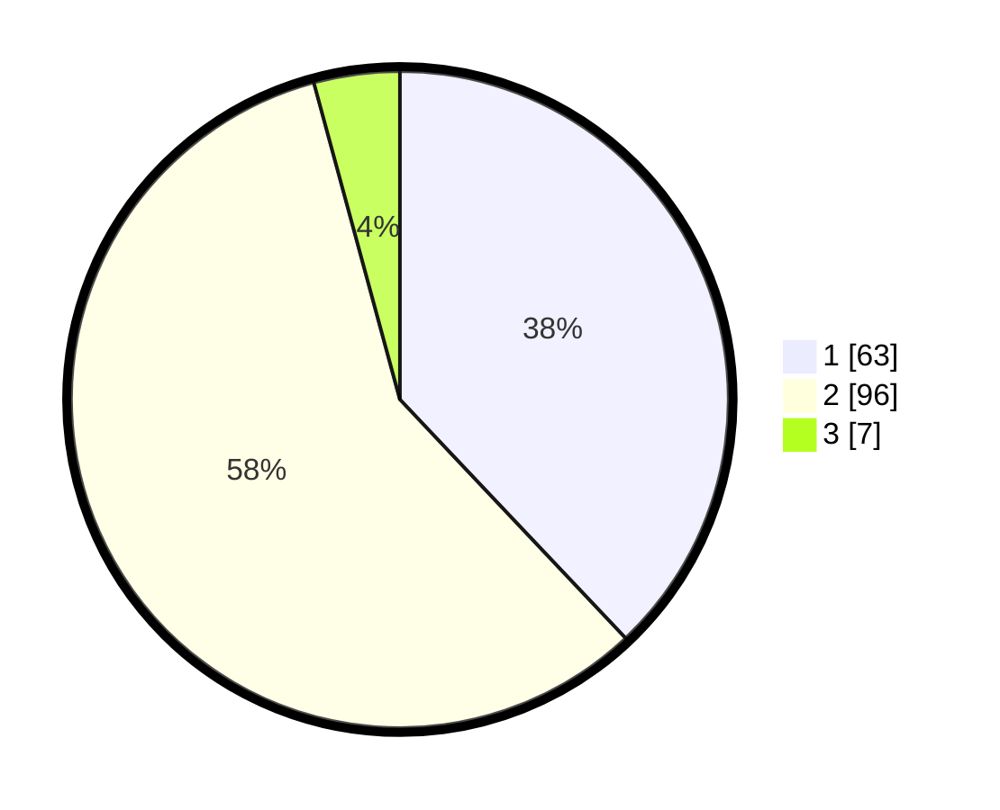

# Hasil

## Grafik

## Tabel

| No. | Nama Paslon    | Suara | Suara (raw) | Persentase |
|:--- |:-------------- | -----:| -----------:| ----------:|
| 1   | ANIES MUHAIMIN | 63    | [63][p-1]   | 37,95      |
| 2   | PRABOWO GIBRAN | 96    | [96][p-2]   | 57,83      |
| 3   | GANJAR MAHFUD  | 7     | [7][p-3]    | 4,22       |

[p-1]: https://github.com/gigit-pemilu/pemilu-2024/blob/main/pilpres/hitung-suara/sub/32-jawa-barat/sub/03-cianjur/sub/07-karangtengah/sub/2001-sukamanah/sub/005-tps/sub/paslon-1.txt
[p-2]: https://github.com/gigit-pemilu/pemilu-2024/blob/main/pilpres/hitung-suara/sub/32-jawa-barat/sub/03-cianjur/sub/07-karangtengah/sub/2001-sukamanah/sub/005-tps/sub/paslon-2.txt
[p-3]: https://github.com/gigit-pemilu/pemilu-2024/blob/main/pilpres/hitung-suara/sub/32-jawa-barat/sub/03-cianjur/sub/07-karangtengah/sub/2001-sukamanah/sub/005-tps/sub/paslon-3.txt

## Foto C Plano

https://sirekap-obj-formc.kpu.go.id/64fe/pemilu/ppwp/32/03/07/20/01/3203072001005-20240215-002026--bf468751-ec5b-45bb-9ad8-44b62c49dd32.jpg

https://sirekap-obj-formc.kpu.go.id/64fe/pemilu/ppwp/32/03/07/20/01/3203072001005-20240215-002150--c8bb80c0-30f5-4c49-8d83-5778dacf6d75.jpg

https://sirekap-obj-formc.kpu.go.id/64fe/pemilu/ppwp/32/03/07/20/01/3203072001005-20240215-002334--464e8652-dcf3-4510-95f1-9c78f9c38871.jpg

## Metadata

| Key        | Value               |
| ---------- | ------------------- |
| Time Stamp | 2024-02-20 11:00:00 |

