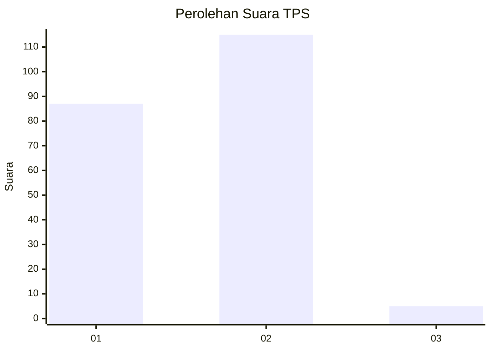
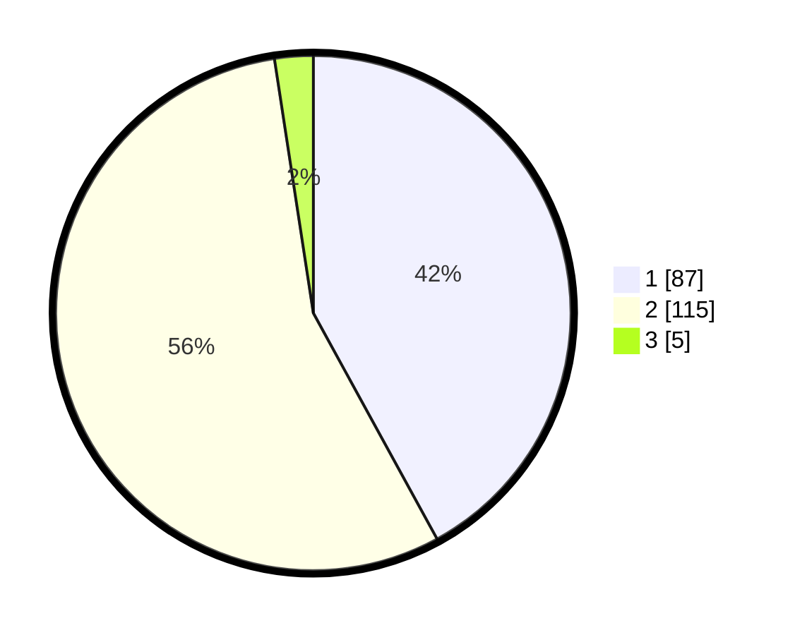

# Hasil

## Grafik

## Tabel

| No. | Nama Paslon    | Suara | Suara (raw) | Persentase |
|:--- |:-------------- | -----:| -----------:| ----------:|
| 1   | ANIES MUHAIMIN | 87    | [87][p-1]   | 42,03      |
| 2   | PRABOWO GIBRAN | 115   | [115][p-2]  | 55,56      |
| 3   | GANJAR MAHFUD  | 5     | [5][p-3]    | 2,42       |

[p-1]: https://github.com/gigit-pemilu/pemilu-2024/blob/main/pilpres/hitung-suara/sub/32-jawa-barat/sub/03-cianjur/sub/07-karangtengah/sub/2001-sukamanah/sub/006-tps/sub/paslon-1.txt
[p-2]: https://github.com/gigit-pemilu/pemilu-2024/blob/main/pilpres/hitung-suara/sub/32-jawa-barat/sub/03-cianjur/sub/07-karangtengah/sub/2001-sukamanah/sub/006-tps/sub/paslon-2.txt
[p-3]: https://github.com/gigit-pemilu/pemilu-2024/blob/main/pilpres/hitung-suara/sub/32-jawa-barat/sub/03-cianjur/sub/07-karangtengah/sub/2001-sukamanah/sub/006-tps/sub/paslon-3.txt

## Foto C Plano

https://sirekap-obj-formc.kpu.go.id/e989/pemilu/ppwp/32/03/07/20/01/3203072001006-20240215-025436--c64e129e-c310-4a35-8eee-972289e859d6.jpg

https://sirekap-obj-formc.kpu.go.id/e989/pemilu/ppwp/32/03/07/20/01/3203072001006-20240215-025442--6b5e4570-ad04-43ad-ac36-8d2d52ab9c9e.jpg

https://sirekap-obj-formc.kpu.go.id/e989/pemilu/ppwp/32/03/07/20/01/3203072001006-20240215-025510--ba5e0405-81a9-486e-b68e-971e89d6df76.jpg

## Metadata

| Key        | Value               |
| ---------- | ------------------- |
| Time Stamp | 2024-02-26 15:00:00 |

