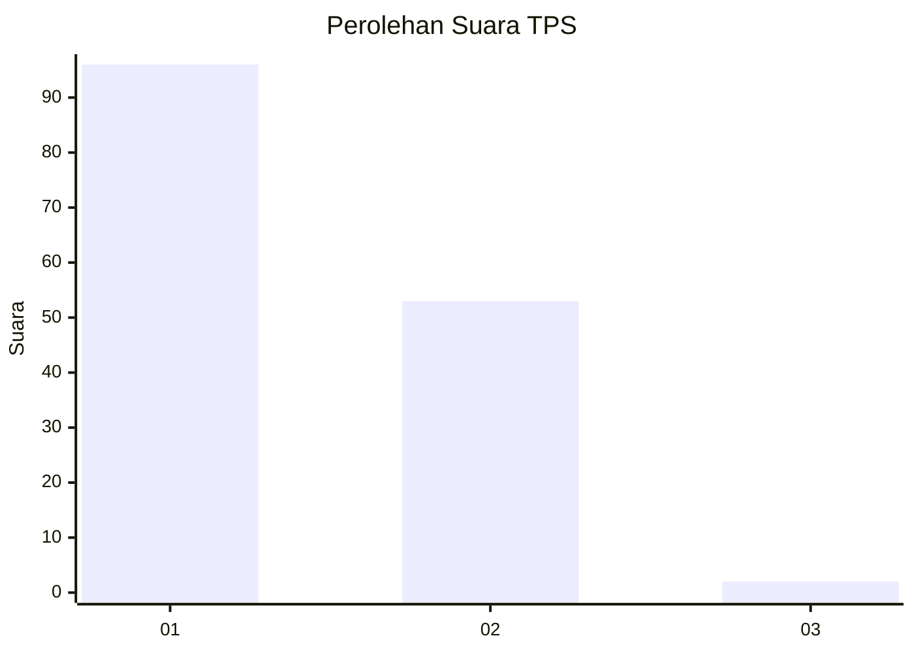
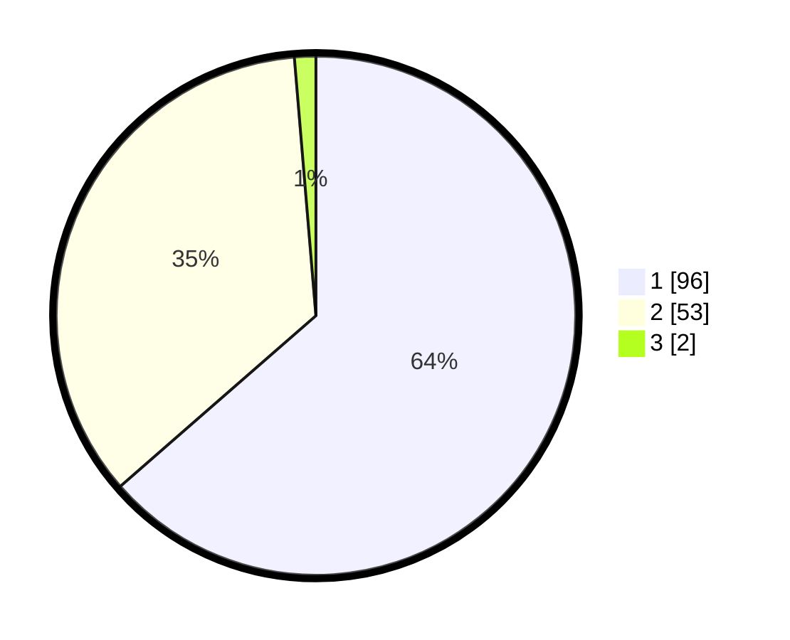

# Hasil

## Grafik

## Tabel

| No. | Nama Paslon    | Suara | Suara (raw) | Persentase |
|:--- |:-------------- | -----:| -----------:| ----------:|
| 1   | ANIES MUHAIMIN | 96    | [96][p-1]   | 63,58      |
| 2   | PRABOWO GIBRAN | 53    | [53][p-2]   | 35,10      |
| 3   | GANJAR MAHFUD  | 2     | [2][p-3]    | 1,32       |

[p-1]: https://github.com/gigit-pemilu/pemilu-2024/blob/main/pilpres/hitung-suara/sub/32-jawa-barat/sub/03-cianjur/sub/07-karangtengah/sub/2003-sindanglaka/sub/002-tps/sub/paslon-1.txt
[p-2]: https://github.com/gigit-pemilu/pemilu-2024/blob/main/pilpres/hitung-suara/sub/32-jawa-barat/sub/03-cianjur/sub/07-karangtengah/sub/2003-sindanglaka/sub/002-tps/sub/paslon-2.txt
[p-3]: https://github.com/gigit-pemilu/pemilu-2024/blob/main/pilpres/hitung-suara/sub/32-jawa-barat/sub/03-cianjur/sub/07-karangtengah/sub/2003-sindanglaka/sub/002-tps/sub/paslon-3.txt

## Foto C Plano

https://sirekap-obj-formc.kpu.go.id/54fd/pemilu/ppwp/32/03/07/20/03/3203072003002-20240214-204341--0a1cf39e-5622-4575-a957-ae89f3634d9f.jpg

https://sirekap-obj-formc.kpu.go.id/54fd/pemilu/ppwp/32/03/07/20/03/3203072003002-20240214-203916--78908bb8-2225-447e-8c00-c09c9fa0c20e.jpg

https://sirekap-obj-formc.kpu.go.id/54fd/pemilu/ppwp/32/03/07/20/03/3203072003002-20240214-202250--21a48602-da8b-4057-9f87-caa0c3223d99.jpg

## Metadata

| Key        | Value               |
| ---------- | ------------------- |
| Time Stamp | 2024-02-24 22:31:28 |

