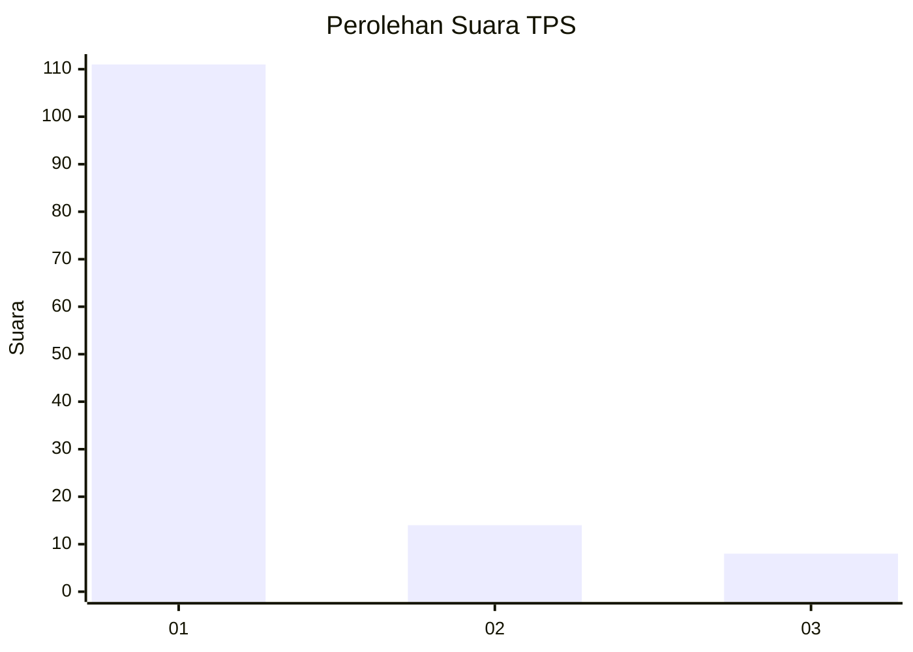
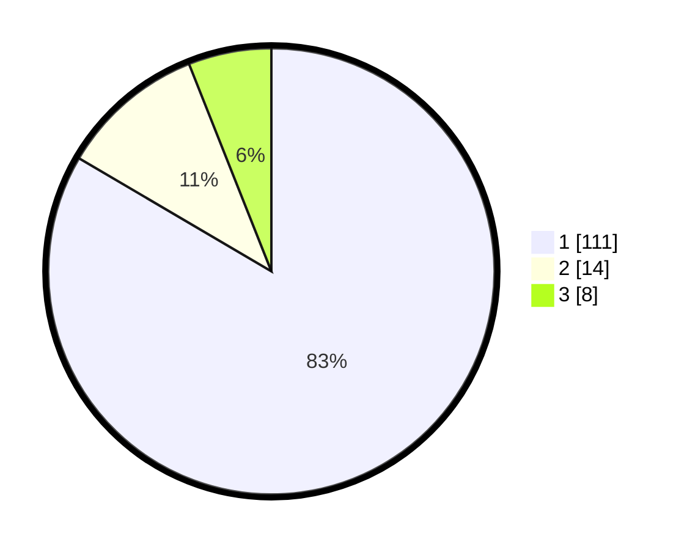

# Hasil

## Grafik

## Tabel

| No. | Nama Paslon    | Suara | Suara (raw) | Persentase |
|:--- |:-------------- | -----:| -----------:| ----------:|
| 1   | ANIES MUHAIMIN | 111   | [111][p-1]  | 83,46      |
| 2   | PRABOWO GIBRAN | 14    | [14][p-2]   | 10,53      |
| 3   | GANJAR MAHFUD  | 8     | [8][p-3]    | 6,02       |

[p-1]: https://github.com/gigit-pemilu/pemilu-2024-32-jawa-barat/blob/main/pilpres/hitung-suara/sub/32-jawa-barat/sub/03-cianjur/sub/07-karangtengah/sub/2011-sindangasih/sub/007-tps/sub/paslon-1.txt
[p-2]: https://github.com/gigit-pemilu/pemilu-2024-32-jawa-barat/blob/main/pilpres/hitung-suara/sub/32-jawa-barat/sub/03-cianjur/sub/07-karangtengah/sub/2011-sindangasih/sub/007-tps/sub/paslon-2.txt
[p-3]: https://github.com/gigit-pemilu/pemilu-2024-32-jawa-barat/blob/main/pilpres/hitung-suara/sub/32-jawa-barat/sub/03-cianjur/sub/07-karangtengah/sub/2011-sindangasih/sub/007-tps/sub/paslon-3.txt

## Foto C Plano

https://sirekap-obj-formc.kpu.go.id/fb0b/pemilu/ppwp/32/03/07/20/11/3203072011007-20240217-025958--441c37cf-1380-4c3c-8011-c277cca74e87.jpg

https://sirekap-obj-formc.kpu.go.id/fb0b/pemilu/ppwp/32/03/07/20/11/3203072011007-20240217-030151--0263a81e-b27e-40e5-b298-c1cf561e30c9.jpg

https://sirekap-obj-formc.kpu.go.id/fb0b/pemilu/ppwp/32/03/07/20/11/3203072011007-20240217-014510--120f56ff-5e71-4ad5-afd2-9c3871ab71ab.jpg

## Metadata

| Key        | Value               |
| ---------- | ------------------- |
| Time Stamp | 2024-02-25 13:00:00 |

