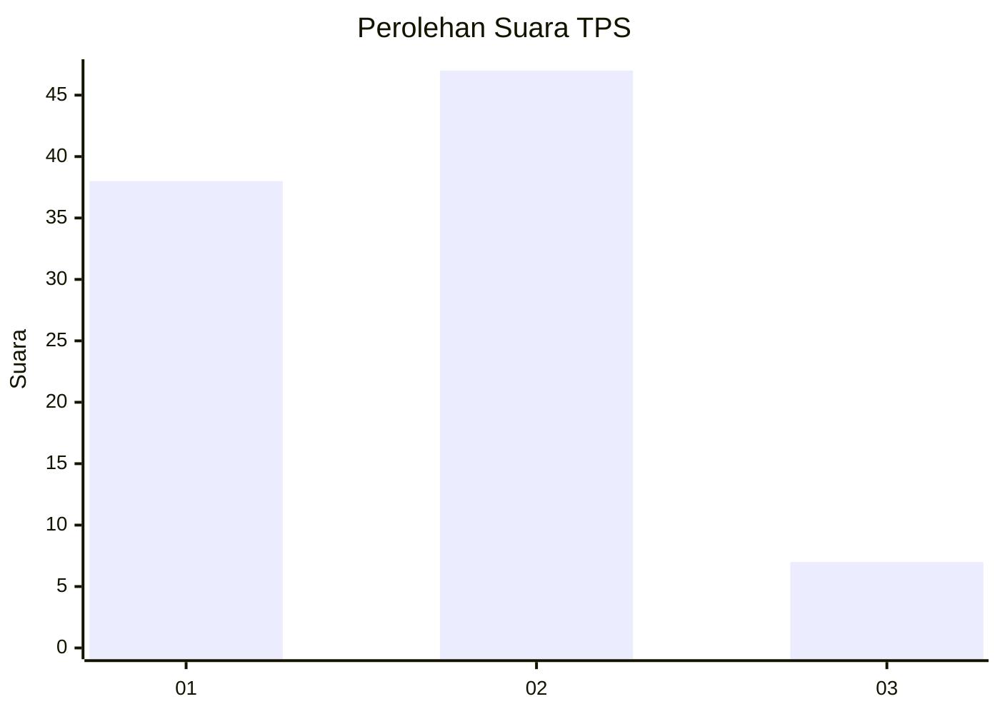
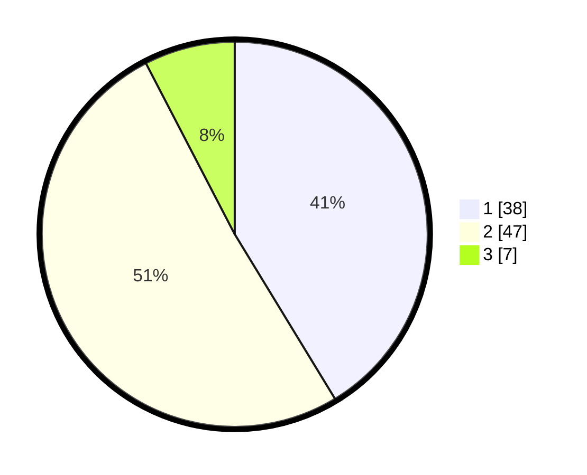

# Hasil

## Grafik

## Tabel

| No. | Nama Paslon    | Suara | Suara (raw) | Persentase |
|:--- |:-------------- | -----:| -----------:| ----------:|
| 1   | ANIES MUHAIMIN | 38    | [38][p-1]   | 41,30      |
| 2   | PRABOWO GIBRAN | 47    | [47][p-2]   | 51,09      |
| 3   | GANJAR MAHFUD  | 7     | [7][p-3]    | 7,61       |

[p-1]: https://github.com/gigit-pemilu/pemilu-2024/blob/main/pilpres/hitung-suara/sub/32-jawa-barat/sub/03-cianjur/sub/07-karangtengah/sub/2014-hegarmanah/sub/002-tps/sub/paslon-1.txt
[p-2]: https://github.com/gigit-pemilu/pemilu-2024/blob/main/pilpres/hitung-suara/sub/32-jawa-barat/sub/03-cianjur/sub/07-karangtengah/sub/2014-hegarmanah/sub/002-tps/sub/paslon-2.txt
[p-3]: https://github.com/gigit-pemilu/pemilu-2024/blob/main/pilpres/hitung-suara/sub/32-jawa-barat/sub/03-cianjur/sub/07-karangtengah/sub/2014-hegarmanah/sub/002-tps/sub/paslon-3.txt

## Foto C Plano

https://sirekap-obj-formc.kpu.go.id/4cef/pemilu/ppwp/32/03/07/20/14/3203072014002-20240215-003003--265dfdd7-9734-4fcb-ab8b-1eeef0afec8d.jpg

https://sirekap-obj-formc.kpu.go.id/4cef/pemilu/ppwp/32/03/07/20/14/3203072014002-20240215-003105--b9d715b1-2437-4a97-beb2-c1c9356c5196.jpg

https://sirekap-obj-formc.kpu.go.id/4cef/pemilu/ppwp/32/03/07/20/14/3203072014002-20240215-003239--7747c34e-b6d4-48c5-a24f-456bb7a9a64a.jpg

## Metadata

| Key        | Value               |
| ---------- | ------------------- |
| Time Stamp | 2024-02-24 22:31:28 |

