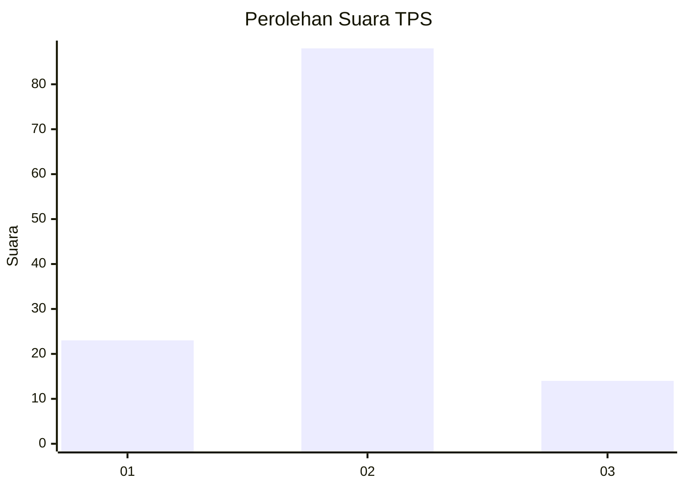
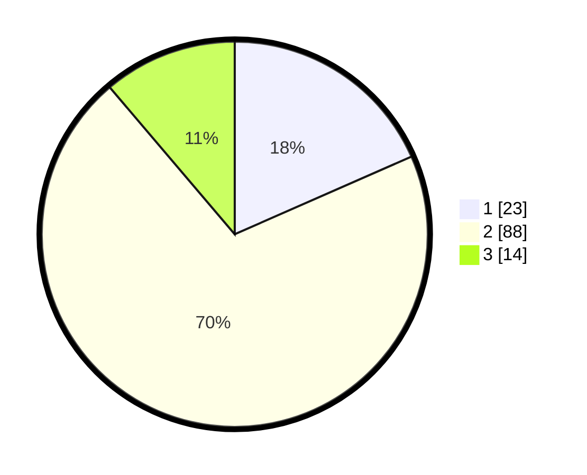

# Hasil

## Grafik

## Tabel

| No. | Nama Paslon    | Suara | Suara (raw) | Persentase |
|:--- |:-------------- | -----:| -----------:| ----------:|
| 1   | ANIES MUHAIMIN | 23    | [23][p-1]   | 18,40      |
| 2   | PRABOWO GIBRAN | 88    | [88][p-2]   | 70,40      |
| 3   | GANJAR MAHFUD  | 14    | [14][p-3]   | 11,20      |

[p-1]: https://github.com/gigit-pemilu/pemilu-2024/blob/main/pilpres/hitung-suara/sub/32-jawa-barat/sub/03-cianjur/sub/08-mande/sub/2010-mekarjaya/sub/005-tps/sub/paslon-1.txt
[p-2]: https://github.com/gigit-pemilu/pemilu-2024/blob/main/pilpres/hitung-suara/sub/32-jawa-barat/sub/03-cianjur/sub/08-mande/sub/2010-mekarjaya/sub/005-tps/sub/paslon-2.txt
[p-3]: https://github.com/gigit-pemilu/pemilu-2024/blob/main/pilpres/hitung-suara/sub/32-jawa-barat/sub/03-cianjur/sub/08-mande/sub/2010-mekarjaya/sub/005-tps/sub/paslon-3.txt

## Foto C Plano

https://sirekap-obj-formc.kpu.go.id/63a8/pemilu/ppwp/32/03/08/20/10/3203082010005-20240216-214912--c17ff391-a142-4a47-8f31-f10cc5e35b9d.jpg

https://sirekap-obj-formc.kpu.go.id/63a8/pemilu/ppwp/32/03/08/20/10/3203082010005-20240216-215122--ef818796-4751-471b-beeb-9ed95683f8e7.jpg

https://sirekap-obj-formc.kpu.go.id/63a8/pemilu/ppwp/32/03/08/20/10/3203082010005-20240216-215545--c520cd1a-7c5a-4b1c-8f3b-652c135eb805.jpg

## Metadata

| Key        | Value               |
| ---------- | ------------------- |
| Time Stamp | 2024-02-24 22:31:28 |

