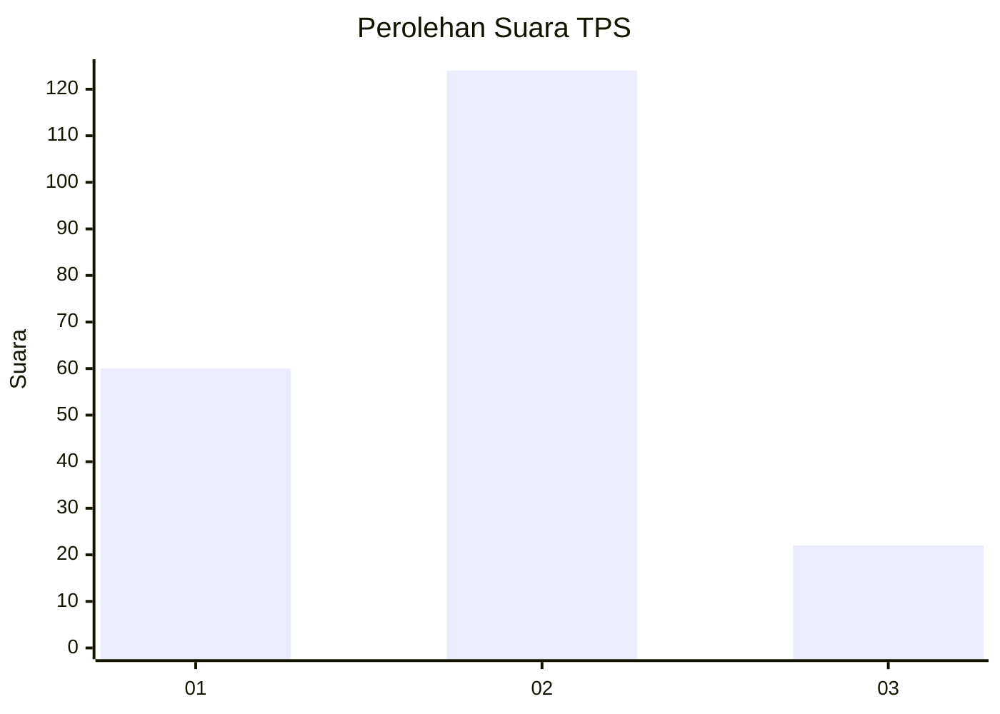
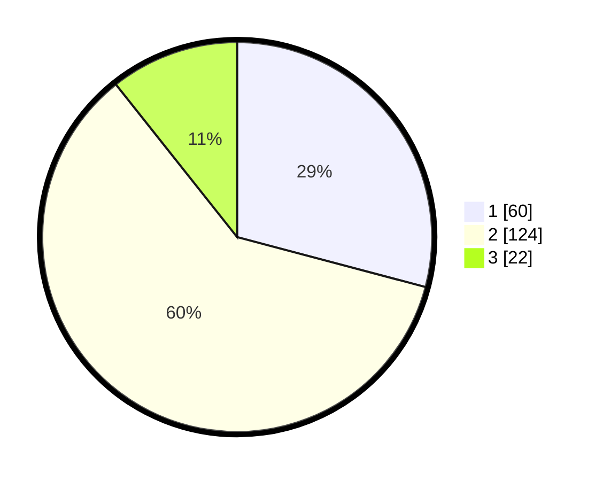

# Hasil

## Grafik

## Tabel

| No. | Nama Paslon    | Suara | Suara (raw) | Persentase |
|:--- |:-------------- | -----:| -----------:| ----------:|
| 1   | ANIES MUHAIMIN | 60    | [60][p-1]   | 29,13      |
| 2   | PRABOWO GIBRAN | 124   | [124][p-2]  | 60,19      |
| 3   | GANJAR MAHFUD  | 22    | [22][p-3]   | 10,68      |

[p-1]: https://github.com/gigit-pemilu/pemilu-2024-32-jawa-barat/blob/main/pilpres/hitung-suara/sub/32-jawa-barat/sub/03-cianjur/sub/09-sukaluyu/sub/2001-selajambe/sub/004-tps/sub/paslon-1.txt
[p-2]: https://github.com/gigit-pemilu/pemilu-2024-32-jawa-barat/blob/main/pilpres/hitung-suara/sub/32-jawa-barat/sub/03-cianjur/sub/09-sukaluyu/sub/2001-selajambe/sub/004-tps/sub/paslon-2.txt
[p-3]: https://github.com/gigit-pemilu/pemilu-2024-32-jawa-barat/blob/main/pilpres/hitung-suara/sub/32-jawa-barat/sub/03-cianjur/sub/09-sukaluyu/sub/2001-selajambe/sub/004-tps/sub/paslon-3.txt

## Foto C Plano

https://sirekap-obj-formc.kpu.go.id/aae3/pemilu/ppwp/32/03/09/20/01/3203092001004-20240214-162223--aebc62f5-d2c5-4c25-8eb5-c9623570859a.jpg

https://sirekap-obj-formc.kpu.go.id/aae3/pemilu/ppwp/32/03/09/20/01/3203092001004-20240214-225325--efbb57a2-ff57-4e23-9ade-4672301dd0b5.jpg

https://sirekap-obj-formc.kpu.go.id/aae3/pemilu/ppwp/32/03/09/20/01/3203092001004-20240214-225333--c9e298af-fb32-4e8d-b4ae-867a41c3e3df.jpg

## Metadata

| Key        | Value               |
| ---------- | ------------------- |
| Time Stamp | 2024-02-16 14:00:34 |

