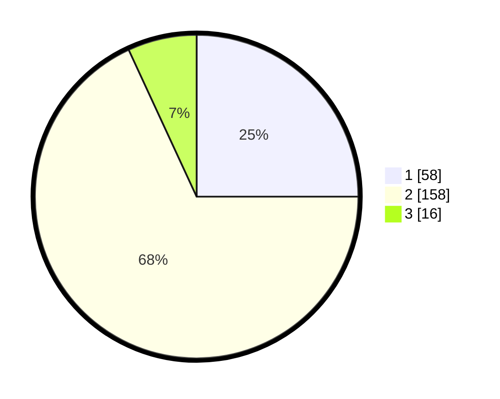

# Hasil

## Grafik

## Tabel

| No. | Nama Paslon    | Suara | Suara (raw) | Persentase |
|:--- |:-------------- | -----:| -----------:| ----------:|
| 1   | ANIES MUHAIMIN | 58    | [58][p-1]   | 25,00      |
| 2   | PRABOWO GIBRAN | 158   | [158][p-2]  | 68,10      |
| 3   | GANJAR MAHFUD  | 16    | [16][p-3]   | 6,90       |

[p-1]: https://github.com/gigit-pemilu/pemilu-2024-32-jawa-barat/blob/main/pilpres/hitung-suara/sub/32-jawa-barat/sub/03-cianjur/sub/09-sukaluyu/sub/2001-selajambe/sub/006-tps/sub/paslon-1.txt
[p-2]: https://github.com/gigit-pemilu/pemilu-2024-32-jawa-barat/blob/main/pilpres/hitung-suara/sub/32-jawa-barat/sub/03-cianjur/sub/09-sukaluyu/sub/2001-selajambe/sub/006-tps/sub/paslon-2.txt
[p-3]: https://github.com/gigit-pemilu/pemilu-2024-32-jawa-barat/blob/main/pilpres/hitung-suara/sub/32-jawa-barat/sub/03-cianjur/sub/09-sukaluyu/sub/2001-selajambe/sub/006-tps/sub/paslon-3.txt

## Foto C Plano

https://sirekap-obj-formc.kpu.go.id/ef12/pemilu/ppwp/32/03/09/20/01/3203092001006-20240215-114013--e92a2b28-dfc1-40c5-b655-ca51a5d703f9.jpg

https://sirekap-obj-formc.kpu.go.id/ef12/pemilu/ppwp/32/03/09/20/01/3203092001006-20240215-113614--68d2543b-f3eb-4df4-81b7-8a45a721f531.jpg

https://sirekap-obj-formc.kpu.go.id/ef12/pemilu/ppwp/32/03/09/20/01/3203092001006-20240215-113654--7814661a-d0a9-4192-bca5-c96978060031.jpg

## Metadata

| Key        | Value               |
| ---------- | ------------------- |
| Time Stamp | 2024-02-16 21:01:00 |

