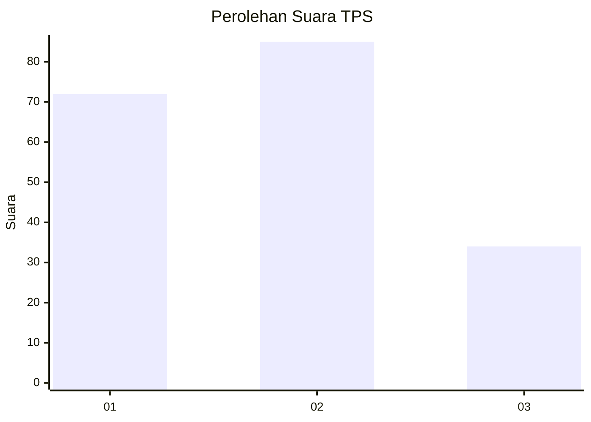
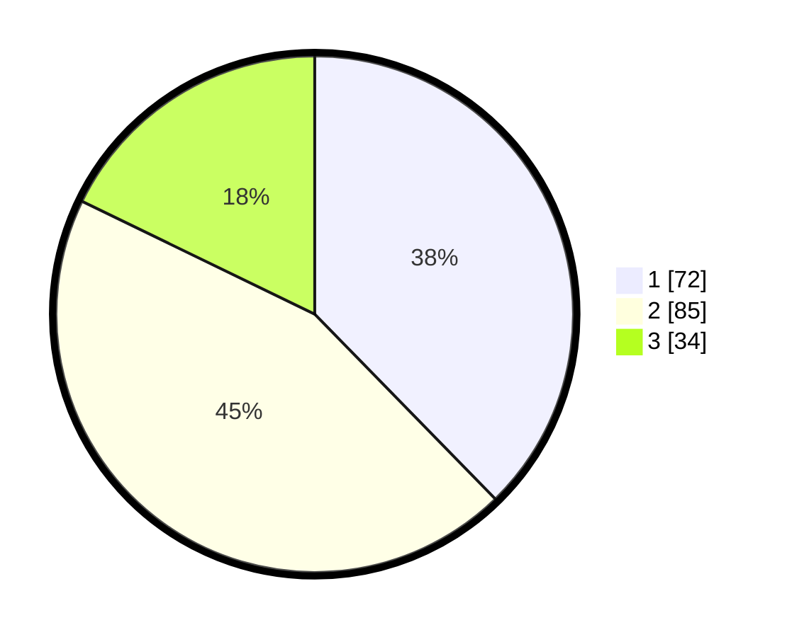

# Hasil

## Grafik

## Tabel

| No. | Nama Paslon    | Suara | Suara (raw) | Persentase |
|:--- |:-------------- | -----:| -----------:| ----------:|
| 1   | ANIES MUHAIMIN | 72    | [72][p-1]   | 37,70      |
| 2   | PRABOWO GIBRAN | 85    | [85][p-2]   | 44,50      |
| 3   | GANJAR MAHFUD  | 34    | [34][p-3]   | 17,80      |

[p-1]: https://github.com/gigit-pemilu/pemilu-2024-32-jawa-barat/blob/main/pilpres/hitung-suara/sub/32-jawa-barat/sub/03-cianjur/sub/09-sukaluyu/sub/2001-selajambe/sub/009-tps/sub/paslon-1.txt
[p-2]: https://github.com/gigit-pemilu/pemilu-2024-32-jawa-barat/blob/main/pilpres/hitung-suara/sub/32-jawa-barat/sub/03-cianjur/sub/09-sukaluyu/sub/2001-selajambe/sub/009-tps/sub/paslon-2.txt
[p-3]: https://github.com/gigit-pemilu/pemilu-2024-32-jawa-barat/blob/main/pilpres/hitung-suara/sub/32-jawa-barat/sub/03-cianjur/sub/09-sukaluyu/sub/2001-selajambe/sub/009-tps/sub/paslon-3.txt

## Foto C Plano

https://sirekap-obj-formc.kpu.go.id/111c/pemilu/ppwp/32/03/09/20/01/3203092001009-20240214-214518--6c8d5a07-17eb-4502-9cc7-48e00ffc1cfc.jpg

https://sirekap-obj-formc.kpu.go.id/111c/pemilu/ppwp/32/03/09/20/01/3203092001009-20240214-202743--015c59fb-ec75-4a9a-9220-72f860cd6fdb.jpg

https://sirekap-obj-formc.kpu.go.id/111c/pemilu/ppwp/32/03/09/20/01/3203092001009-20240214-214746--b64ad94a-3f8d-4627-b473-c790cf872dab.jpg

## Metadata

| Key        | Value               |
| ---------- | ------------------- |
| Time Stamp | 2024-02-15 09:00:24 |

