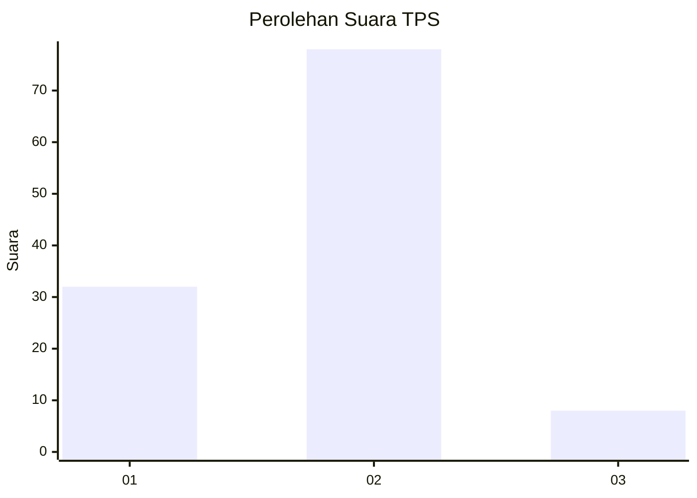
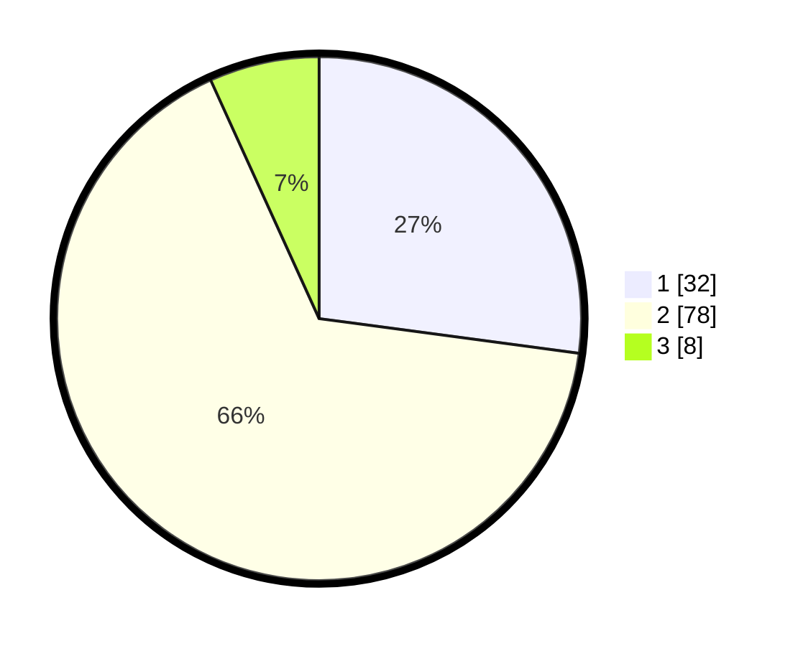

# Hasil

## Grafik

## Tabel

| No. | Nama Paslon    | Suara | Suara (raw) | Persentase |
|:--- |:-------------- | -----:| -----------:| ----------:|
| 1   | ANIES MUHAIMIN | 32    | [32][p-1]   | 27,12      |
| 2   | PRABOWO GIBRAN | 78    | [78][p-2]   | 66,10      |
| 3   | GANJAR MAHFUD  | 8     | [8][p-3]    | 6,78       |

[p-1]: https://github.com/gigit-pemilu/pemilu-2024/blob/main/pilpres/hitung-suara/sub/32-jawa-barat/sub/03-cianjur/sub/09-sukaluyu/sub/2007-sukasirna/sub/004-tps/sub/paslon-1.txt
[p-2]: https://github.com/gigit-pemilu/pemilu-2024/blob/main/pilpres/hitung-suara/sub/32-jawa-barat/sub/03-cianjur/sub/09-sukaluyu/sub/2007-sukasirna/sub/004-tps/sub/paslon-2.txt
[p-3]: https://github.com/gigit-pemilu/pemilu-2024/blob/main/pilpres/hitung-suara/sub/32-jawa-barat/sub/03-cianjur/sub/09-sukaluyu/sub/2007-sukasirna/sub/004-tps/sub/paslon-3.txt

## Foto C Plano

https://sirekap-obj-formc.kpu.go.id/afce/pemilu/ppwp/32/03/09/20/07/3203092007004-20240214-222234--b9e866dc-9258-4c50-9cdd-1597168359cb.jpg

https://sirekap-obj-formc.kpu.go.id/afce/pemilu/ppwp/32/03/09/20/07/3203092007004-20240214-210845--0edaeff9-bee4-41be-8006-e5f1369bf556.jpg

https://sirekap-obj-formc.kpu.go.id/afce/pemilu/ppwp/32/03/09/20/07/3203092007004-20240214-210907--3149ba3a-57a6-4b61-9981-6105fcf984c6.jpg

## Metadata

| Key        | Value               |
| ---------- | ------------------- |
| Time Stamp | 2024-02-15 15:00:29 |

