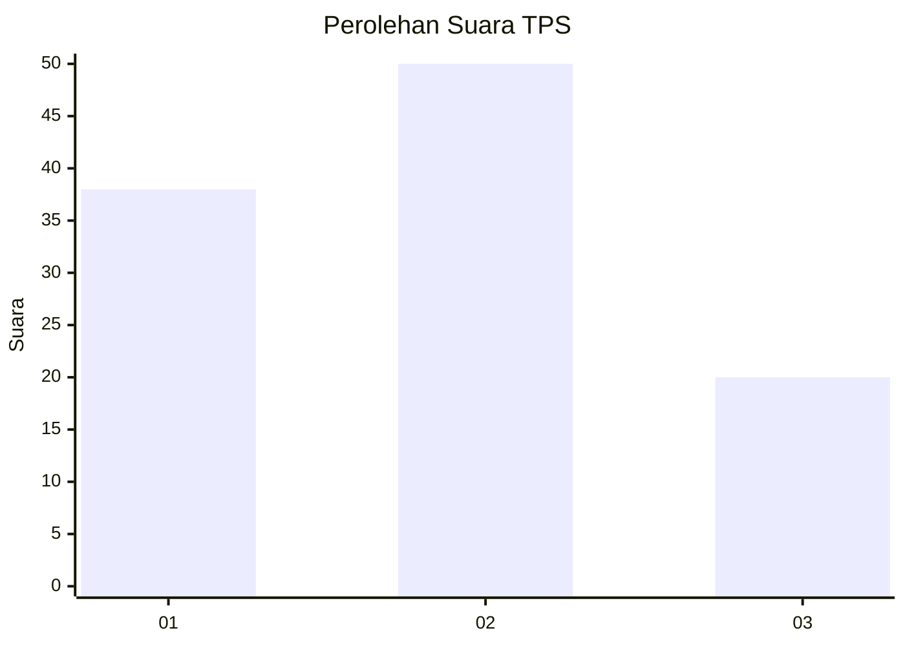
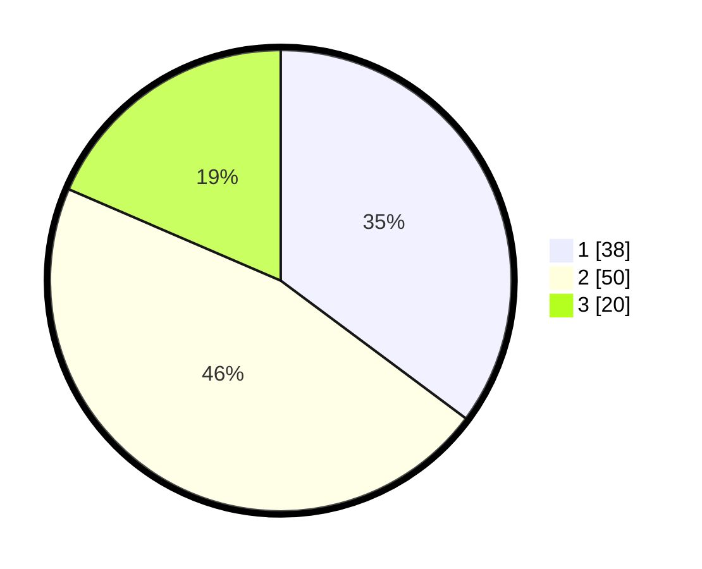

# Hasil

## Grafik

## Tabel

| No. | Nama Paslon    | Suara | Suara (raw) | Persentase |
|:--- |:-------------- | -----:| -----------:| ----------:|
| 1   | ANIES MUHAIMIN | 38    | [38][p-1]   | 35,19      |
| 2   | PRABOWO GIBRAN | 50    | [50][p-2]   | 46,30      |
| 3   | GANJAR MAHFUD  | 20    | [20][p-3]   | 18,52      |

[p-1]: https://github.com/gigit-pemilu/pemilu-2024/blob/main/pilpres/hitung-suara/sub/32-jawa-barat/sub/03-cianjur/sub/10-pacet/sub/2003-cibodas/sub/026-tps/sub/paslon-1.txt
[p-2]: https://github.com/gigit-pemilu/pemilu-2024/blob/main/pilpres/hitung-suara/sub/32-jawa-barat/sub/03-cianjur/sub/10-pacet/sub/2003-cibodas/sub/026-tps/sub/paslon-2.txt
[p-3]: https://github.com/gigit-pemilu/pemilu-2024/blob/main/pilpres/hitung-suara/sub/32-jawa-barat/sub/03-cianjur/sub/10-pacet/sub/2003-cibodas/sub/026-tps/sub/paslon-3.txt

## Foto C Plano

https://sirekap-obj-formc.kpu.go.id/7db5/pemilu/ppwp/32/03/10/20/03/3203102003026-20240218-112525--1af639cd-3714-4a2c-84b2-1900ccaea188.jpg

https://sirekap-obj-formc.kpu.go.id/7db5/pemilu/ppwp/32/03/10/20/03/3203102003026-20240218-112604--7b983332-cb2a-4a26-9331-8d12236911df.jpg

https://sirekap-obj-formc.kpu.go.id/7db5/pemilu/ppwp/32/03/10/20/03/3203102003026-20240218-112641--0aa97265-4746-4416-8cf8-47db39d5d061.jpg

## Metadata

| Key        | Value               |
| ---------- | ------------------- |
| Time Stamp | 2024-02-24 22:31:28 |

