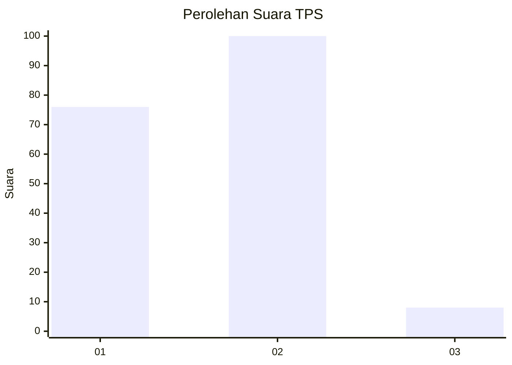
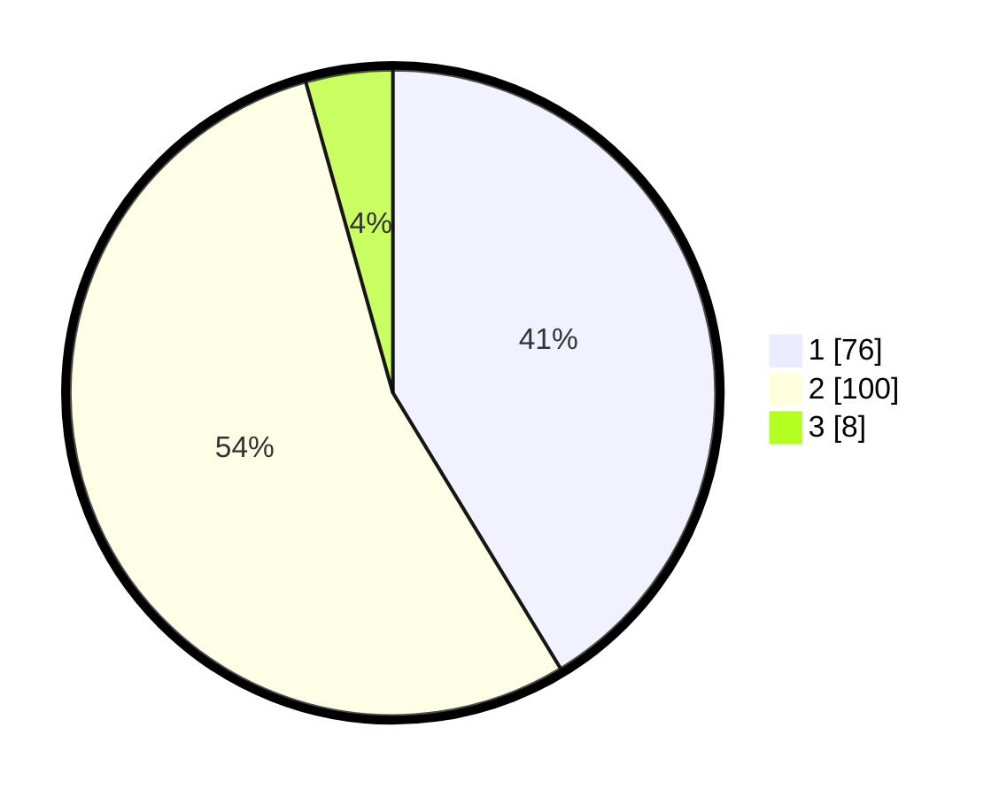

# Hasil

## Grafik

## Tabel

| No. | Nama Paslon    | Suara | Suara (raw) | Persentase |
|:--- |:-------------- | -----:| -----------:| ----------:|
| 1   | ANIES MUHAIMIN | 76    | [76][p-1]   | 41,30      |
| 2   | PRABOWO GIBRAN | 100   | [100][p-2]  | 54,35      |
| 3   | GANJAR MAHFUD  | 8     | [8][p-3]    | 4,35       |

[p-1]: https://github.com/gigit-pemilu/pemilu-2024/blob/main/pilpres/hitung-suara/sub/32-jawa-barat/sub/03-cianjur/sub/11-cugenang/sub/2001-sukamanah/sub/002-tps/sub/paslon-1.txt
[p-2]: https://github.com/gigit-pemilu/pemilu-2024/blob/main/pilpres/hitung-suara/sub/32-jawa-barat/sub/03-cianjur/sub/11-cugenang/sub/2001-sukamanah/sub/002-tps/sub/paslon-2.txt
[p-3]: https://github.com/gigit-pemilu/pemilu-2024/blob/main/pilpres/hitung-suara/sub/32-jawa-barat/sub/03-cianjur/sub/11-cugenang/sub/2001-sukamanah/sub/002-tps/sub/paslon-3.txt

## Foto C Plano

https://sirekap-obj-formc.kpu.go.id/461c/pemilu/ppwp/32/03/11/20/01/3203112001002-20240220-210352--e66949e5-a1e4-4fc8-8f59-f3e408696d41.jpg

https://sirekap-obj-formc.kpu.go.id/461c/pemilu/ppwp/32/03/11/20/01/3203112001002-20240214-210935--7a0bcc28-8c23-4af3-b102-ce8e8827b482.jpg

https://sirekap-obj-formc.kpu.go.id/461c/pemilu/ppwp/32/03/11/20/01/3203112001002-20240220-212031--9c535c4e-fca8-4528-bdbc-6977d2fc19d4.jpg

## Metadata

| Key        | Value               |
| ---------- | ------------------- |
| Time Stamp | 2024-02-20 22:00:00 |

