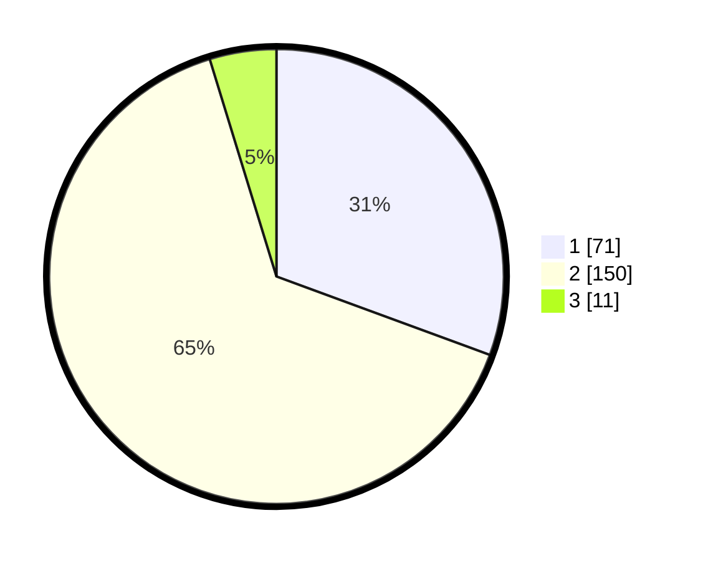

# Hasil

## Grafik

## Tabel

| No. | Nama Paslon    | Suara | Suara (raw) | Persentase |
|:--- |:-------------- | -----:| -----------:| ----------:|
| 1   | ANIES MUHAIMIN | 71    | [71][p-1]   | 30,60      |
| 2   | PRABOWO GIBRAN | 150   | [150][p-2]  | 64,66      |
| 3   | GANJAR MAHFUD  | 11    | [11][p-3]   | 4,74       |

[p-1]: https://github.com/gigit-pemilu/pemilu-2024/blob/main/pilpres/hitung-suara/sub/32-jawa-barat/sub/03-cianjur/sub/11-cugenang/sub/2004-cibeureum/sub/002-tps/sub/paslon-1.txt
[p-2]: https://github.com/gigit-pemilu/pemilu-2024/blob/main/pilpres/hitung-suara/sub/32-jawa-barat/sub/03-cianjur/sub/11-cugenang/sub/2004-cibeureum/sub/002-tps/sub/paslon-2.txt
[p-3]: https://github.com/gigit-pemilu/pemilu-2024/blob/main/pilpres/hitung-suara/sub/32-jawa-barat/sub/03-cianjur/sub/11-cugenang/sub/2004-cibeureum/sub/002-tps/sub/paslon-3.txt

## Foto C Plano

https://sirekap-obj-formc.kpu.go.id/a6b7/pemilu/ppwp/32/03/11/20/04/3203112004002-20240215-082437--96a3a3f4-6a80-45de-bd84-82919002d89e.jpg

https://sirekap-obj-formc.kpu.go.id/a6b7/pemilu/ppwp/32/03/11/20/04/3203112004002-20240215-082835--07c4847f-a179-4e8a-9c1d-cde8072f24cb.jpg

https://sirekap-obj-formc.kpu.go.id/a6b7/pemilu/ppwp/32/03/11/20/04/3203112004002-20240215-083327--9a0549f5-ed26-43e6-9cde-bcb81c612e35.jpg

## Metadata

| Key        | Value               |
| ---------- | ------------------- |
| Time Stamp | 2024-02-16 16:25:10 |

