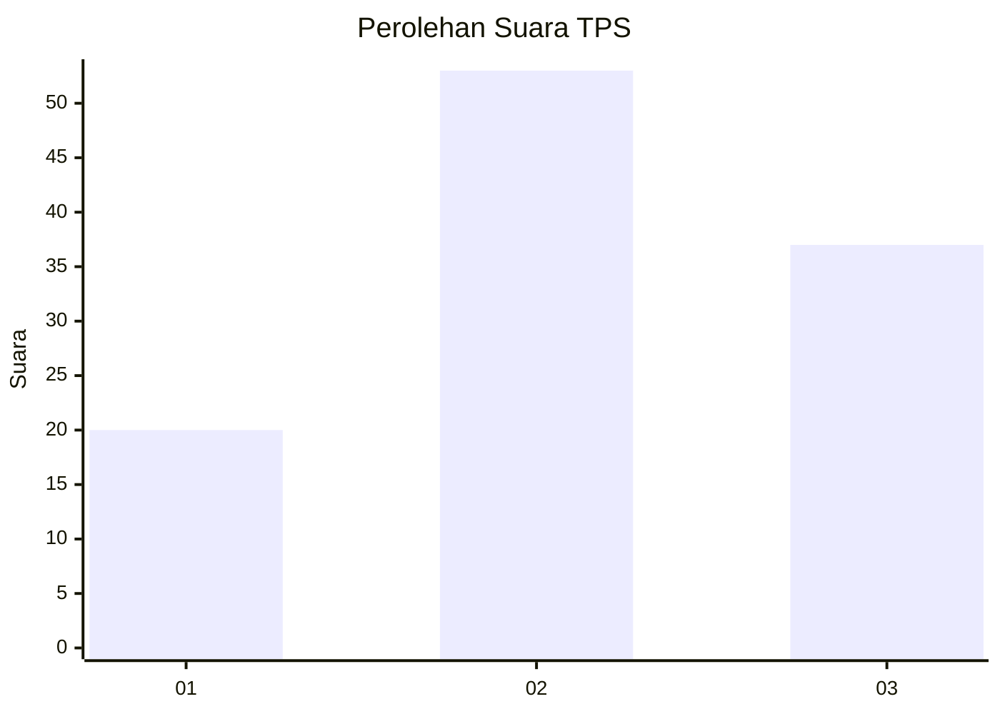
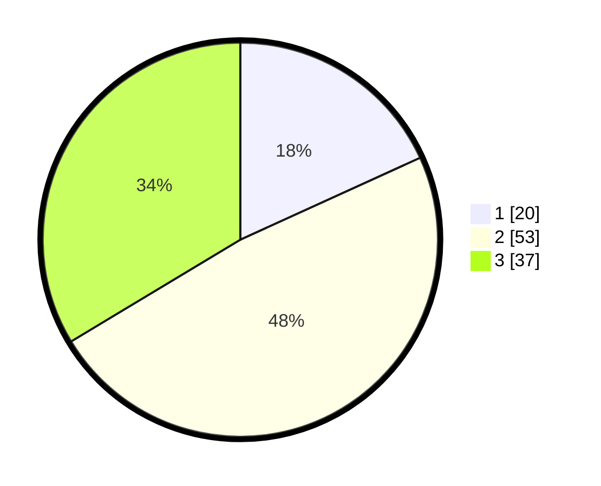

# Hasil

## Grafik

## Tabel

| No. | Nama Paslon    | Suara | Suara (raw) | Persentase |
|:--- |:-------------- | -----:| -----------:| ----------:|
| 1   | ANIES MUHAIMIN | 20    | [20][p-1]   | 18,18      |
| 2   | PRABOWO GIBRAN | 53    | [53][p-2]   | 48,18      |
| 3   | GANJAR MAHFUD  | 37    | [37][p-3]   | 33,64      |

[p-1]: https://github.com/gigit-pemilu/pemilu-2024/blob/main/pilpres/hitung-suara/sub/32-jawa-barat/sub/03-cianjur/sub/11-cugenang/sub/2008-talaga/sub/017-tps/sub/paslon-1.txt
[p-2]: https://github.com/gigit-pemilu/pemilu-2024/blob/main/pilpres/hitung-suara/sub/32-jawa-barat/sub/03-cianjur/sub/11-cugenang/sub/2008-talaga/sub/017-tps/sub/paslon-2.txt
[p-3]: https://github.com/gigit-pemilu/pemilu-2024/blob/main/pilpres/hitung-suara/sub/32-jawa-barat/sub/03-cianjur/sub/11-cugenang/sub/2008-talaga/sub/017-tps/sub/paslon-3.txt

## Foto C Plano

https://sirekap-obj-formc.kpu.go.id/962d/pemilu/ppwp/32/03/11/20/08/3203112008017-20240215-043313--49051f31-b986-4243-ab43-2ad2db69eaf7.jpg

https://sirekap-obj-formc.kpu.go.id/962d/pemilu/ppwp/32/03/11/20/08/3203112008017-20240215-042136--d27f18cb-c58d-451e-b9d3-0c8f24b457af.jpg

https://sirekap-obj-formc.kpu.go.id/962d/pemilu/ppwp/32/03/11/20/08/3203112008017-20240215-044029--1727bdb3-b4ef-418f-ba28-ddd929b6faf7.jpg

## Metadata

| Key        | Value               |
| ---------- | ------------------- |
| Time Stamp | 2024-02-24 22:31:28 |

