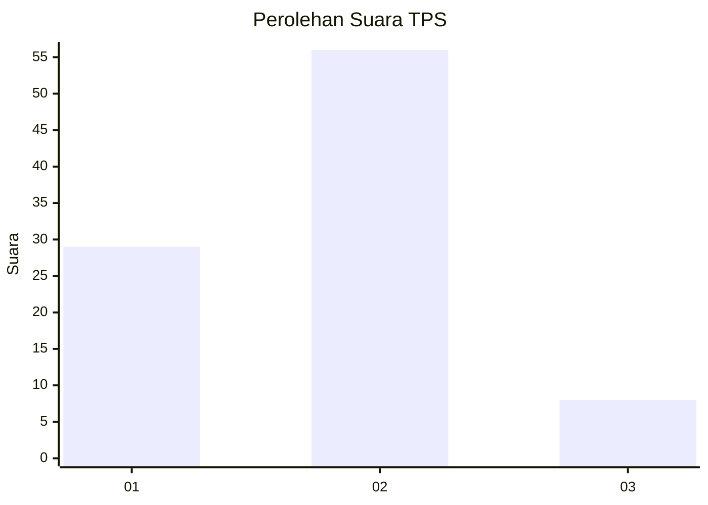
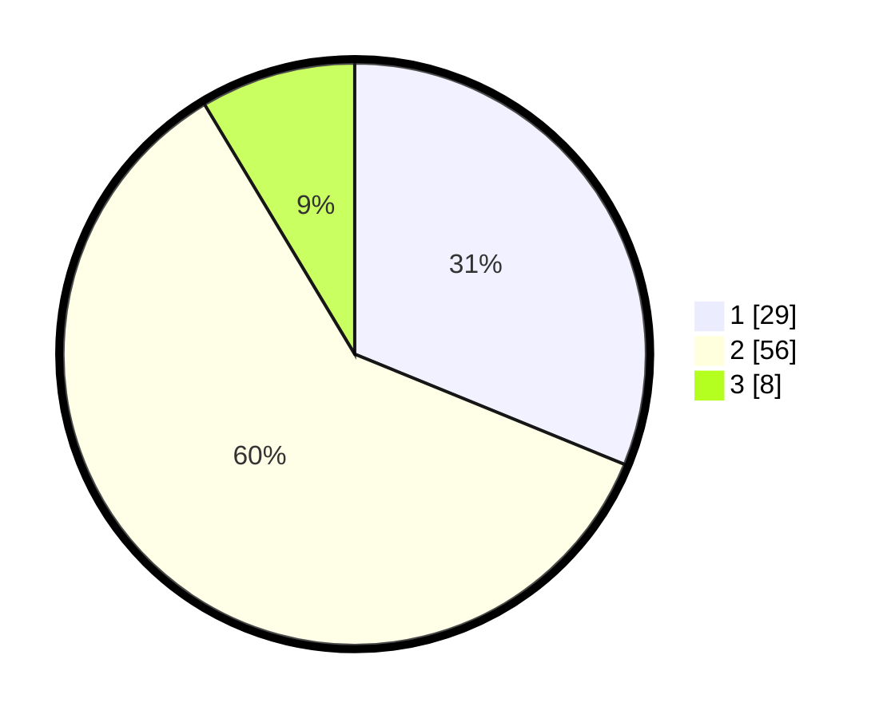

# Hasil

## Grafik

## Tabel

| No. | Nama Paslon    | Suara | Suara (raw) | Persentase |
|:--- |:-------------- | -----:| -----------:| ----------:|
| 1   | ANIES MUHAIMIN | 29    | [29][p-1]   | 31,18      |
| 2   | PRABOWO GIBRAN | 56    | [56][p-2]   | 60,22      |
| 3   | GANJAR MAHFUD  | 8     | [8][p-3]    | 8,60       |

[p-1]: https://github.com/gigit-pemilu/pemilu-2024/blob/main/pilpres/hitung-suara/sub/32-jawa-barat/sub/03-cianjur/sub/11-cugenang/sub/2015-padaluyu/sub/003-tps/sub/paslon-1.txt
[p-2]: https://github.com/gigit-pemilu/pemilu-2024/blob/main/pilpres/hitung-suara/sub/32-jawa-barat/sub/03-cianjur/sub/11-cugenang/sub/2015-padaluyu/sub/003-tps/sub/paslon-2.txt
[p-3]: https://github.com/gigit-pemilu/pemilu-2024/blob/main/pilpres/hitung-suara/sub/32-jawa-barat/sub/03-cianjur/sub/11-cugenang/sub/2015-padaluyu/sub/003-tps/sub/paslon-3.txt

## Foto C Plano

https://sirekap-obj-formc.kpu.go.id/58b3/pemilu/ppwp/32/03/11/20/15/3203112015003-20240214-232033--e11d16f6-3026-4a1c-9527-3c7a533e2445.jpg

https://sirekap-obj-formc.kpu.go.id/58b3/pemilu/ppwp/32/03/11/20/15/3203112015003-20240214-222649--18107f0a-8b90-4c76-85ca-b839a816be63.jpg

https://sirekap-obj-formc.kpu.go.id/58b3/pemilu/ppwp/32/03/11/20/15/3203112015003-20240214-222808--012121e3-77a1-447a-85d4-8aa7b4df3961.jpg

## Metadata

| Key        | Value               |
| ---------- | ------------------- |
| Time Stamp | 2024-02-24 22:31:28 |

