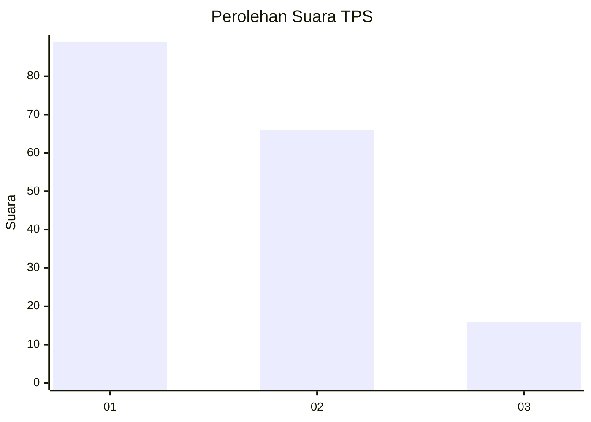
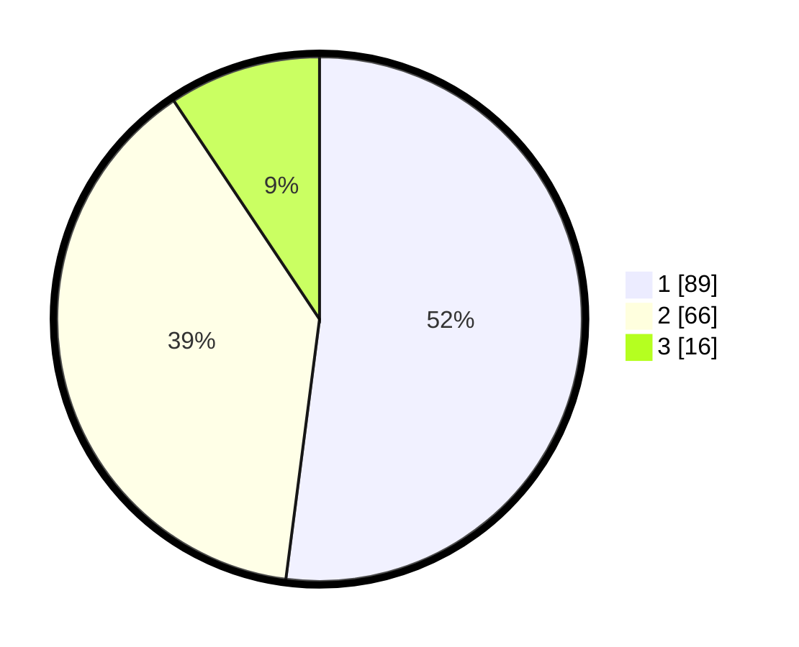

# Hasil

## Grafik

## Tabel

| No. | Nama Paslon    | Suara | Suara (raw) | Persentase |
|:--- |:-------------- | -----:| -----------:| ----------:|
| 1   | ANIES MUHAIMIN | 89    | [89][p-1]   | 52,05      |
| 2   | PRABOWO GIBRAN | 66    | [66][p-2]   | 38,60      |
| 3   | GANJAR MAHFUD  | 16    | [16][p-3]   | 9,36       |

[p-1]: https://github.com/gigit-pemilu/pemilu-2024-32-jawa-barat/blob/main/pilpres/hitung-suara/sub/32-jawa-barat/sub/03-cianjur/sub/12-cikalongkulon/sub/2001-sukagalih/sub/005-tps/sub/paslon-1.txt
[p-2]: https://github.com/gigit-pemilu/pemilu-2024-32-jawa-barat/blob/main/pilpres/hitung-suara/sub/32-jawa-barat/sub/03-cianjur/sub/12-cikalongkulon/sub/2001-sukagalih/sub/005-tps/sub/paslon-2.txt
[p-3]: https://github.com/gigit-pemilu/pemilu-2024-32-jawa-barat/blob/main/pilpres/hitung-suara/sub/32-jawa-barat/sub/03-cianjur/sub/12-cikalongkulon/sub/2001-sukagalih/sub/005-tps/sub/paslon-3.txt

## Foto C Plano

https://sirekap-obj-formc.kpu.go.id/c3c7/pemilu/ppwp/32/03/12/20/01/3203122001005-20240215-114634--ed1eba5f-1efd-40e6-b25a-953a75bfee67.jpg

https://sirekap-obj-formc.kpu.go.id/c3c7/pemilu/ppwp/32/03/12/20/01/3203122001005-20240215-114731--77be5b6d-28da-4433-8c84-59873ea6ffbc.jpg

https://sirekap-obj-formc.kpu.go.id/c3c7/pemilu/ppwp/32/03/12/20/01/3203122001005-20240215-114821--925c905e-7e9a-4ef3-9dd1-5b40592d64a1.jpg

## Metadata

| Key        | Value               |
| ---------- | ------------------- |
| Time Stamp | 2024-02-15 21:01:18 |

