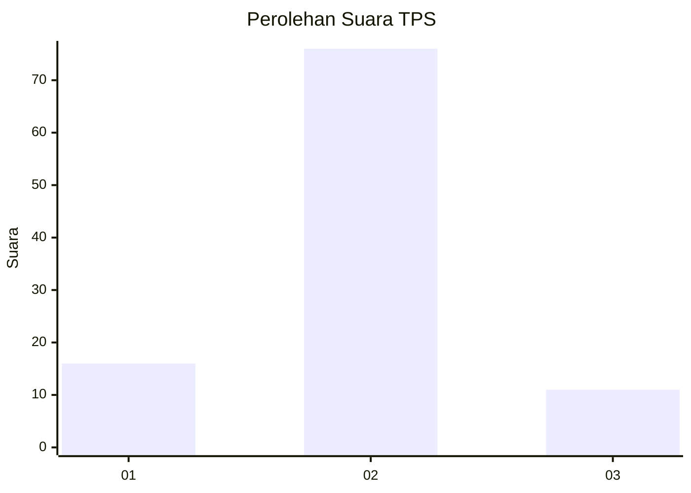
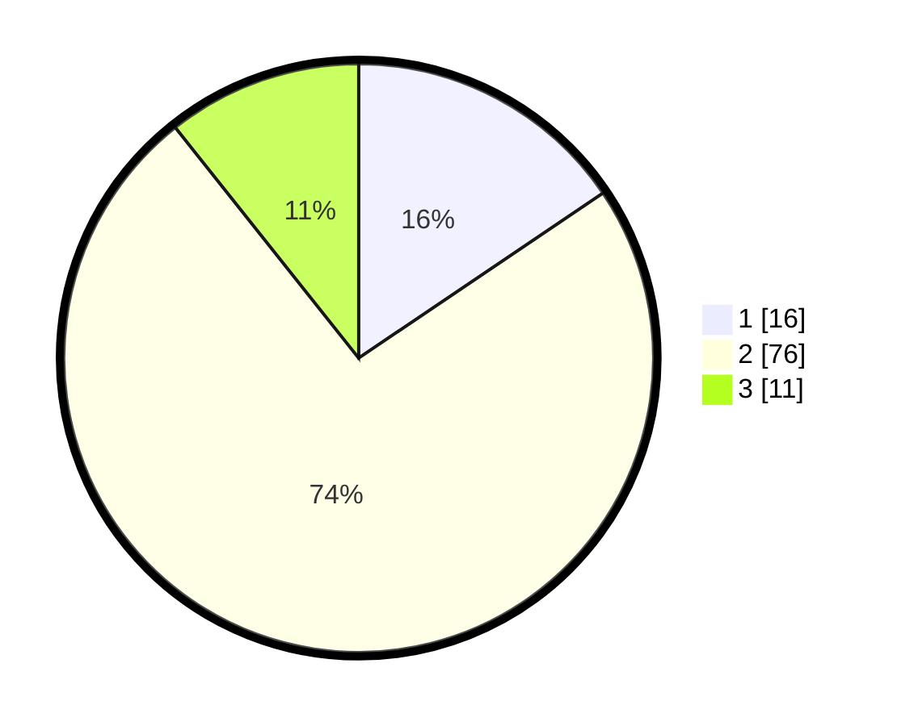

# Hasil

## Grafik

## Tabel

| No. | Nama Paslon    | Suara | Suara (raw) | Persentase |
|:--- |:-------------- | -----:| -----------:| ----------:|
| 1   | ANIES MUHAIMIN | 16    | [16][p-1]   | 15,53      |
| 2   | PRABOWO GIBRAN | 76    | [76][p-2]   | 73,79      |
| 3   | GANJAR MAHFUD  | 11    | [11][p-3]   | 10,68      |

[p-1]: https://github.com/gigit-pemilu/pemilu-2024-32-jawa-barat/blob/main/pilpres/hitung-suara/sub/32-jawa-barat/sub/03-cianjur/sub/12-cikalongkulon/sub/2008-ciramagirang/sub/005-tps/sub/paslon-1.txt
[p-2]: https://github.com/gigit-pemilu/pemilu-2024-32-jawa-barat/blob/main/pilpres/hitung-suara/sub/32-jawa-barat/sub/03-cianjur/sub/12-cikalongkulon/sub/2008-ciramagirang/sub/005-tps/sub/paslon-2.txt
[p-3]: https://github.com/gigit-pemilu/pemilu-2024-32-jawa-barat/blob/main/pilpres/hitung-suara/sub/32-jawa-barat/sub/03-cianjur/sub/12-cikalongkulon/sub/2008-ciramagirang/sub/005-tps/sub/paslon-3.txt

## Foto C Plano

https://sirekap-obj-formc.kpu.go.id/7be6/pemilu/ppwp/32/03/12/20/08/3203122008005-20240215-071714--8da2380c-1824-49b1-948b-f0b5f00f3fb0.jpg

https://sirekap-obj-formc.kpu.go.id/7be6/pemilu/ppwp/32/03/12/20/08/3203122008005-20240215-072027--dc6ae785-2310-4e20-837f-df26cd8a0924.jpg

https://sirekap-obj-formc.kpu.go.id/7be6/pemilu/ppwp/32/03/12/20/08/3203122008005-20240215-072228--c2265915-86dc-4fe5-ade6-85c0dc0d345e.jpg

## Metadata

| Key        | Value               |
| ---------- | ------------------- |
| Time Stamp | 2024-02-24 22:31:28 |

