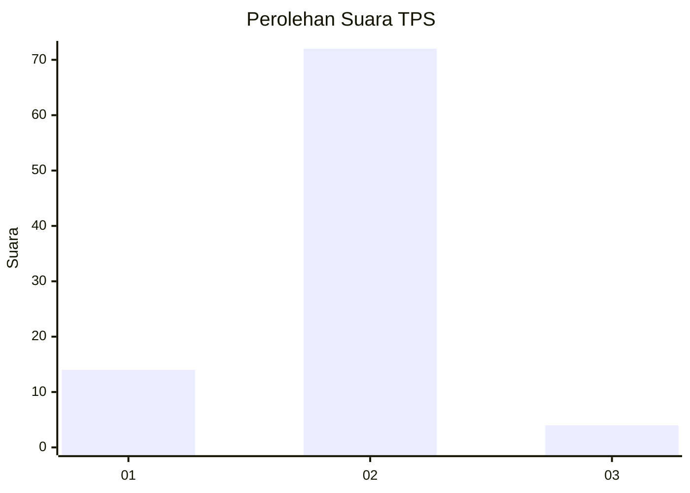
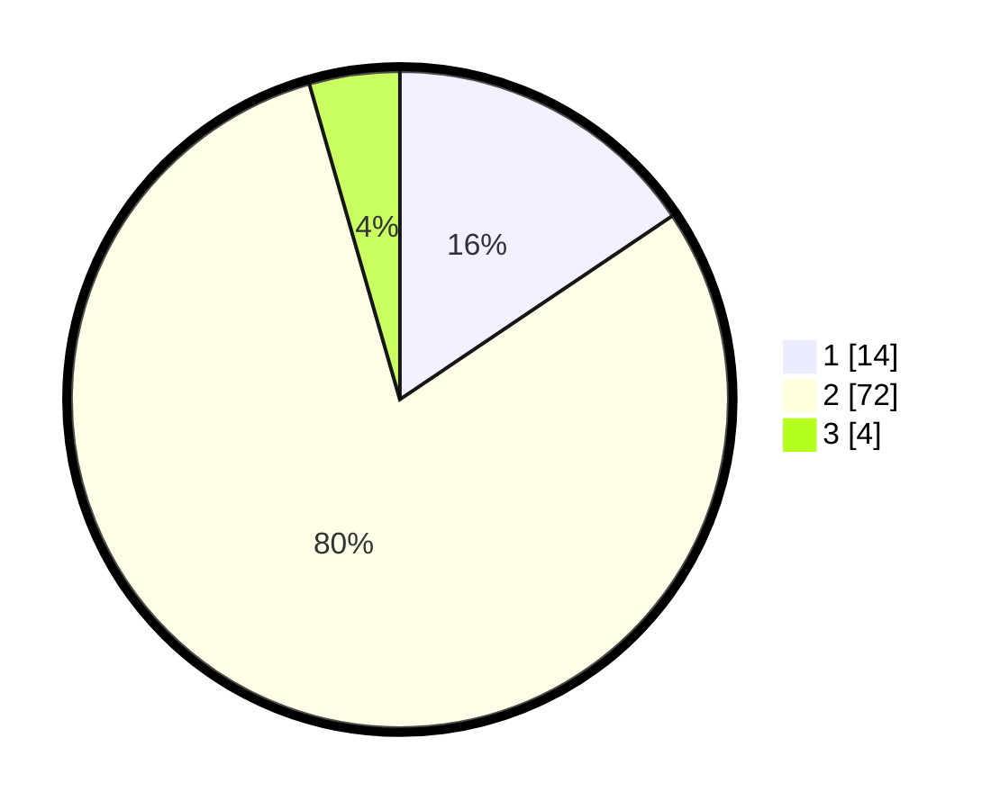

# Hasil

## Grafik

## Tabel

| No. | Nama Paslon    | Suara | Suara (raw) | Persentase |
|:--- |:-------------- | -----:| -----------:| ----------:|
| 1   | ANIES MUHAIMIN | 14    | [14][p-1]   | 15,56      |
| 2   | PRABOWO GIBRAN | 72    | [72][p-2]   | 80,00      |
| 3   | GANJAR MAHFUD  | 4     | [4][p-3]    | 4,44       |

[p-1]: https://github.com/gigit-pemilu/pemilu-2024/blob/main/pilpres/hitung-suara/sub/32-jawa-barat/sub/03-cianjur/sub/12-cikalongkulon/sub/2008-ciramagirang/sub/012-tps/sub/paslon-1.txt
[p-2]: https://github.com/gigit-pemilu/pemilu-2024/blob/main/pilpres/hitung-suara/sub/32-jawa-barat/sub/03-cianjur/sub/12-cikalongkulon/sub/2008-ciramagirang/sub/012-tps/sub/paslon-2.txt
[p-3]: https://github.com/gigit-pemilu/pemilu-2024/blob/main/pilpres/hitung-suara/sub/32-jawa-barat/sub/03-cianjur/sub/12-cikalongkulon/sub/2008-ciramagirang/sub/012-tps/sub/paslon-3.txt

## Foto C Plano

https://sirekap-obj-formc.kpu.go.id/7336/pemilu/ppwp/32/03/12/20/08/3203122008012-20240215-092756--b9d1aa7a-9ed5-4c88-90ce-1fc8387f506c.jpg

https://sirekap-obj-formc.kpu.go.id/7336/pemilu/ppwp/32/03/12/20/08/3203122008012-20240215-093623--79f80ee2-6ae5-4bdc-bc87-835c44d6e88e.jpg

https://sirekap-obj-formc.kpu.go.id/7336/pemilu/ppwp/32/03/12/20/08/3203122008012-20240215-094306--b54af800-00e2-4e50-b57c-70dc0843049c.jpg

## Metadata

| Key        | Value               |
| ---------- | ------------------- |
| Time Stamp | 2024-02-16 14:00:34 |

