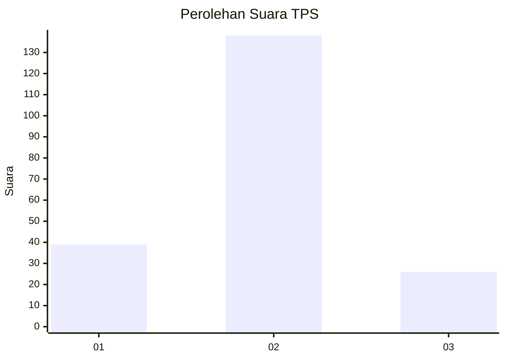
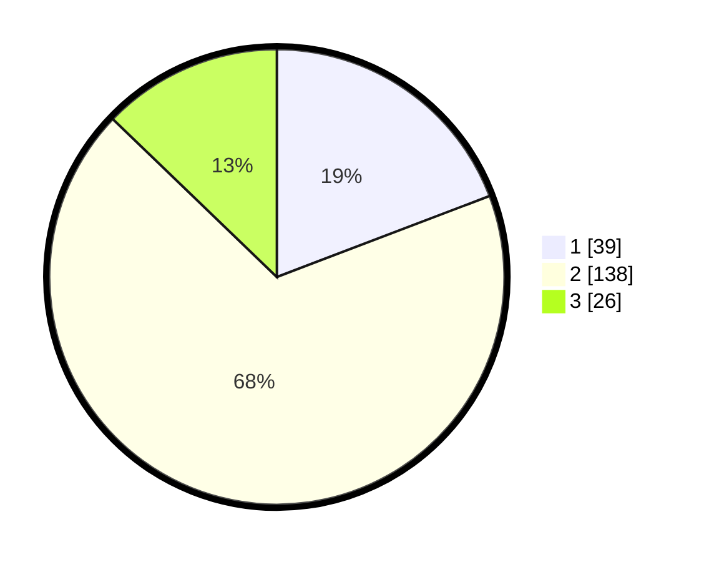

# Hasil

## Grafik

## Tabel

| No. | Nama Paslon    | Suara | Suara (raw) | Persentase |
|:--- |:-------------- | -----:| -----------:| ----------:|
| 1   | ANIES MUHAIMIN | 39    | [39][p-1]   | 19,21      |
| 2   | PRABOWO GIBRAN | 138   | [138][p-2]  | 67,98      |
| 3   | GANJAR MAHFUD  | 26    | [26][p-3]   | 12,81      |

[p-1]: https://github.com/gigit-pemilu/pemilu-2024-32-jawa-barat/blob/main/pilpres/hitung-suara/sub/32-jawa-barat/sub/03-cianjur/sub/13-sukaresmi/sub/2001-cikanyere/sub/002-tps/sub/paslon-1.txt
[p-2]: https://github.com/gigit-pemilu/pemilu-2024-32-jawa-barat/blob/main/pilpres/hitung-suara/sub/32-jawa-barat/sub/03-cianjur/sub/13-sukaresmi/sub/2001-cikanyere/sub/002-tps/sub/paslon-2.txt
[p-3]: https://github.com/gigit-pemilu/pemilu-2024-32-jawa-barat/blob/main/pilpres/hitung-suara/sub/32-jawa-barat/sub/03-cianjur/sub/13-sukaresmi/sub/2001-cikanyere/sub/002-tps/sub/paslon-3.txt

## Foto C Plano

https://sirekap-obj-formc.kpu.go.id/734e/pemilu/ppwp/32/03/13/20/01/3203132001002-20240215-000606--70754994-b38e-4ded-9b9b-041b8e0b1079.jpg

https://sirekap-obj-formc.kpu.go.id/734e/pemilu/ppwp/32/03/13/20/01/3203132001002-20240215-000934--1b05e93b-462c-47c1-bd82-a0bf47ab6c20.jpg

https://sirekap-obj-formc.kpu.go.id/734e/pemilu/ppwp/32/03/13/20/01/3203132001002-20240215-001040--2436ec18-0c23-48f8-ac8b-4056e32dd7c0.jpg

## Metadata

| Key        | Value               |
| ---------- | ------------------- |
| Time Stamp | 2024-02-16 23:00:00 |

