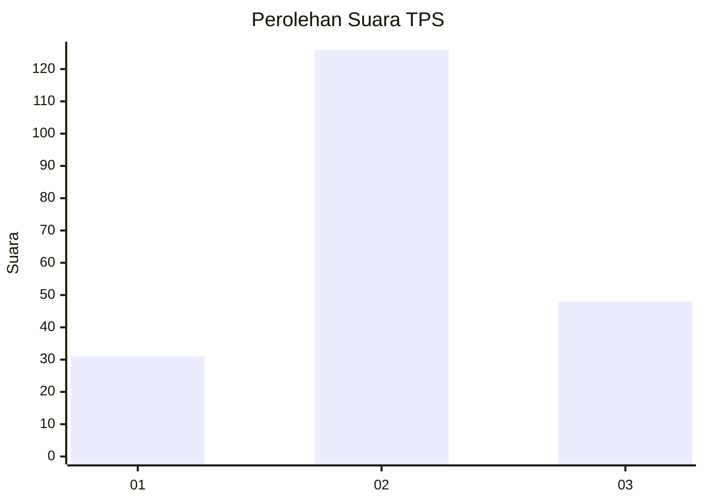
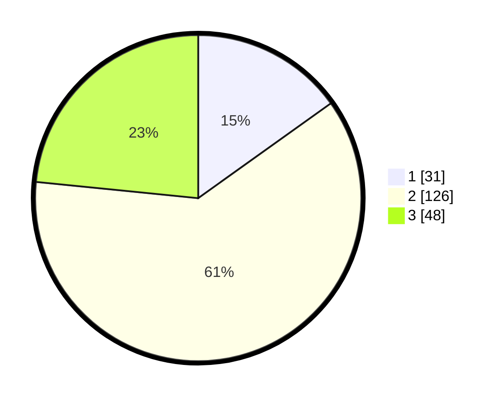

# Hasil

## Grafik

## Tabel

| No. | Nama Paslon    | Suara | Suara (raw) | Persentase |
|:--- |:-------------- | -----:| -----------:| ----------:|
| 1   | ANIES MUHAIMIN | 31    | [31][p-1]   | 15,12      |
| 2   | PRABOWO GIBRAN | 126   | [126][p-2]  | 61,46      |
| 3   | GANJAR MAHFUD  | 48    | [48][p-3]   | 23,41      |

[p-1]: https://github.com/gigit-pemilu/pemilu-2024-32-jawa-barat/blob/main/pilpres/hitung-suara/sub/32-jawa-barat/sub/03-cianjur/sub/13-sukaresmi/sub/2001-cikanyere/sub/006-tps/sub/paslon-1.txt
[p-2]: https://github.com/gigit-pemilu/pemilu-2024-32-jawa-barat/blob/main/pilpres/hitung-suara/sub/32-jawa-barat/sub/03-cianjur/sub/13-sukaresmi/sub/2001-cikanyere/sub/006-tps/sub/paslon-2.txt
[p-3]: https://github.com/gigit-pemilu/pemilu-2024-32-jawa-barat/blob/main/pilpres/hitung-suara/sub/32-jawa-barat/sub/03-cianjur/sub/13-sukaresmi/sub/2001-cikanyere/sub/006-tps/sub/paslon-3.txt

## Foto C Plano

https://sirekap-obj-formc.kpu.go.id/62ce/pemilu/ppwp/32/03/13/20/01/3203132001006-20240214-233535--bb455391-3f2b-4486-b735-633a1d050912.jpg

https://sirekap-obj-formc.kpu.go.id/62ce/pemilu/ppwp/32/03/13/20/01/3203132001006-20240219-174408--02efc346-0047-4345-8310-d761a1c587cd.jpg

https://sirekap-obj-formc.kpu.go.id/62ce/pemilu/ppwp/32/03/13/20/01/3203132001006-20240219-174155--b4dc6b0c-8374-4064-a20d-f5a8f5f68ab1.jpg

## Metadata

| Key        | Value               |
| ---------- | ------------------- |
| Time Stamp | 2024-02-19 18:00:00 |

## DATA PEMILIH TETAP

Jumlah pemilih dalam DPT: **525**.
 * L: **314**.
 * P: **10**.

## DATA PENGGUNA HAK PILIH

Jumlah pengguna hak pilih dalam DPT: **310**.
 * L: **800**.
 * P: **268**.

Jumlah pengguna hak pilih dalam DPTb: **29**.
 * L: **21**.
 * P: **8**.

Jumlah pengguna hak pilih dalam DPK: **4**.
 * L: **3**.
 * P: **8**.

Jumlah pengguna hak pilih: **216**.
 * L: **525**.
 * P: **91**.

## JUMLAH SUARA SAH DAN TIDAK SAH

JUMLAH SELURUH SUARA SAH: **205**.

JUMLAH SUARA TIDAK SAH: **11**.

JUMLAH SELURUH SUARA SAH DAN SUARA TIDAK SAH: **216**.

