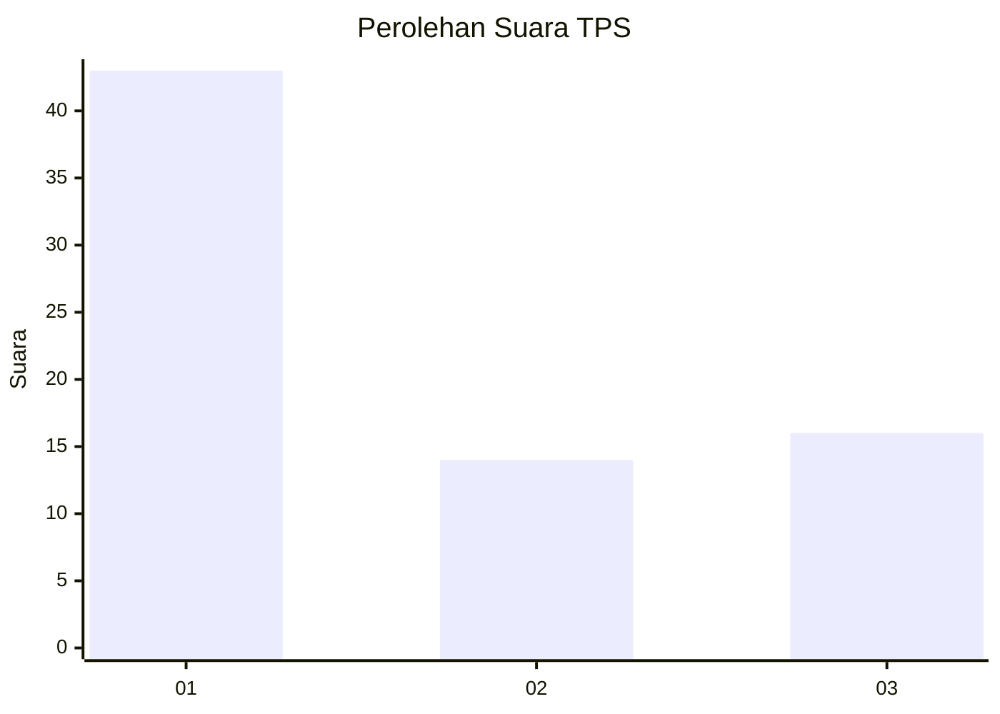
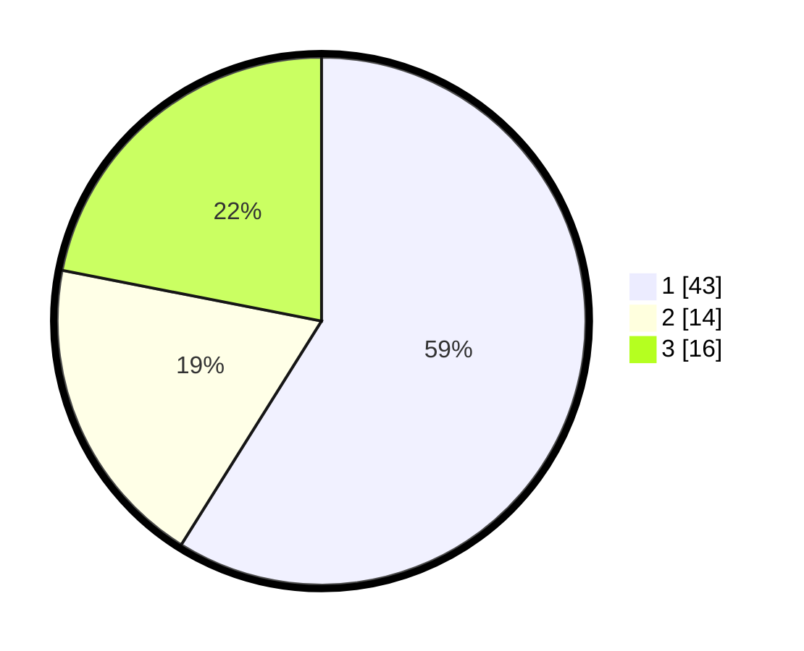

# Hasil

## Grafik

## Tabel

| No. | Nama Paslon    | Suara | Suara (raw) | Persentase |
|:--- |:-------------- | -----:| -----------:| ----------:|
| 1   | ANIES MUHAIMIN | 43    | [43][p-1]   | 58,90      |
| 2   | PRABOWO GIBRAN | 14    | [14][p-2]   | 19,18      |
| 3   | GANJAR MAHFUD  | 16    | [16][p-3]   | 21,92      |

[p-1]: https://github.com/gigit-pemilu/pemilu-2024-32-jawa-barat/blob/main/pilpres/hitung-suara/sub/32-jawa-barat/sub/03-cianjur/sub/13-sukaresmi/sub/2005-cibadak/sub/026-tps/sub/paslon-1.txt
[p-2]: https://github.com/gigit-pemilu/pemilu-2024-32-jawa-barat/blob/main/pilpres/hitung-suara/sub/32-jawa-barat/sub/03-cianjur/sub/13-sukaresmi/sub/2005-cibadak/sub/026-tps/sub/paslon-2.txt
[p-3]: https://github.com/gigit-pemilu/pemilu-2024-32-jawa-barat/blob/main/pilpres/hitung-suara/sub/32-jawa-barat/sub/03-cianjur/sub/13-sukaresmi/sub/2005-cibadak/sub/026-tps/sub/paslon-3.txt

## Foto C Plano

https://sirekap-obj-formc.kpu.go.id/f825/pemilu/ppwp/32/03/13/20/05/3203132005026-20240220-151448--7b76421b-aac2-4817-95d0-fe16151ec0d8.jpg

https://sirekap-obj-formc.kpu.go.id/f825/pemilu/ppwp/32/03/13/20/05/3203132005026-20240220-151824--aa460e99-5a0c-4e8d-aaed-fa03b56b4d74.jpg

https://sirekap-obj-formc.kpu.go.id/f825/pemilu/ppwp/32/03/13/20/05/3203132005026-20240220-152127--babfc92d-b9d8-4891-be18-9405633ddd91.jpg

## Metadata

| Key        | Value               |
| ---------- | ------------------- |
| Time Stamp | 2024-02-24 22:31:28 |

